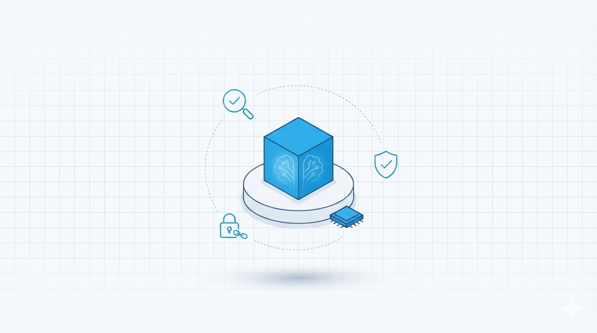

# Brain Server

**Governed, local-first memory for AI agents in regulated environments.**

Governance is usually side work: nobody owns quality, access, or cleanup. This server owns it. Nothing becomes permanent knowledge until a human approves the exact bytes. One Rust binary, no cloud, no embedding API, no data leaving the box by default. Built for teams that treat memory poisoning (OWASP ASI06) as a production risk.

<p align="center">

[](#)
[](https://markfietje.github.io/brain-server/)
[](#)
[](#)
[](#)
[](#)

</p>

<p align="center">
Web + desktop + mobile GUI (Dioxus) · OpenAI-compatible embeddings · MCP server · OpenClaw plugin
</p>



## Try it in 30 seconds

No Docker, no API keys, no accounts. Download the binary and paste the demo. It starts empty, unauthenticated, on loopback only:

```bash
curl -L -o brain-server https://github.com/markfietje/brain-server/releases/latest/download/brain-server-darwin-arm64
chmod +x brain-server
./brain-server
# 127.0.0.1:8765 - first start fetches the embedding model (~30 s, one-time;
# every start after that is ~1 s). Other platforms: swap the suffix for
# brain-server-{darwin,linux}-{x86_64,arm64}.
```

Then, in a second terminal:

```bash
curl -s -X POST http://127.0.0.1:8765/ingest \
  -H 'Content-Type: application/json' \
  -d '{"title":"Bignay","content":"Bignay is alternative to blueberry."}'
curl -s -X POST http://127.0.0.1:8765/recall \
  -H 'Content-Type: application/json' \
  -d '{"query":"blueberry alternative","provenance":true}' | jq .
```

You get `decision: ok` with ranked sources. Each hit carries its score, provenance, and the exact evidence text, fenced and labelled `untrusted`. Nothing gets invented.

Prefer to build from source?

```bash
cargo build --release --features bench
./target/release/brain-server
# same behavior; data at ~/.openclaw/workspace/brain.db
```

The full 5-minute walkthrough, the human approval gate, the `brain` CLI, and running it as a persistent service, is in the [Quickstart](https://markfietje.github.io/brain-server/quickstart.html). Production deploys (Docker, SSO, launchd) are in [Deployment](https://markfietje.github.io/brain-server/deployment.html).

## Who it is for

* Teams in **financial services, healthcare, legal, government, and BPOs** that store decisions, customer context, or operational knowledge in long-lived agents.
* **Security, compliance, and platform teams** that require human gates, digests, quarantine, and tamper-evident audit.
* Teams running **agentic coding assistants** (Claude Code, OpenClaw, Cursor, and custom agents) that need a governed memory backend.

This is not a general-purpose memory layer for quick prototypes. It is for places where a wrong recall has a cost.

## Guarantees

* **Human promotion gate.** Agent captures become proposals. Promotion requires explicit approval bound to the SHA-256 of the exact bytes reviewed (`content_digest`). Drift returns 409. High-risk queues can require two distinct approvers (`BRAIN_APPROVAL_QUORUM=2`).
* **Ingest screening and quarantine.** Every write is screened. Suspect content is quarantined and excluded from vector, full-text, and graph retrieval.
* **Untrusted fences.** Recalled content is rendered inside unforgeable boundaries, stripped of invisible-character and bidi smuggling plus auto-fetch constructs, and labelled untrusted.
* **Deterministic retrieval with explicit verdicts.** Hybrid retrieval: vector KNN plus FTS5 via reciprocal rank fusion. Same query, same answer. Every recall carries a decision verdict and per-hit confidence instead of prose guesses, and `POST /verify` checks any claim against the stored text.
* **Tamper-evident audit.** Append-only keyed hash chain with a verifiable head. `GET /audit/verify` checks it.
* **Verifiable deletion.** DSAR and purge produce certificates and tombstones.
* **Local-first, zero-token recall.** Static embeddings and hybrid retrieval. No LLM in the hot path. No data egress by default. Zero per query.
* **Scoped principals.** Agents get least-privilege tokens limited to recall, store, and propose - separate from operator credentials. A revoked principal is refused on every route from the moment of revocation, and re-provisioning does not resurrect it.

## Why this instead of a cloud memory service

| Cloud memory | Brain Server |
|---|---|
| Pay per read and write | Zero per query. Local static embeddings. |
| Data in someone else's datacenter | Data stays in SQLite on your box. No telemetry. |
| Extra round trip | p95 around 24 ms on loopback (measured table in `BENCHMARKS.md`) |

## Proof, not promises

* UMP 1.0 L3, 13 of 13 reference-suite checks, derived from the CI `integration` conformance gate (asserted every push, not hand-claimed)
* 1,572 tests passed — count not selfcheck-verified (`scripts/badges.sh --selfcheck` guards the disclaimer, not the number); authoritative count is the full `cargo test --features bench,migrate` run / CI `integration` job for the tagged commit. `cargo fmt` and `clippy -D warnings` clean
* Append-only SHA-256 audit chain, `GET /audit/verify` to check it
* Maps to ISO 42001, NIST AI RMF, SOC 2, GDPR. See `COMPLIANCE.md`

Try the MCP server in two seconds:

```bash
curl -L -o mcp https://github.com/markfietje/brain-server/releases/latest/download/mcp-darwin-arm64
chmod +x mcp
echo '{"jsonrpc":"2.0","id":1,"method":"server/discover","params":{"_meta":{"io.modelcontextprotocol/protocolVersion":"2026-07-28"}}}' | ./mcp
```

## Docs

| | |
|---|---|
| Docs site | [markfietje.github.io/brain-server](https://markfietje.github.io/brain-server/) |
| API | `GET /openapi.yaml` at runtime and `API_CONTRACT.md` |
| Security | `SECURITY.md`, `THREAT_MODEL.md` |
| Compliance | `COMPLIANCE.md`, `docs/RFP_RESPONSE_KIT.md` |
| Trust map | `docs/trust/proof-map.md` - every claim traced to release and curl |
| Roadmap | `ROADMAP.md` |

## License

MIT 2026 Mark Fietje. See `LICENSE`. Issues welcome on GitHub.

If it saves you a query, a star helps others find it.
