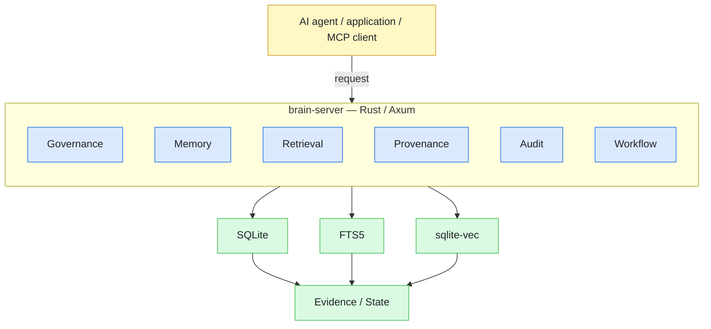
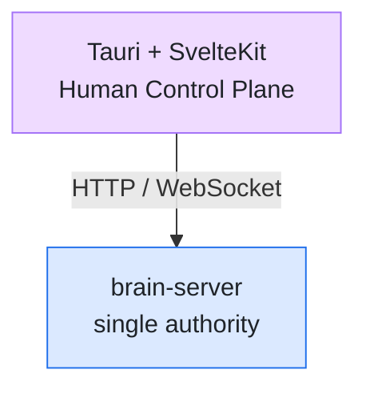
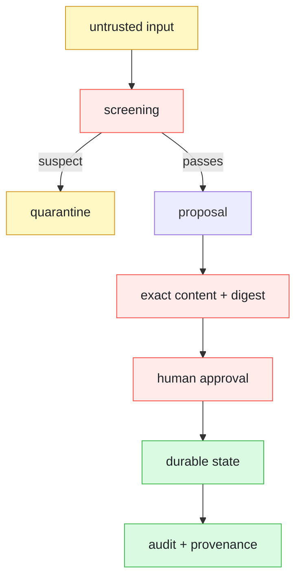
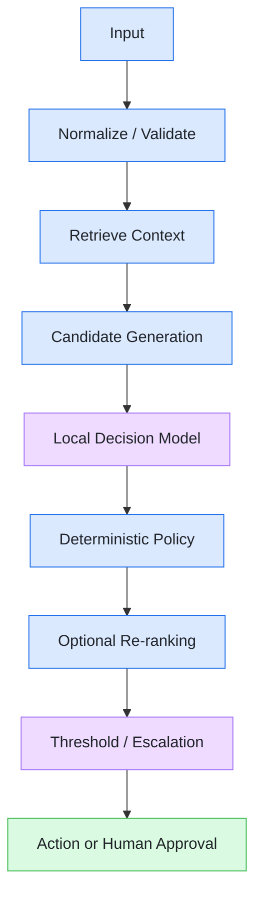

# Brain Server

**Governed, local-first memory and decision infrastructure for AI agents.**

Brain Server is a **self-hosted AI agent memory server** for systems where incorrect, poisoned, or unauthorized memory has real consequences.

It provides **deterministic hybrid retrieval, human-gated memory promotion, provenance, tamper-evident audit, quarantine, verifiable deletion, and least-privilege access** in a single Rust/Axum server.

> **No hosted memory service. No embedding API required. No LLM required in the hot recall path. No data leaves the system by default.**

<p align="center">

[](#)
[](https://markfietje.github.io/brain-server/)
[](#)
[](#)

</p>

<p align="center">

**Rust / Axum · SQLite · FTS5 · sqlite-vec · MCP · Tauri + SvelteKit · OpenClaw**

</p>


---

## Table of contents

- [Why Brain Server?](#why-brain-server)
- [What it provides](#what-it-provides)
- [Architecture](#architecture)
- [Governance model](#governance-model)
- [Local-first by default](#local-first-by-default)
- [Security model](#security-model)
- [Designed for reproducible agent systems](#designed-for-reproducible-agent-systems)
- [Decision and evaluation direction](#decision-and-evaluation-direction)
- [MCP](#mcp)
- [OpenClaw](#openclaw)
- [Who is it for?](#who-is-it-for)
- [Try Brain Server](#try-brain-server)
- [Build from source](#build-from-source)
- [CLI](#cli)
- [Verification and evidence](#verification-and-evidence)
- [Universal Memory Protocol](#universal-memory-protocol)
- [Compliance and regulated environments](#compliance-and-regulated-environments)
- [Documentation](#documentation)
- [Project principles](#project-principles)
- [What Brain Server is not](#what-brain-server-is-not)
- [License](#license)

---

## Why Brain Server?

AI agents increasingly depend on persistent memory: customer context, operational knowledge, decisions, preferences, case history, instructions, and facts collected over time.

That creates a security and governance problem.

- A wrong retrieval can produce a wrong answer.
- A poisoned memory can influence future behavior.
- An agent should not be able to silently turn untrusted content into permanent knowledge.

Brain Server is built around a simple principle:

> **Memory is governed state, not just retrieved text.**

The server is the authority for memory, retrieval, provenance, governance, workflow, and audit.

---

## What it provides

### Deterministic AI agent memory

Brain Server combines multiple retrieval signals without requiring an LLM in the hot recall path:

- **FTS5 full-text search**
- **Vector similarity**
- **Reciprocal rank fusion (RRF)**
- Provenance-bearing results
- Explicit retrieval and decision metadata

The retrieval pipeline is designed so that the same query against the same indexed state and configuration produces the same ordered result.

### Human-gated memory promotion

Agent-proposed knowledge is not automatically promoted to permanent memory.

A proposal is reviewed by a human and approved against the **SHA-256 `content_digest` of the exact bytes being promoted**.

If the content changes after review, the approval no longer matches and promotion fails.

> High-risk deployments can require multiple distinct approvers.

### Memory poisoning protection

Incoming content is screened before it becomes trusted searchable state.

Suspect content can be quarantined and excluded from:

- Vector retrieval
- Full-text retrieval
- Graph retrieval

Recalled content is explicitly represented as **untrusted data**, preventing stored instructions from silently becoming trusted agent instructions.

### Provenance and evidence verification

Recall results can include the evidence and provenance behind each result.

Brain Server also provides a direct verification path so a claim can be checked against stored evidence rather than delegated to an LLM.

```text
POST /verify
```

The goal is simple:

> **Show the evidence. Do not ask the model to invent the evidence.**

### Tamper-evident audit

Brain Server maintains an append-only keyed hash chain with a verifiable head.

The audit chain can be checked directly:

```text
GET /audit/verify
```

This makes later modification of recorded events detectable.

### Verifiable deletion

Data lifecycle operations are part of the system rather than an afterthought.

DSAR and purge operations can produce:

- Certificates
- Tombstones
- Auditable deletion events

Deletion therefore has a verifiable record.

### Least-privilege access

Agents and operators do not need the same authority.

Scoped principals can be restricted to capabilities such as:

- `recall`
- `store`
- `propose`

Operator credentials remain separate from agent credentials.

Revoked principals are refused immediately and cannot regain access simply by re-provisioning old credentials.

---

## Architecture

Brain Server is the **authoritative data and governance plane**.



The human-facing desktop client is a **Tauri + SvelteKit application** consuming the public server contract:



The client is deliberately **not a second backend**.

- It does not own the data plane, memory database, governance state, or authoritative business logic.
- The server remains fully usable without the GUI through its binary, HTTP API, MCP interface, CLI, and verification tooling.

---

## Governance model

Brain Server treats durable agent knowledge as a governed lifecycle:



The important boundary is that **agent capture and durable memory are different states**.

Human promotion is explicit and digest-bound.

---

## Local-first by default

Brain Server is designed to run under the customer's control.

The default local path does **not** require:

- A hosted memory provider
- A cloud account
- An embedding API
- An LLM for recall

Data remains in customer-controlled storage unless an explicitly configured integration sends it elsewhere.

This makes Brain Server suitable for:

- Self-hosted environments
- Private networks
- Sovereign deployments
- Restricted environments
- Edge devices
- Disconnected or tightly controlled systems

---

## Security model

Brain Server is designed around explicit trust boundaries.

Stored content is treated as **data, not trusted instructions**.

The security model addresses concerns including:

| Category | Concerns |
|---|---|
| Content | Memory poisoning, indirect prompt and instruction injection through stored content |
| Governance | Unauthorized memory promotion, privilege escalation |
| Evidence | Provenance loss, audit tampering |
| Access | Unauthorized retrieval |
| Lifecycle | Data-retention and deletion requirements |

See:

- [`SECURITY.md`](SECURITY.md)
- [`THREAT_MODEL.md`](THREAT_MODEL.md)
- [`COMPLIANCE.md`](COMPLIANCE.md)

---

## Designed for reproducible agent systems

Brain Server is **not** a general-purpose agent runtime.

It is infrastructure that agent systems can depend on for:

- Trusted memory
- Deterministic recall
- Governed writes
- Evidence verification
- Workflow state
- Provenance
- Audit

The architecture is designed to extend this same authority model into a governed decision layer, where retrieval, local decision models, deterministic policy, optional reranking, thresholds, escalation, and human approval can participate in one structured execution trace.

The rule remains:

> **Decision capabilities belong inside the governed server; the GUI exposes them but never becomes authoritative.**

---

## Decision and evaluation direction

The long-term architecture introduces a versioned decision pipeline while preserving the existing governance boundary:



Decision models remain **replaceable components behind a common contract**.

Possible local models include classifiers, scorers, rerankers, and specialized typed-decision models.

> [!NOTE]
> This architecture is intentionally future-facing; the current release remains focused on the governed memory and retrieval substrate.

---

## MCP

Brain Server exposes a governed MCP surface so agent systems can use the same memory backend without creating a second data or governance layer.

MCP is an **integration surface into Brain Server**, not an independent authority.

See the documentation for the current MCP protocol and capability surface.

---

## OpenClaw

Brain Server can be used as a governed memory backend for agentic coding environments and OpenClaw deployments.

The integration is intentionally thin: the agent uses Brain Server for memory and governance rather than bypassing the underlying controls.

---

## Who is it for?

Brain Server is designed for teams operating **long-lived AI agents** where memory quality, data control, provenance, and auditability matter.

| Sector | Teams |
|---|---|
| Regulated industries | Financial services, healthcare, legal, government |
| Operations | BPO and contact centers |
| Assurance | Security, compliance, and platform teams |
| Engineering | Agentic developer tools |
| Deployment | Private and edge AI deployments |

The core use case is simple:

> **When a wrong memory has a cost.**

---

## Try Brain Server

The fastest way to understand the system is the [Quickstart](https://markfietje.github.io/brain-server/quickstart.html).

It covers:

- Building from source
- Starting the server
- Health and statistics
- Ingestion
- The human-in-the-loop promotion gate
- Deterministic recall
- Provenance
- The `brain` CLI
- Persistent service deployment

For production deployment, see the [Deployment guide](https://markfietje.github.io/brain-server/deployment.html).

---

## Build from source

```bash
git clone https://github.com/markfietje/brain-server.git
cd brain-server

cargo build --release --features bench
./target/release/brain-server
```

| Setting | Default |
|---|---|
| Data path | `~/.openclaw/workspace/brain.db` (override: `BRAIN_DB_PATH`) |
| Bind address | `127.0.0.1:8765` (loopback) |

> [!IMPORTANT]
> The server refuses a public bind unless explicitly enabled.

---

## CLI

The `brain` CLI provides a terminal interface to the same backend:

```bash
./target/release/brain status
./target/release/brain query "your query" --k 3
./target/release/brain explain "your query"
./target/release/brain ingest-dir ./vault
```

---

## Verification and evidence

Brain Server is built around the principle that important claims should be reproducible.

The repository contains:

- Benchmark definitions and measured results
- Integration and conformance checks
- Security tests
- Audit-chain verification
- Deletion verification
- API contract definitions
- A public trust and proof map

Where a claim matters, the project aims to provide a path to verify it rather than relying on marketing language.

See:

- [`BENCHMARKS.md`](BENCHMARKS.md)
- [`API_CONTRACT.md`](API_CONTRACT.md)
- [`docs/trust/proof-map.md`](docs/trust/proof-map.md)

---

## Universal Memory Protocol

Brain Server includes a bounded implementation of **Universal Memory Protocol 1.0 (UMP)**, including its local integrity layer and portable memory bindings.

UMP support provides a standards-oriented path for moving governed memory records between compatible systems while retaining content integrity, capabilities, provenance, and audit semantics.

See the API contract and UMP documentation for the exact implemented surface.

---

## Compliance and regulated environments

Brain Server is designed for environments where organizations need stronger controls around persistent agent state.

The repository documents mappings and evidence for the frameworks buyers actually ask about:

### Management systems & assurance

| Framework | Where mapped |
|---|---|
| ISO/IEC 42001 (AI management systems) | [`COMPLIANCE.md`](COMPLIANCE.md) §6.1 |
| NIST AI RMF | [`COMPLIANCE.md`](COMPLIANCE.md) §6.1 |
| SOC 2 | [`COMPLIANCE.md`](COMPLIANCE.md) §6.1 + evidence kit |
| Intent-Based Auditing (4/4 pillars) | [`COMPLIANCE.md`](COMPLIANCE.md) §6.2 |

### Privacy & data protection

| Framework | Where mapped |
|---|---|
| GDPR (Regulation (EU) 2016/679) | [`COMPLIANCE.md`](COMPLIANCE.md) §4, §6.3 — DSAR Art 15/17/19, Art 22 trace, Art 30 RoPA |
| UK GDPR + ICO IDTA / Addendum | Cross-border transfer register ([`docs/README.md`](docs/README.md)) |
| CCPA / CPRA + California ADMT | [`COMPLIANCE.md`](COMPLIANCE.md) §6.3 |
| PH Data Privacy Act (RA 10173) + NPC | [`COMPLIANCE_PH.md`](COMPLIANCE_PH.md) |
| EU SCCs 2021, EU-U.S. DPF, CBPR, adequacy | Validated transfer register ([`COMPLIANCE.md`](COMPLIANCE.md) §6.3) |

### AI-specific regulation

| Framework | Where mapped |
|---|---|
| EU AI Act (Regulation (EU) 2024/1689) | [`COMPLIANCE.md`](COMPLIANCE.md) §3, §6.4, §6.6, §7 — Art 4 literacy, Art 12/26(6) logging, Art 50 `/.well-known/ai-notice` |
| EU Cyber Resilience Act (CRA) | SBOM + Art 14 reporting runbook ([`docs/cra.md`](docs/cra.md)) |
| OWASP Agentic ASI06 (memory poisoning) | [`COMPLIANCE.md`](COMPLIANCE.md) §6.5 |
| EU CoE CETS 225 (AI Framework Convention) | [`docs/compliance.md`](docs/compliance.md) |

### Sector & regulated buyers

| Framework | Where mapped |
|---|---|
| **HIPAA** (45 CFR Part 164 — Security Rule + §164.502(g)) | [`COMPLIANCE.md`](COMPLIANCE.md) §10.1 — access, audit, integrity, minimum-necessary, PHI tokenization, legal hold, retention report |
| SOX (17 CFR §229 / PCAOB AS 2201) | [`COMPLIANCE.md`](COMPLIANCE.md) §10.2 |
| FedRAMP / FISMA (NIST 800-53 posture) | [`COMPLIANCE.md`](COMPLIANCE.md) §10.3 |
| US 50-state AI statutes (TX TRAIGA, CA/CO ADMT, NYC LL144, …) | [`COMPLIANCE.md`](COMPLIANCE.md) §11 + [`docs/US_STATE_MAP.md`](docs/US_STATE_MAP.md) |
| COPC R8.0 / ISO 18295-1 / ISO 10002–10003 (contact centre) | [`COMPLIANCE.md`](COMPLIANCE.md) §6.7 |

> [!WARNING]
> These mappings describe how the implementation addresses relevant controls; they are **not** a claim of third-party certification. ISO/IEC 42001 and SOC 2 attestation are organization-level audits outside this repository. PCI DSS is an **explicit non-scope** (payment-card data is never ingested — see [`THREAT_MODEL.md`](THREAT_MODEL.md) §6).

See the full row-by-row control maps in [`COMPLIANCE.md`](COMPLIANCE.md) and the trust/proof map in [`docs/trust/proof-map.md`](docs/trust/proof-map.md).

---

## Documentation

| Topic | Resource |
|---|---|
| Documentation | [brain-server docs](https://markfietje.github.io/brain-server/) |
| Quickstart | [Get started](https://markfietje.github.io/brain-server/quickstart.html) |
| Deployment | [Deployment guide](https://markfietje.github.io/brain-server/deployment.html) |
| API | `GET /openapi.yaml` and [`API_CONTRACT.md`](API_CONTRACT.md) |
| Security | [`SECURITY.md`](SECURITY.md) |
| Threat model | [`THREAT_MODEL.md`](THREAT_MODEL.md) |
| Compliance | [`COMPLIANCE.md`](COMPLIANCE.md) |
| Trust / proof map | [`docs/trust/proof-map.md`](docs/trust/proof-map.md) |

---

## Project principles

Brain Server is built around a small set of non-negotiable principles:

1. **The server is the authority.**
2. **Agent-proposed durable knowledge requires human approval.**
3. **Approval is bound to the exact content reviewed.**
4. **Untrusted memory remains untrusted.**
5. **Recall should be reproducible.**
6. **Audit history should be tamper-evident.**
7. **Deletion should be verifiable.**
8. **The default path should not require a cloud memory service.**
9. **The server must remain useful without a GUI.**

---

## What Brain Server is not

Brain Server is **not**:

- A chatbot
- A general-purpose agent framework
- A hosted cloud memory service
- An LLM
- A generic RAG library
- A second agent runtime

It is **infrastructure for governed, reproducible AI-agent memory and decision systems**.

---

## License

Brain Server is released under the [MIT License](LICENSE).

Copyright © 2026 Mark Fietje.
