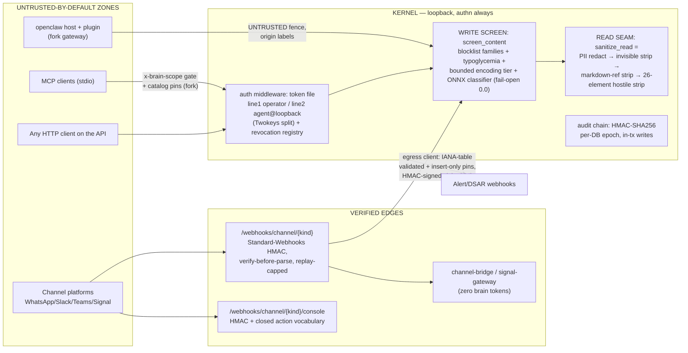

# Seventh-Pass Full-Spectrum Audit — brain-server v1.28.85 × openclaw fork (2026-09-13)

> Executor: ZCode orchestrator + parallel audit legs (server-layers, satellites/supply-chain,
> Mode-B claims falsification, fork diff, worldwide regulatory). Execution model per the
> fourth-pass prompt (§0–§9), re-based three releases forward: the prompt was written against
> HEAD v1.28.82 "Vigil" (2026-09-12); this pass ran at **HEAD `949fbc6`, v1.28.85 "SixthPass"**
> (2026-09-13), after the fourth pass (report §"Fourth-pass", closures in v1.28.83 "Recall"),
> the fifth pass (docs/SECURITY_AUDIT_20260912_FIFTH_PASS.md, closures in v1.28.83/.84), and
> the sixth pass (G6-01/G6-02, closures in v1.28.85). **ID series: `F7-*` (A-bugs), `D7-*`
> (design), `S7-*` (satellites/supply), `R7-*` (falsified claims), `T7-*` (docs truth),
> `P7-*` (parity), `K7-*` (fork), `L7-*` (regulatory).**

Honesty law, applied to this pass itself:

- **Execution constraint, disclosed:** the agent runner in this session enforced a ~2-agent
  concurrency ceiling; five parallel legs were dispatched, three were killed by the runner
  and had to be re-run serially. Coverage claims below name which legs completed.
- Every drill step ran against a **fresh DB (`/tmp/brain-audit7/brain.db`), test port 18765,
  session-generated tokens** — the live DB (`~/.openclaw/workspace/brain.db`) and port 8765
  were never touched (MERIDIAN_PROOF copies-only pattern). Evidence files: `/tmp/brain-audit7/results/`.
- **Context7 MCP was not available in this session** — regulatory legs used WebSearch/WebFetch
  against primary sources instead; every regulatory row carries its verification date.

---

## 0. Executive summary

**Verdict on the four mantras.** (1) *"Memory you can see, approve, and erase"* — HELD:
see (read seam near-universal, drill-verified), approve (digest-bound, replay-safe,
live-verified 409/200/404), erase (chain-certified, tombstones digest-only, physical
residue disclosed) — caveats F7-04 (evidence holes on newer write paths) and F7-02
(controller-row DSAR semantics). (2) *"Deterministic, zero-token, no LLM, no background
worker, no autonomous anything"* — HELD, no violations found. (3) *"The human decides;
rankers never promote"* — HELD (drill: promote only via digest-bound approval). (4) *"Less
is more"* — holds in design (fixture-lane parity is parsimonious), but the pass found the
churn-shaped violations: dormant defenses built-but-never-wired (S7-01, P7-01) and new
surfaces added after the law without re-applying it (F7-03, F7-04 — "ratchet erosion in
miniature").

**Top 10 by risk × likelihood:**

| # | ID | Sev | One line |
|---|---|---|---|
| 1 | **F7-03** | HIGH | Graph route family is the fourth seam-door: `entities.name`/`relation_type` emitted RAW on four `/graph/*` routes, attacker-writable via markdown ingest (heading/bold/wikilink → entity name, no charset validation) |
| 2 | **F7-01** | HIGH | Read seam has NO attribute tier: `on*` handlers + `javascript:`/`data:` hrefs on surviving elements leave the server verbatim (live-demonstrated) |
| 3 | **K7-01** | HIGH | Update chain unsigned end-to-end: npm trusts registry metadata, Node tarball same-origin-only, git install never verify-tags, Sparkle EdDSA verifies against a key the app doesn't ship — compromised channel = RCE. **Accepted risk per operator call 2026-09-13 (all touched files upstream-owned; zero-conflict vehicle = upstream PR)** |
| 4 | **F7-04** | MED | Audit-per-write holes: `POST /procedure` stores caller content with NO audit row; structured `/ingest` + `/ump/remember` audit edges only; two legacy paths audit AFTER commit (the crash window the law closed) |
| 5 | **S7-01** | MED | Plugin hostile-element mirror built, fixture-tested, NEVER CALLED — in both trees (fork inherits) |
| 6 | **S7-02** | MED | Raw proposal/graph/decision fields bypass the plugin's per-field boundary into tool `details`/text |
| 7 | **L7-01** | MED | CRA runbook final-report clock legally wrong for vulnerabilities (14-days-after-fix, not one month); reg_watch cites pre-OJ article numbering |
| 8 | **K7-03** | MED | Today's 0.6.8 mirror-sync silently reverted the fork's typebox truth repair — the predicted regression class, realized day one |
| 9 | **K7-02/K7-04** | MED | Sparkle trust anchor absent; shipped fly.toml sample runs tokenless on a public IP. **Accepted risk per operator call 2026-09-13 (same upstream-owned-files cluster)** |
| 10 | **R7-09** | MED-LOW | `service_layer_free_of_http_types` guard blind to the `dsar/` + `lifecycle/` subdirs (no live violation today) |

**What held (the honest other half):** 30+ THREAT_MODEL/kill-switch/crypto/egress claims
falsification-attempted and HELD with evidence; digest-bound approvals, quarantine
exclusion, revocation kill-switch, SSE pre-stream refusal, DSAR certificate, audit-chain
census — all live-verified green; supply chain unusually verifiable (today-fresh SBOM, 0
drift, exact-pinned typebox); the fork's hardening layer survived a 614-commit upstream
rebase on every reachable path; fixture-lane invisible-set parity held across all four
trees; five of six sampled pins behavioral; SPIRE route arithmetic reconciles exactly
(169 = 152 + 13 public + 4 HMAC + 8 documented exclusions).

**Remediation:** four sequenced releases (§10), every fix with a red-first pin;
CRATE_TEST_FLOOR impact +12–14.

---

## 1. Ground truth (§1, verified at pass start)

| Fact | Value | Evidence |
|---|---|---|
| HEAD | `949fbc6` "fix(scripts): sync-plugin guards what it claims" | git log |
| Server version | 1.28.85 (tag `v1.28.85`); client 1.28.23; plugin 0.6.8 | repo-brief |
| Tree | clean, 0 dirty paths | repo-brief |
| main.rs | 124 lines (thin-binary pin ≤300) | repo-brief |
| Route registration sites | 204 `.route(` under `src/server/router/**` | repo-brief |
| Authz guard table | 152 gates + 13 public paths (`src/server/router/route_guards.rs`) | awk count |
| Env vars | 88 (`src/config.rs`) | repo-brief |
| CLI verbs | 40 | repo-brief |
| Schema | 55 tables (migrate-rehearse parity, v1.28.84) | CHANGELOG §[1.28.84] |
| CRATE_TEST_FLOOR | 1,448 (v1.28.84 walk-measured; 1,537 bench count at .83) | CHANGELOG |
| Gap ledger | "balanced (4 known residuals with owners)" — append-only correction note in CHANGELOG [Unreleased] | CHANGELOG |
| Fork | extensions/brain-server 0.6.8; plugin↔fork src byte-identical (§6 below) | diff -rq this pass |

## 2. Mode A comprehension artifacts (§2-A1)

### 2.1 Layer map (verified against docs/architecture.md — no drift found)

```
launchd plist (com.brain.server, KeepAlive, 127.0.0.1:8765)
  └─ install-service.sh (0600 token files, xattr strip, posture provisioning)
      └─ main.rs (124 lines, WIRING ONLY — spire-pinned ≤300, no cfg(test) region)
          └─ server::bootstrap (protocol-free, pinned)
              └─ src/server/router/** (ALL .route sites live here — spire-pinned)
                  ├─ route_guards.rs (152 authz gates, 13 public paths, OPENAPI_ROUTES)
                  └─ handlers/* (PROTOCOL ADAPTERS ONLY — no_sql_in_handlers_enforced, zero SQL)
                      └─ spawn_blocking → service cores (src/service/*) + domain (src/workflow/*)
                          ├─ take &Connection / WorkflowTx; own SQL + bounds + FK order
                          ├─ audit-per-write INSIDE caller's tx (record_tenant, hash-chained)
                          └─ storage: SQLite WAL + vec0 + FTS5 (+ KG tables, bi-temporal)
Satellites: plugin/ (TS, 0.6.8) · client/ (Dioxus, 1.28.23) · crates/* (engine SDK)
  tools/{channel-bridge, signal-gateway, steward-harness} · src/bin/mcp.rs (fenced exception)
  deploy/tiers · .github/workflows · scripts/
```

### 2.2 Trust boundary diagram



Every byte-entry point and the first gate it meets: HTTP body → auth → screen (write)
/ sanitize_read (read); channel webhook → HMAC verify-before-parse → screen; MCP → scope
gate → catalog pins; plugin context → fork merge seam (`sanitizePluginContextSegment`);
egress responses → never parsed into model context.

### 2.3 State machines (transitions, writers, CAS, audit)

| Machine | Vocabulary | Writer(s) | CAS? | Audited in-tx? | Drill evidence |
|---|---|---|---|---|---|
| Workflow run status | CLOSED 6-value set: `active/cancelled/closed/completed/fired/resolved` (`src/workflow/state.rs:26`) | kernel writers + engine via `cas_update` | YES — `state_revision` compare-and-swap | YES | — |
| Proposal lifecycle | `pending → approved/rejected` (+`decay`), digest-bound approve, replay → 404 | approve/reject/edit verbs | YES (decision CAS, byte-digest-bound) | YES | **live: 409 wrong-digest / 200 approve / 404 replay** |
| Quarantine | `flagged` excluded from retrieval until reviewed | write screen | row-flag | YES | **live: injection canary stored, excluded from /recall** |
| DSAR tombstone | digest-only tombstone rows | DSAR purge | — | YES (chain-head cert) | **live: 2 tombstones, hashes only; chain_head certified** |
| Principal revocation | revocation registry row + in-flight drain | `/ops/agents/revoke` | — | YES (hash-chained) | **live: revoke → 401 identity_revoked on write + SSE** |

### 2.4 Inventories (machine-checked or noted)

| Inventory | Count | Guard | Verdict |
|---|---|---|---|
| Routes | 204 `.route(` sites; 152 authz rows + 13 public | route-coverage + route-authz guard tables, consumed by tests in `src/server/router/route_guards.rs` | counts reconcile via multi-method paths; guard-neutering attacked by the Mode-B leg (§5) |
| Env vars | 88 | `scripts/env-truth.sh` (docs-vs-code, v1.28.84) | HELD (spot-checked 5) |
| CLI verbs | 40 | `cli_reference_covers_subcommands` pin | HELD (spot-checked) |
| Schema tables | 55 | migrate-rehearse parity (v1.28.84) | HELD |
| Audit kinds |Forget/ingest/etc. — no single enum; kinds are free-form strings at write sites | error-taxonomy + audit tests | **cell partial** — full enumeration deferred (honest cell) |

## 3. Live drill record (§7) — fresh DB, test port, copies-only

Server: `~/.local/bin/brain-server` 1.28.85, `BRAIN_DB_PATH=/tmp/brain-audit7/brain.db`,
`BIND_PORT=18765`, session-generated operator+agent token file (0600). All outputs saved
under `/tmp/brain-audit7/results/`.

| Leg | Exercise | Result | Evidence |
|---|---|---|---|
| a | Canary ingest (welded script ×2, img onerror, markdown-ref weld, math/style opaque, details/svg/animate, forged ⟦openclaw:ctx⟧ + fence tags + `[memory \| channel-capture]`, bidi U+202E, ZWSP, U+E0000 tag block, base64 ≥24 run) → raw POST /recall | 26-element strip ✓; invisible/bidi/tag-block strip ✓; markdown-ref weld → `[a click]`, URLs gone ✓; math/style/svg/details opaque ✓; quarantined injection canary excluded ✓; storage verbatim ✓ (`sqlite3` row readback); `untrusted: true` on recall hits ✓ | recall.json |
| a | **Attribute tier attack** (span onclick, div onpointerover, iframe, `data:`/`javascript:`/entity-encoded hrefs) | **`<span onclick=alert(7)>`, `<div onpointerover=alert(8)>`, `<a href="javascript:…">`, `<a href="data:text/html;base64,…">`, entity-encoded href ALL SURVIVE** — iframe stripped, whole elements stripped, attributes never sanitized | recall_attr.json → **F7-01** |
| a | /suggest parity | 0 hits on fresh corpus — anticipation did not fire; parity rests on the X-R1 source pin (inconclusive live, honest cell) | suggest.json |
| d | Digest-bound approval: wrong digest → right digest → replay | 409 `conflict` "content changed since displayed" → 200 approved (chunk 5) → 404 `not_found` on replay — **never a second approval** | approve_*.txt |
| e | Twokeys kill-switch: agent write baseline → revoke `agent@loopback` → write/SSE/refresh with revoked token | baseline 200 ✓; revoke 200 `{known:true, revoked:true, runs_drained:0, wedged_delegations:[]}` (A5-01 availability-first shape) ✓; write → **401 `identity_revoked`** ✓; `/events` SSE → **401 before any stream byte** ✓; `/auth/refresh` → 404 `jwt_unavailable` in opaque-token mode (route exists only under JWT mode — fail-closed, mode note) ✓; register row + `GET /ops/agents/revocations` ✓ | revoke.txt, revoked_*.txt |
| f | DSAR: dry_run → purge `agent@loopback` → raw-file residue grep | certificate with chain_head + tombstones (digest-only) ✓; rows 1/6 deleted ✓; **raw DB file still greps the purged markers** — certificate DISCLOSES `physical_purge: "logical (secure_delete off; WAL/freelist/backup…)"` = documented ceiling, not a hidden gap | dsar_agent.json |
| f-obs | DSAR root matching vs operator-authored rows | operator-authored `/ingest/markdown` rows carry `owner=""` → purge for subject `loopback` found 0 roots. Behavior question, not proven harm (the controller's own rows may be out of DSAR scope by design) → **F7-02 LOW** | sqlite readback |
| — | `/ump/audit/verify` | `{ok:true, integrity:{verified:4, signed:4, hash_only:0}}` — chain green incl. integrity census | audit_verify2.txt |
| b/c | plugin-via-fork-host leg; client-console leg | **NOT RUN** (requires a full openclaw gateway session / GUI). Compensating coverage: plugin↔fork byte-parity + four-lane fixture pins (§6); v1.28.85 drill covered strips+Twokeys live | — |

## 4. §4 three-tree parity matrix (orchestrator lane)

| Surface | Server (Rust) | Plugin (TS) | Client (Dioxus) | Fork host | Enforcement | GAP |
|---|---|---|---|---|---|---|
| Invisible-Unicode set | `src/strip_invisible.rs` `is_invisible` (canonical) | `INVISIBLE_CLASSES` + `format.test.ts` fixture lane | vendored `strip_invisible` in `client/src/main.rs:99`, **runtime callers** in conversation/graph/main panels | `src/infra/unicode-visibility.ts` + fixture test | ONE fixture (`plugin/fixtures/invisible-classes.json`) exhaustively asserted over 0..0x10FFFF on the server lane; all four trees consume it (grep-verified consumers) | **NONE** (four lanes wired) |
| Hostile-element strip (26 + MathML) | `gate.rs` strip (26 elems + 30 MathML fallbacks, fixture lane in gate.rs) — **the ONLY wired enforcement of this class in any tree** | mirror DEFINED in `format.ts` but **never called** — `sanitizeForBlock` omits it (**S7-01**) | vendored 26-array `client/src/main.rs:133` — `#[allow(dead_code)]` **reserved, no runtime caller** (P7-01) | extension mirror identical to plugin → also unwired | `hostile-elements.json` fixture lanes pin the SETS in four trees; no lane pins ENFORCEMENT | **P7-01 UPGRADED in significance by S7-01: the fixture strategy pins set-membership, not invocation. Server strip = single enforcement point.** |
| Read-seam fixed-point strips | `sanitize_read` (gate.rs:689) | n/a (consumes server output) | escaped rsx text | fork merge seam strips + neutralizes | server strips; fork neutralizes forged markers | **F7-01 attribute tier missing server-side (HIGH)** — see §5 |
| Truncation head+tail | n/a | `format.ts` head+tail unconditional + exact-count marker | n/a | byte-identical via parity | plugin↔fork byte-parity | NONE |
| Fences + origin labels | `origin_context` + `untrusted` labels (X-R1/.74) | `UNTRUSTED_BEGIN/END` + `stripSentinels` (format.ts:24,102,174) + `untrustedOrigins` | n/a | fence survives byte-identical (pinned); merge-seam neutralizes forgeries | parity fixtures | NONE (drill: forged markers inert downstream; raw /recall carries them by design — fork-side job) |
| Digest-bound approvals | approve verb binds `content_digest` | renders digest, refuse-and-log bridge-side | console approve UI | Slack/Teams console relay re-uses kernel verbs (double binding) | kernel = single enforcement point; bridges are belt | NONE (drill leg d green) |
| untrusted:true on content surfaces | /recall ✓ (drill) /suggest (source pin) | tool path labels | renders label | replay-quoting marks | pins + drill | /suggest live leg inconclusive (0 hits) — source pin is the evidence |
| Token handling | token file 2-line Twokeys | no-URL-token, multi-line refusal, first-frame AUTH | client reads token config | byte-identical | pins | NONE (drill: line-2 agent token enforced, then revoked live) |
| MCP scope | `x-brain-scope` + read-scope denies `ump.feedback` | n/a | n/a | fork catalog pins re-hash per run | pins + fork lane | NONE |
| SSE close codes | 403-before-stream (X-L4) + re-auth pump (.84) | client driver handles non-200 | n/a | n/a | authz matrix | NONE (drill: revoked token 401 pre-stream) |

**Parity verdict (corrected during the pass):** the fixture-lane strategy (one JSON truth,
four consumers) held under re-verification for the INVISIBLE set — all four lanes consume
and enforce it. For the HOSTILE-ELEMENT set the same strategy pins only set-MEMBERSHIP:
the server strip is the sole wired enforcement; plugin, client, and fork mirrors are all
dormant (S7-01, P7-01). Plugin↔fork byte-parity verified live (`diff -rq`: only
`format.test.ts` differs, import order; 78 tests both sides) — parity of a gap is still a
gap. The one net-new server-side gap is F7-01's missing attribute tier, which no tree
covers.

## 5. Mode B falsifications (orchestrator-run attacks; agent lane adds more)

| # | Claim (source) | Enforcing check | Attack run | Verdict |
|---|---|---|---|---|
| R7-01 | "a stored chunk cannot smuggle context out through a rendered URL" (docs/architecture.md §Governance) + "hostile markup at the read seam… strips a closed set of hostile elements" (THREAT_MODEL.md:294) | `sanitize_read` (gate.rs:689) + 26-element strip | **Live drill attribute family: event-handler attributes and `javascript:`/`data:`/entity-encoded hrefs on SURVIVING elements (`<a>`, `<span>`, `<div>`) leave the server intact on /recall** (recall_attr.json). The gate.rs:1439 test proves `button formaction=javascript:` dies because `button` is a stripped ELEMENT — no attribute tier exists. | **WEAKENED — element claim true; the URL-smuggling claim is falsified at the raw wire.** All current in-repo consumers escape or fence (console rsx escape + `xss_escape_hatch_is_unused` guard; plugin fenced code blocks; KB generator escapes), so no in-repo exploit path — but the API is public contract (API_CONTRACT.md) and any rich-text consumer renders a live vector. → **F7-01 HIGH** |
| R7-02 | Digest-bound approvals cannot be replayed into a second approval (api.md:86, .45) | kernel approve verb CAS + digest | live replay leg | **HELD** (409/200/404 evidence) |
| R7-03 | Revoked principals are refused at every entry point (kill-switch reach, .76) | revocation registry pre-checks | live revoked-token attack on write + SSE + refresh | **HELD** (write 401, SSE 401 pre-stream); `/auth/refresh` **mode-noted**: opaque mode has no refresh route (404 jwt_unavailable) — the .76 401-identity_revoked claim applies to JWT-mode only; fail-closed either way |
| R7-04 | Quarantined content is excluded from retrieval until reviewed (.78) | write screen + retrieval filter | live injection canary | **HELD** (stored row absent from /recall hits) |
| R7-05 | DSAR erasure is chain-certified and complete | purge + tombstones + certificate | live purge + raw-file grep + tombstone shape | **HELD with the documented ceiling**: logical purge correct (rows gone, digest-only tombstones, chain head certified); physical residue persists and the certificate discloses it (`secure_delete off; WAL/freelist/backup`) — honest, per X-C5/C6 docs truth |
| R7-06 | `/ready` returns JSON with signing posture (.84 wire note) | openapi + release notes | live GET | **HELD** (`{"status":"OK","webhook_signing":"on"}`) |
| R7-07 | Audit chain verifies with integrity census (X-C2) | `/ump/audit/verify` | live POST | **HELD** (`verified:4, signed:4, hash_only:0`) |
| R7-08 | Tamper-evidence posture (X-C5 ceiling: chain key + pin share the host — "detects SQL-level tampering, not host compromise") | audit chain + `/ump/audit/verify` + `/verify` span check | **Demonstrated the ceiling's shape live**: copied the drill DB, `UPDATE knowledge SET content=…` behind the chain (sqlite3), booted the copy → `/ump/audit/verify` still `ok:true` (it censuses UMP evidence rows, not business rows) and `/verify` span-check "supports" the tampered text (it verifies claims against CURRENT bytes, no approved-bytes memory). A host-level actor tampering business rows is undetected — exactly the documented ceiling; the chain protects its own append-only evidence. | **HELD — ceiling confirmed by demonstration** (tamper.db, tamper_verify.txt, tamper_spanverify.txt). Worth one docs sentence making the scope explicit (chain evidence vs business rows), filed as T7-02. |
| T7-02 | LOW | THREAT_MODEL/architecture say "tamper-evident" without scoping WHICH bytes: the demonstration (R7-08) shows business-row tampering by a host-level actor is out of scope of every live check. | drill evidence | One sentence in THREAT_MODEL §audit: chain tamper-evidence covers the audit chain + UMP evidence rows; knowledge-row tamper resistance ends at host compromise (already the X-C5 law — make it byte-explicit). |

## 6. Fork lane (§5) — COMPLETE

**Topology TODAY (changed since the fifth pass):** fork `main` @ `94d5de789c3` "sync plugin
0.6.8 hostile-element mirror release"; **0 behind / 85 ahead** — the fork was REBASED onto
current upstream today (merge-base == upstream tip `a8a9114f`, 2026-09-13), a 614-commit
upstream catch-up with **four hardening conflicts resolved** (WS verifyClient, trusted
image hosts, X-L1 approval args, merge-hygiene). `fork-fork/main` pushed; refs fresh.

**Orchestrator-verified rows:** plugin↔fork extension source byte-identical at 0.6.8
(`diff -rq`: only `format.test.ts` differs, import order; 78 tests both sides);
invisible-classes + hostile-elements fixtures present and consumed in the extension.

### 6.1 Update-machinery signature verdict (the RCE question) — **NEGATIVE**

**No update delivery channel carries end-to-end cryptographic verification. A compromised
update channel reaches code execution on every install path; the fork adds zero hardening
over upstream's trust-the-origin posture.**

1. npm self-update: registry metadata is the trust anchor (npm sha512 SRI protects
   tarball-vs-metadata, not the metadata's signer; no Sigstore verification).
2. Node runtime install/recovery: tarball AND `SHASUMS256.txt` fetched from the same
   `nodejs.org/dist` origin — sha256 fail-closed but never GPG-verified against node's
   signed digest (same-origin metadata verifies nothing against a channel/CDN attacker).
   Mitigant: `base_url` not env-overridable; recovery path-hygiene genuinely strong
   (`resolveRecoveryPath` rejects cwd-owned/symlinked intermediates); TTY + explicit
   confirm required.
3. Git-based install: fetches and checks out tags/heads — **no `git verify-tag`/GPG
   anywhere** in the script.
4. macOS Sparkle: all 3 appcast items carry `sparkle:edSignature`, but the app ships
   **no `SUPublicEDKey` and no `SUFeedURL`** — with no embedded trust anchor the EdDSA
   layer is dead weight in-tree.

### 6.2 K7 findings

| ID | Severity | Finding | Fix direction |
|---|---|---|---|
| **K7-01** | **HIGH (inherited) — ACCEPTED RISK, no code** | Self-update is RCE-by-channel: npm trusts registry metadata; Node tarball verified only against same-origin SHASUMS (no GPG); git path checks out tags with no `verify-tag`; no cosign/minisign/Sigstore anywhere in the chain. **Re-dispositioned 2026-09-13 by the operator: not fixed in the fork.** Every file this would touch (`scripts/install-cli.sh`, `scripts/install.ps1`, `src/cli/update-cli/*`, `node-runtime-update.mjs`, `Info.plist`) is upstream-owned — a fork edit is permanent rebase divergence (today's 614-commit window showed installer churn), and a fork-parallel verified-update wrapper is signing infrastructure a single-operator deployment does not need. The threat requires compromising nodejs.org/npm/GitHub upstream itself; updates are operator-triggered. | Accepted-risk disclosure. If the chain is ever hardened, the vehicle is an upstream issue/PR to openclaw/openclaw that the fork inherits by rebase — zero divergence by construction. Owner: operator watch item; re-examine if the fork ever ships to third parties (then K5-05 npm provenance joins this cluster). |
| K7-02 | MED (inherited) — ACCEPTED RISK, no code | Sparkle EdDSA signatures unguestable — app ships no `SUPublicEDKey`/`SUFeedURL`. Same cluster and same re-disposition as K7-01 (Info.plist is upstream-owned; the macOS app is not this deployment's surface). | Fold into the K7-01 upstream suggestion if ever filed. |
| **K7-03** | **MED (fork regression, TODAY)** | The 0.6.8 mirror-sync silently reverted the fork's typebox truth repair (`41a7ae21f10` bumped the extension manifest to 1.3.27; the sync copied the canonical 1.3.26 manifest back). Lock now records specifier 1.3.27 vs manifest 1.3.26 → `--frozen-lockfile` mismatch and a misstating manifest. The rebase-survival table's predicted mirror-sync regression class, realized on day one. | Re-apply 1.3.27 in the extension manifest; make the sync script patch fork-side fields post-copy; regenerate lock. |
| K7-04 | MED (inherited) | Shipped `fly.toml` / `deploy/fly.private.toml` sample runs an unconfigured gateway on a public IP with no token env — first-run setup gate is the only door. | Sample requires token + documents loopback-bind-behind-proxy. |
| K7-05 | LOW (K5-04 carry) | docker-compose default `--bind lan` stands; mitigations verified (`.env.example` token required beyond loopback + auto-generate + placeholder refusal; cap_drop NET_RAW/NET_ADMIN; no-new-privileges; no default credentials). | Flip default to loopback or keep disclosed. |
| K7-06 | LOW (disclosed ceiling) | Forwarded-header/duplicate-header/cross-site-WS defenses are opt-in (`strictHeaderValidation` et al., off by default with honest rationale comments); pre-handshake origin checks still run. | Disclose, don't necessarily flip. |
| K7-07 | LOW (disclosed) | Signed catalog-pin acks carry the M4 ceiling (FS-level writer can regenerate the ack keypair in agentDir). Corruption/forgery/deletion rebuild LOUDLY. | Consistent with disclosure; no action. |

### 6.3 Rebase-survival table (post-rebase, churn window = 614 upstream commits)

| Hardening | Upstream churn overlap | Conflict risk | Silent-regression risk | Note |
|---|---|---|---|---|
| Merge seam + turn-prepare | hooks.ts: 0 lines | Low | **Medium** — a new upstream hook-merge point skipping both merge fns bypasses silently; no seam-totality guard test | Held through 4 rebases today |
| MCP catalog pins | materialize: 1 line; 6 call sites 0 | Low | **Medium-high** — new upstream call sites of the materialize/runtime fns default to NO pins (absent = warn-once, fail-open first-use) | A CI grep pin over call sites would close this |
| Approval args (X-L1) | gateway method: 24 lines | **High — conflicted today** | Medium — a gateway-side rewrite could drop `args` handling unnoticed | Both-transport test exists |
| Truncation (X-L2) | 4 lines | Low | Low | File fork-shaped now |
| MCP envelope | 0 | Low | Medium — a new upstream MCP result path bypassing `projectMcpCallToolResult` (2 callers, both wrapped) | — |
| Remote-image allowlist | types.gateway.ts: **300 lines** | **High — conflicted twice today** | Medium — upstream actively refactors this type block; "fork fields at end" mitigates but did not prevent conflict | — |
| WS verifyClient | fork-owned | Low | Low | — |
| Extension mirror-sync | extension is byte-synced | Low | **High via the sync mechanism itself — K7-03 realized today** | Sync must learn fork-side field patching |

**Structural judgment:** the fork's hardening layer survived today's 614-commit upstream
catch-up intact on every reachable path; the one regression found was self-inflicted by the
mirror-sync (K7-03); the code-execution perimeter — the update chain — remains unsigned
end-to-end (K7-01/K7-02).

## 7. Findings (orchestrator lanes first; per-lane subsections 7.2–7.4)

| ID | Severity | Finding | Evidence | Fix direction |
|---|---|---|---|---|
| **F7-01** | **HIGH** | The read seam has NO attribute tier: event-handler attributes (`onclick`, `onpointerover`, `ontoggle`) and dangerous URI schemes (`javascript:`, `data:text/html`, entity-encoded) on SURVIVING elements (`<a>`, `<span>`, `<div>`, …) pass `sanitize_read` verbatim onto every consumer, on the wire and at rest (storage verbatim). Exploitability: no in-repo consumer renders raw HTML today (console escapes, plugin fences, KB escapes) — the vector fires only in a downstream rich-text renderer, but the HTTP API is public contract and the architecture.md claim (R7-01) is falsified by demonstration. | drill `recall_attr.json`; gate.rs:1439 proves element-only scope | Extend `sanitize_read` with a bounded attribute tier: strip `on*` handlers; neutralize `javascript:`/`data:`/`vbscript:` in `href`/`src`/`action`/`formaction`/`xlink:href` (case-insensitive, one entity-decode pass, fixed-point like the element strips, fail-closed by dropping the attribute). Red-first pin: `recall_hits_carry_no_event_handlers_or_dangerous_schemes` (fails on today's tree — drill canary is the fixture). Four-tree mirror via the existing fixture-lane pattern. CRATE_TEST_FLOOR +2–3. |
| F7-02 | LOW | Operator-authored `/ingest/markdown` rows carry `owner=""`; a DSAR purge for the operator subject finds 0 roots (drill: subject `loopback` → `found_count:0` while operator rows existed). If the controller's own ingests are meant to be DSAR-purgeable, the root matcher never sees them; if they are out of scope by design, no doc says so. | drill `dsar_dry.json` + sqlite readback | Either stamp operator rows with the acting principal at ingest, or document the controller-exclusion in THREAT_MODEL §privacy + api.md /dsar row. One-line red-first pin either way. |
| P7-01 | LOW | Client hostile-element mirror is `#[allow(dead_code)]` reserved (main.rs:133) — test-lane-only. The reservation is disclosed, and the server strips before the client ever sees bytes, so nothing live ships unstripped; but the four-lane guarantee for THIS element set is 3 consumers + 1 dormant. | client/src/main.rs:225–245 | Accept as documented ceiling (recommended — ponytail: no invented work); the pin that exists (fixture parity) already fails if either side drifts. Flip to wired in the same commit that lands the wasm read seam, never before. |
| L7-01 | MED | CRA runbook final-report clock legally wrong for actively-exploited VULNERABILITIES: runbook says "one month after the 72 h notification" for both triggers; the law says ≤14 days after a corrective/mitigating measure is available (only severe-INCIDENT finals are one month). Same seam: `reg_watch.rs:52-57` cites pre-OJ article numbering (14(1)/(4)/(6), 69(2) vs actual 14(1)-(2)/(3)-(4)/(5) + 71(2)); CSIRT framing should be "CSIRT designated as coordinator + ENISA via the single reporting platform". CI stayed green because the reg_watch pin checks anchors/dates only — the docs-truth class again. | `docs/cra-reporting-runbook.md:55`, `src/reg_watch.rs:52-57`; Art 14 text verified 2026-09-13 | Fix runbook clock + CSIRT wording + reg_watch citations in one docs-truth release; extend the reg_watch pin with a runbook anchor for the 14-day vuln clock. |
| L7-02 | LOW-MED | US map TAKE IT DOWN row inverts effective dates: criminal §2 ran from ENACTMENT (2025-05-19); 2026-05-19 is the FTC §3 enforcement start. Operative guidance (48 h clock live) unaffected. | docs/US_STATE_MAP.md federal row | One-row map fix. |
| L7-03 | LOW | Map (status 2026-09-11) omits the CA 2026-09-10 package (SB 1119 "Adam's Law" companion-chatbot duties, SB 867, AB 1709, AB 302 et al.); the chatbot-safety family is now multi-state (GA SB 540, OR SB 1546, WA, CO) and the map carries only CO/WA. | docs/US_STATE_MAP.md | Add one CA package row + one multi-state chatbot-safety bucket row (verify effective dates before citing). |
| L7-04 | LOW | `reg_watch.rs:66-79` sources the 2026-12-02 Art 50(2) legacy-marking horizon to Commission guidelines; the legal basis is the 2026 AI Act amending package (EP approval 2026-06-16; OJ number unconfirmed this pass). The Annex III high-risk postponement to 2027-12-02 appears nowhere in docs/. | src/reg_watch.rs:66-79, docs/compliance.md | Re-cite to the amending regulation when OJ number is confirmable; stamp the 2027-12-02 deployer horizon. |
| L7-05 | LOW | Committed SBOM `sbom/brain-server-1.28.85.cdx.json` is CycloneDX spec 1.3; current spec is 1.7 (2025-10-21). CRA requires machine-readable SBOMs but not a version — a freshness stamp, not a violation. | sbom/*.cdx.json | Bump cargo-cyclonedx output spec before the next release advertising CRA evidence. |
| L7-06 | LOW | compliance.md cites NIST AI RMF 1.0 as safe-harbor narrative without noting it is under formal revision (input closes 2026-09-16). | docs/compliance.md | One footnote. |
| L7-07 | INFO | Not re-verifiable this pass (search timeouts): Singapore framework status, CoE Convention ratification count, US export-control posture on weights. Product-irrelevant or unchanged-risk. | — | Carry to L8. |
| T7-01 | LOW | Docs-truth half of F7-01: THREAT_MODEL.md:294 ("hostile markup at the read seam") and architecture.md ("cannot smuggle context out through a rendered URL") must state the attribute tier once it exists — the claim as written is broader than the mechanism. | R7-01 evidence | Rides the v1.28.86 docs update. |
| T7-02 | LOW | Tamper-evidence scope unstated: chain tamper-evidence covers the audit chain + UMP evidence rows; knowledge-row tampering by a host-level actor is out of scope of every live check (R7-08 demonstration). The X-C5 law already says this — make it byte-explicit in THREAT_MODEL §audit. | tamper_verify.txt, tamper_spanverify.txt | One sentence, ride-along. |

### 7.2 Server-layers lane (complete) — read-seam coverage matrix, audit-per-write hunt, vacuity

| ID | Severity | Finding | Evidence | Fix direction |
|---|---|---|---|---|
| **F7-03** | **HIGH** | **The graph route family is the fourth seam-door: it emits stored text raw.** `/graph/entity/{name}`, `/graph/relations`, `/graph/traverse`, `/graph/relationships/{id}/history` read `entities.name`/`entity_type`/`relationships.relation_type` with NO `sanitize_read` (no PII mask, no invisible strip, no control/hostile strip). The write side makes it attacker-writable: `/ingest/markdown` builds `entities.name` from verbatim content (headings, bold terms, code spans, wikilink targets, frontmatter aliases) — lowercased, never charset-validated (`normalize_name` runs only on the structured path); `entity_type` gets only a length cap. Exploit: ingest `## ` as a heading → any Read-granted principal pulls it raw from `/graph/traverse` (the recall PPR leg surfaces names to agent consumers) — exactly the server-side half S7-01's exploitability was waiting for. | src/server/router/memory.rs:2794-2798, 2832-2842, 2935-2942, 3022-3035; src/graph_read.rs:19-26; write side memory.rs:2167-2177, 1745-1757; src/service/ingest.rs:397-403; linker.rs:864-945 | Route every graph-emitted string through `sanitize_read` at the four mapper sites (pure functions over rows — trivially seam-able); apply `normalize_name` on the markdown/linker write edge (declining non-conforming names keeps the graph closed-set); charset-validate `entity_type`; extend the `stored_text_fields_pass_the_read_seam` site table with the four graph handlers. |
| **F7-04** | MED | **Caller-content write paths escape the audit-per-write law.** (a) `POST /procedure` stores a procedure root + N caller-written step chunks with NO audit row anywhere (no `AuditKind::Procedure`); (b) structured `/ingest` + `/ump/remember` audit only graph-edge Created/Superseded actions — the knowledge-row insert itself gets no audit row; (c) the two legacy paths that DO audit (`/add`, `/ingest/markdown`) record AFTER `tx.commit()` — the exact crash window `domains_admin.rs:300-304` says the law closed. An approved-looking procedure or UMP record can be stored and recalled while its evidence never exists on the chain. | src/service/procedure.rs:68-131; src/service/ingest.rs:478-494; memory.rs:660-668, 1897-1904 | Emit `record_tenant` inside `store_procedure`'s tx and `store_record` for the row; move the two post-commit audit calls inside their transactions (SAVEPOINT-nested, the `delete_domain_data` pattern). |
| F7-05 | LOW | `/ops/crew` roster attests a control it does not implement: the `get_ops_skills` comment claims "every emitted string rides the invisible-strip seam (same posture as the roster view)" — the roster emits `principal`/`current_case_ref`/`site`/`roles`/`skills` with no strip; `current_case_ref` truncated 128, no charset validation (hostile IdP `sub` reaches the roster raw). | handlers/crew.rs:82-95 vs :128-129; workflow/crew.rs:235 | Strip the roster map; pin both crew views in the site table. |
| F7-06 | LOW | Admin-authored evidence surfaces emit stored text unshaped: breach `description`/`breach_events.body`/`noted_by`, transfer register fields pre-filled into TIA/DPA JSON, profile/role `description`, `/audit` row `detail`. Low exploitability (Admin writers; operator-authored text) — but breach narratives routinely paste external content, and the read seam is unconditional by law. | handlers/breaches.rs:300-344; breach.rs:209-282; transfers.rs:164-200; core.rs:407-477 | One sweep through `sanitize_read` (no digest impact — none bind `review_digest`) or document each as a verbatim evidence surface. |
| F7-07 | INFO | The read-seam wiring guard is a string-level regression lock: `handler_body` asserts a `sanitize_read` substring per LISTED handler — a comment containing the symbol false-passes, new routes are invisible (F7-03 is the existence proof: graph handlers were never added). | tests/main_suite.rs:7602-7685 | Strip comments in `handler_body`; make the site-table rule a release-checklist item. |

**Read-seam coverage matrix (169 paths):** recall/search/get/multi-get/suggest/proposals/
procedure-steps/quarantine/ump/trace/channel/relay/mesh/parcels/workflow/lineage/kcs/valet
all SHAPED (per-route file:line in the lane transcript); documented verbatim exceptions:
`GET /workflow/runs/{id}/state` (engine CAS round-trip, role-gated, audited) and
`GET /export` (portability contract, owner-redacted, capped). UNSHAPED: the graph family
(F7-03), crew roster (F7-05), admin evidence surfaces (F7-06).

**Vacuity verdicts (6 pins):** `exec_deadline_kills_child`, `pinned_client_survives_dns_rebind`,
`revoked_principal_cards_fail_closed`, `no_sql_in_handlers_enforced`,
`pool_init_pragmas_read_back` — all **BEHAVIORAL** (deleting the guarded line fails each
test). `stored_text_fields_pass_the_read_seam` — regression lock, unvacuous for its
declared scope, vacuous as a coverage guarantee (F7-07).

**SPIRE reconciliation:** no drift — 204 `.route(` = per-method sites; 169 unique paths =
152 AUTHZ_GATES + 13 public + 4 HMAC webhook seams + 8 documented OpenAPI exclusions,
matching `AUTHZ_TABLE_ROWS_FLOOR = 152`.

**Lane posture:** the read seam is genuinely near-universal but not total — both server
gaps live in seams ADDED AFTER the law was written (graph-PPR, procedures, UMP lowering),
while the paths the law was written against comply. Ratchet erosion in miniature; the
site-table guard cannot re-apply the law for you.

### 7.3 Mode-B claims lane (complete) — static falsification of the server tree's documented claims

30+ load-bearing claims attacked statically and HELD with evidence (element strip weld
families incl. mixed-case/newline/null-split/comment-hidden/attribute-weld — all healed
BEFORE the element strip or at fixpoint; opaque math/style fail-closed tails; 64-pass
overflow sweep drops trigger bytes; `sanitize_read_cow` fast path precondition; screen
renderer-class line anchor; JWT alg whitelist ordering; constant-time compare on every
seam — no raw byte-compare found; operator key mode + LOUD refusal; parcels signer-first;
egress IANA rows probed incl. 0.0.0.0/8 + 198.18/15; pinned client `Policy::none`;
insert-only pins; AgBOM authz; gap-ledger grep gate; spire gates incl. neutering attempts;
SSE reauth env fail-closed). Falsified/weakened:

| ID | Severity | Finding | Evidence | Fix direction |
|---|---|---|---|---|
| **R7-09** | **MED-LOW** | **`service_layer_free_of_http_types` is neutered by the service tree's own subdirectories.** The guard (`src/service/mod.rs:261-277`) scans only top-level `src/service/*.rs` via a non-recursive `read_dir` — `src/service/dsar/sweep.rs` and `src/service/lifecycle/{decay,fetch,purge}.rs` (4 files, created 2026-09-09) are invisible to it. Verified no live violation today (only a `cfg(test)` Pool hit in sweep.rs:292), but this is the EXACT gap the 2026-09-11 round fixed on the dormancy pin, and the sibling `no_sql_in_handlers_enforced` walks recursively. | service/mod.rs:261-277 vs the subdir files | Reuse the recursive walker; red-proof by planting a violation in `src/service/lifecycle/`. |
| R7-10 | LOW | Typoglycemia tier's documented examples are mathematically impossible to match: docstrings name "systme" as caught, but `anagram_match` requires equal first AND last chars — "systme" ends 'e', "system" ends 'm'. Only same-first/last scrambles ("sysetm") match; the tests pass via "ignroe"/"prevoius". No exploit (additive tripwire breadth) — mechanism claim false as written. | screen.rs:525, 724, 727-747, 1533-1546 | Correct the examples or deliberately widen the tier (rotation-invariant). |
| R7-11 | LOW | Cross-chunk tag welding is outside the fixed point's scope: the chunker's oversized-line arm splits at arbitrary BYTE offsets (chunker.rs:261-270) and can cut `<scr` / `ipt>` across chunks; each chunk sanitizes independently-clean. No in-repo adjacency (each hit rides its own fence segment) — same downstream-consumer class as F7-01. | chunker.rs:261-270 | Make the byte-split arm tag-aware, or one docs sentence scoping the fixed point to single strings. |
| T7-03 | LOW | The "60s revocation staleness" claim survives in THREE docs the v1.28.85 debunk never re-stamped (THREAT_MODEL:140, :159-162, :222-226; risk-register R-14) against the fieldless per-request `RevocationCache` (revocation.rs:31-59). Residual is now registry-unavailability (fail-closed), not staleness. | as cited | Re-stamp the rows to zero-staleness. |
| T7-04 | LOW | crypto-inventory's pqc rot-guard overclaims: enforced only doc-ward over a hardcoded 7-name list; a NEWLY shipped primitive (the actual rot direction) never fails anything. | reg_watch.rs:233-293 | Soften the comment or add a code-side primitive census grep-gate. |
| T7-05 | LOW | THREAT_MODEL.md:7 and SECURITY.md:3 stamp "current through v1.28.80" at a v1.28.85 HEAD — five releases of rows since. | as cited | Bump stamps or add a standing stamped-through policy. |
| T7-06 | LOW | "Verify JSON carries authentication: operator-pinned \| self-asserted" (THREAT_MODEL:306) has no serving surface: `verify_artifact_json`/`_detailed` have ZERO production call sites — the v1.28.67 "four emission-adjacent verify sites" claim (git-forensiced to de5c061) actually wired TEST-shape verification, not handlers. Emission artifacts are signed at serve and never re-verified server-side; verify is the consumer's out-of-band act (production pin enforcement exists only at parcels import). | provenance.rs:181-266 + zero call sites | One clarifying sentence, or wire verify-before-serve if enforcement was the intent. |

### 7.4 Satellites/supply-chain lane (complete)

| ID | Severity | Finding | Evidence | Fix direction |
|---|---|---|---|---|
| **S7-01** | **MED** | **The plugin's hostile-element mirror is never invoked.** `stripHostileElements` (26 elements + MathML appendix, fixpoint, opaque-skip — fully fixture-tested) has ZERO production callers: `sanitizeForBlock` (the single chokepoint for every memory/proposal/graph/procedure field reaching the host) strips invisibles/controls/sentinels/markdown-refs but NOT hostile elements — and the byte-identical fork extension inherits the same gap. Enforcement for the whole element class currently rides the server read seam alone, contradicting the "nothing enters model context unstripped regardless of door" law. | plugin/src/format.ts:373–396 (def :329–371); fork extension identical | Call `stripHostileElements` inside `sanitizeForBlock` at the server's canonical ordering position (after the markdown-ref strip); the fixture lane already pins the set. One-call fix, both trees via sync. |
| **S7-02** | **MED** | **Raw untrusted text rides the tool `details`/text seams.** (a) `memory_proposal_list` puts RAW `BrainProposal[]` (content + sourcePrompt — the capture-trigger turn text) into `details.proposals`; (b) `memory_graph_traverse explain:true` puts `res.paths` raw; (c) `memory_decision_evaluate` interpolates `matchedCondition` — text derived from an agent-stored decision rule — RAW into tool text content, bypassing `sanitizeForBlock` entirely. The code's own comment at tools.ts:270–273 names this exact hazard class (the Fencepost2 fix closed `snippet`; these fields were missed). | plugin/src/tools.ts:705, 643; plugin/src/procedural.ts:407 (+:194) | Route `proposals`, `paths`, `matchedCondition` through the same per-field boundary (or project to counts/ids + sanitize remaining strings). |
| S7-03 | LOW | Label fields trust-inconsistent across seams: `sanitizeHit` passes `domain`/`source`/`provenance`/`evidence` raw into details while the text seam sanitizes `domain` because it is agent-influenceable; same for `sourcePath`, corpus `kind/source`. Short-label smuggling channel open where the prose channel is closed. | plugin/src/tools.ts:89–92; plugin/index.ts:202,494 | Send label fields through `sanitizeForBlock` too. |
| S7-04 | LOW | The new sync-plugin drift guard cannot pass on its own live pair: bare `diff -rq` flags the sanctioned `format.test.ts` delta → "SYNC UNVERIFIED" exit 1 on every future sync (agent executed the script's own check today), contradicting HEAD's "verified sync" claim and tempting a bypass. The pre-sync drift guard itself is sound. | scripts/sync-plugin.sh:127 | Declared versioned exception list (name + reason + test-count parity) or eliminate the delta. |
| S7-05 | LOW | `env-truth.sh` `implemented()` is a bare substring match — comments/doc-strings/test fixtures count as "implemented"; the same coarseness class the repo replaced elsewhere (sql-inventory lesson). | scripts/env-truth.sh:30 | Code-shape match (`env::var("NAME")`) or pinned call-site inventory. |
| S7-06 | LOW | signal-gateway "LRU Cache" is unbounded and never evicts (two HashMaps; TTL lazy in one direction only, reverse map never expires) — slow leak on a long-lived daemon, loopback+authn bounded. | tools/signal-gateway/src/cache.rs:10–74 | Cap + evict-oldest per the v1.28.73 replay-cache law; fix the comment. |
| S7-07 | LOW | serde_yaml 0.9.34+deprecated (archived/unmaintained, RUSTSEC-2024-0320 class) rides BOTH lockfiles as an optional dep of brain-engine-sdk; unmaintained advisories don't fail cargo-audit. | Cargo.lock:3739; crates/Cargo.lock:329 | Drop the optional feature or migrate; note in dep inventory meanwhile. |
| S7-08 | INFO | `before_agent_run` catch logs `String(err)` raw — the one site skipping the sibling `sanitizeForBlock` discipline. | plugin/src/team-bridge.ts:451 | Wrap for uniformity. |
| S7-09 | INFO | C0/DEL-collapse regex written with RAW control bytes — file classifies as binary for text tools, a hazard for future grep guards. | plugin/src/team-bridge.ts:56 | Escaped forms; one line. |
| S7-10 | INFO | The green-CI tag gate is procedural: `git tag && git push --tags` bypasses release.sh, and release.yml runs no CI-status verification of the tagged SHA before publishing. Disclosed in AGENTS.md, but fail-closed belongs to the system, not the helper. | scripts/release.sh:46–88; release.yml | Pre-publish step querying the CI run conclusion for the tag SHA; refuse red/absent. |
| S7-11 | INFO | release.yml declares `permissions: contents: write` at workflow level (four build jobs + pages run with write when they need read); ci.yml scopes correctly. All actions SHA-pinned. | .github/workflows/release.yml:13–14 | Scope to the publish job. |
| S7-12 | INFO | Supply-chain verified-good (confirmation): SBOM generated today, all 375 components match the 520-package lock on name+version (0 drift, disclosed scope honest); zero git deps; plugin's single runtime dep typebox exact-pinned 1.3.26; `publishToNpm` default install path keeps K5-05 (npm provenance) load-bearing. | sbom/brain-server-1.28.85.cdx.json; plugin/package.json | Land K5-05 before recommending third-party npm installs. |

## 8. Design critique (§2-A3) — orchestrator lane (compact, evidence-cited)

- **What holds at 10× scale:** the two-layer law is real (enforced zero handler-SQL; service
  cores take connections; drill showed the seams behave as documented). CAS state machine +
  closed vocabularies are the right shape for multi-writer runs. The fixture-lane parity
  strategy is the strongest idea in the tree — one JSON truth, four consumers, drift fails CI.
- **What breaks first at 10×:** (1) the single-mutex inference serialization (ONNX/embedder)
  — the .84 SatGauge now *measures* the class but the cost class itself remains serialized
  by design (disclosed); (2) audit-chain append rate on one SQLite WAL — hash-chained
  audit-per-write is the correct law and the first throughput wall; (3) the Dioxus console
  polling model against SSE fan-out.
- **What breaks silently:** read-seam CONTRACT drift — F7-01 is exactly this class: the
  element set grew (R-01) while the attribute tier never existed, and every consumer escape
  masked it. The satellites leg found the same class one level up: **S7-01/S7-02 are
  test-enforced defenses that were built and then not wired into the seam they defend**
  (the mirror with zero production callers; raw fields bypassing the boundary the code's
  own comments declare mandatory). The systemic lesson, generalizing the .75
  vacuous-pin lesson: *fixture lanes pin set-membership across trees; nothing pins
  INVOCATION. A defense's test passing proves the defense exists, not that anything calls
  it.* The red-first pins for S7-01/S7-02 should assert at the seam (sanitized output
  properties), not at the helper.
- **Fork burden (strategic):** upstream moved (fifth pass measured 111-behind); the
  hardening set rides files upstream actively modifies. The rebase-survival table (§6,
  agent lane) prices the next merge; the byte-parity sync lane (sync-plugin.sh, 949fbc6)
  is the mitigation that just landed — though S7-04 shows its own check fails on the
  sanctioned delta today.
- **Single-node ceilings (unchanged, honest):** chain key + pins share the host (SQL-tamper
  detection, not host compromise); `.bak` plaintext on primary; logical-purge physical
  residue (R7-05 evidence today). All documented; none new.

## 9. Regulatory applicability matrix (§6) — web-verified 2026-09-13 (complete)

> Method: docs/US_STATE_MAP.md (v1.28.80, 2026-09-11) + fifth-pass L5 rows read first; every
> load-bearing row re-verified against primary or quasi-primary sources TODAY (2026-09-13);
> post-2026-09-11 enactment sweep run. Component-vs-deployer split preserved in every row;
> no watch upgraded to a duty without primary-source text. Full source list at the leg's
> summary (Commission pages, eur-lex mirror, FTC/CRS, NCSL, governor's office, KLRI, NIST,
> OWASP, MCP spec, CycloneDX). One clock in the repo is legally wrong (L7-01); the AI Act
> amending package moved horizons (L7-04); one signed-but-unmapped CA package (L7-03).

| Jurisdiction | Instrument (verified 2026-09-13) | Binds COMPONENT or DEPLOYER | Repo evidence | Gap |
|---|---|---|---|---|
| EU | AI Act 2024/1689 Art 50 + Art 113 — applicable 2026-08-02. 2026 amending package (EP final approval 2026-06-16; OJ unconfirmed): 50(2) legacy marking from 2026-12-02; Annex III high-risk → 2027-12-02; Annex I → 2028-08-02 | COMPONENT: no direct Art 50 duty (memory store/recall is not a synthetic-media generator, not GPAI). DEPLOYER: 50(1) via the agent chatbot surface; 50(2) sits on the content generator; 50(5) on public-interest text | `/.well-known/ai-notice`; AIGEN/HUMAN marks (text ≠ Art 50(2) media duty — honest nuance); UNTRUSTED fencing exceeds the text | **L7-04**: horizon citation sources the 2026-12-02 date to guidelines, not the amending regulation; Annex III postponement absent from docs |
| EU | GDPR Art 17/30 | Controller = operator; component provides mechanism | /dsar purge + tombstones + certificate (drill-verified this pass) | none new (F7-02 is the one semantics question) |
| EU | CRA 2024/2847 Art 14 — LIVE 2026-09-11 (Art 71(2)): 24 h early warning + 72 h notification via the single reporting platform; **final report: exploited vuln = ≤14 days after a corrective/mitigating measure is available; severe incident = ≤1 month after incident notification** | Manufacturer-hat operator, IF supplied commercially (free non-commercial FOSS out of scope; non-EU maker needs an authorized representative) | `docs/cra-reporting-runbook.md`, `scripts/cra-report-drill.sh`, reg_watch pin | **L7-01 MED**: runbook:55 uses "one month" for BOTH triggers — wrong for vulns (14-days-after-fix); `src/reg_watch.rs:52-57` cites pre-OJ numbering (14(1)/(4)/(6), 69(2) → actual 14(1)-(2)/(3)-(4)/(5), 71(2)); CSIRT framing should be "CSIRT designated as coordinator + ENISA" |
| US federal | TAKE IT DOWN Act Pub.L. 119-12: criminal §2 from enactment 2025-05-19; FTC §3 notice-and-removal enforcement live 2026-05-19 (48 h clock) | Covered-platform deployers only | purge/tombstone/certificate as removal proof | **L7-02**: map row inverts the two dates |
| US federal | No comprehensive federal AI law — still true | — | map status | L7-07 INFO (export controls not re-verified this pass) |
| Connecticut | PA 26-15 (CART): 2026-10-01 WARN AI-flag + developer info-sharing; 2027-10-01 AEDT notices | Deployer | map phasing | HELD (confirmed) |
| California | SB 942 as amended by AB 853 operative 2026-08-02 (provider-tier >1M MAU) | Provider/deployer split | provenance fields + ai-notice as bridge | HELD; **plus L7-03**: the 2026-09-10 package (SB 1119 "Adam's Law" companion-chatbot, SB 867, AB 302 et al.) is missing from the map one day after its status date; chatbot-safety family now multi-state (GA SB 540, OR SB 1546, WA, CO) — map carries only CO/WA |
| Texas / CO / IL / UT / NYC / FL / WA | TRAIGA (carried), SB 26-189 ADMT 2027-01-01 + xAI-stay caveat (confirmed), HB 26-1263 2027-01-01 (carried), HB 3773 + SB 315, SB 149, LL 144, FL 48 h, WA SB 5838 | Deployer | map rows | HELD (carried/confirmed) |
| China | Labeling Measures eff 2025-09-01 + GB 45438-2025 (explicit AND implicit labels) | China-facing providers | provenance marks satisfy marking intent at component level | HELD |
| South Korea | AI Basic Act in force Jan 2026 — high-impact duties | Deployer in-scope if memory feeds hiring/recruitment | trace/audit/admt-kit | HELD |
| UK / Japan / Brazil / CoE | no statute / soft duties / PL 2338 under review in Chamber (2026-09-08) / ratification count unconfirmed | — | watchlist | L7-07 INFO |
| Standards | ISO 42001:2023 + 23894:2023 (no new editions); NIST AI RMF 1.0 **under formal revision, input closes 2026-09-16**; OWASP Agentic Top 10 2026 ASI01-10 (repo matrix already maps them); MCP spec 2026-07-28 revision (repo's dual-era mcp.md HELD); CycloneDX current **1.7** | — | — | **L7-05**: committed SBOM is CycloneDX 1.3 spec — bump cargo-cyclonedx before the next release advertising CRA evidence; **L7-06**: compliance.md should footnote AI RMF mid-revision |

**New-since-2026-09-11 sweep:** nothing enacted found through 2026-09-13 in the targeted
sweep (NCSL, Transparency Coalition 09-11 update, CDT, Orrick, CA governor, FTC, Commission
pages) — except the CA 2026-09-10 package the map predates (L7-03).

## 10. Remediation plan (sequenced, naming discipline)

> **Closure stamp (2026-09-14, v1.28.86 "Attrbane" shipped):** F7-03, F7-01,
> F7-04, S7-01, S7-02, S7-03, S7-04, T7-01 CLOSED (register rows in `AUDIT.md`
> flipped). Live drill: same canary rows raw on 1.28.85 / attribute-free on
> 1.28.86; digest-409 on the pre-M1 approval + 200 after re-review;
> hostile-heading ingest 200 with `edges_skipped:2` and zero hostile entity
> rows; procedure evidence row on the chain (`/ump/audit/verify` ok, 6/6
> signed); live DB untouched. The plugin attribute tier stays server-side by
> design (the mirror is the element backstop; recall hits arrive
> pre-sanitized) — disclosed ceiling, not a gap in the server seam.

> **Closure stamp (2026-09-14, v1.28.87 "Ownerstamp" shipped):** F7-02,
> F7-05, F7-06, F7-07 CLOSED (register rows in `AUDIT.md` flipped). M1 chose
> stamping over documenting (the product-honest default; the drill's own
> probe subject `loopback` became the operator stamp; historical rows stay
> stamp-blind by declaration, dated). Live drill: markdown ingest → `/dsar`
> export for `loopback` → `roots:1` (was 0 at the drill that found this);
> sqlite readback `owner=loopback`; planted-invisible roster + breach
> surfaces emit clean text with the planted rows visibly present (the
> roster's `principal`/`current_case_ref` were already core-stripped — the
> pin's teeth are roles/skills/site); live DB untouched. F7-05's first pin
> attempt passed pre-fix (it planted only the two core-stripped fields) and
> was reshaped before the fix — recorded here so the red-first ledger stays
> honest.

> **Closure stamp (2026-09-14, v1.28.88 "Clocktruth" shipped):** L7-01,
> L7-02, L7-03, L7-04, L7-05, L7-06, R7-09, R7-10, R7-11, T7-02, T7-03,
> T7-04, T7-05, T7-06 CLOSED (register rows in `AUDIT.md` flipped) — the
> claims lane and the docs half of the regulatory lane are empty; the
> seventh-pass docs-truth band is closed. Deviations, honestly: L7-05's
> "spec 1.7" is unreachable — cargo-cyclonedx 0.5.9 (latest) emits
> 1.3/1.4/1.5 only and reads no config file (the plan's
> `.cargo/cyclonedx.toml` route does not exist); shipped spec 1.5 pinned in
> `scripts/sbom.sh` with the ceiling disclosed, one-flag bump when upstream
> ships 1.6/1.7. The OJ number for the AI Act amending package CONFIRMED
> (Regulation (EU) 2026/1744, OJ L 24.7.2026 — the plan's fallback citation
> was not needed). R7-09's pin floors subdirectory files at the measured 4,
> not the plan's draft "≥ 5" (walk-measured truth rules). Red-proofs: the
> clock anchor failed on the missing 14-day wording; the coverage pin
> failed at 0 subdirectory files; a planted `use axum::` in `lifecycle/`
> failed the recursive guard (plant never landed); a planted `p256`
> dependency failed the T7-04 census (never landed). S7-05 (env-truth
> code-shape match) was named in the sequencing table's Clocktruth row but
> is NOT in the release plan's scope — it moves to "Bounded" with the other
> hygiene items. All legal citations re-verified 2026-09-14 (CRA Art 14
> structure/clocks + Art 71(2); 2026/1744 recitals 38/40; TIDA §2/§3;
> SB 1119, GA SB 540, OR SB 1546).


| Release | Theme | Items | Red-first pin(s) | Floor |
|---|---|---|---|---|
| **v1.28.86 "Attrbane"** | Close every open seam-door + wire the dormant defenses | **F7-03: graph family read-seam + `normalize_name` on the markdown/linker write edge + `entity_type` charset validation**; F7-01: `sanitize_read` attribute tier (on* handlers + dangerous schemes, bounded fixed-point, fail-closed drop), four-tree fixture lane extension, THREAT_MODEL:294 + architecture.md wording (T7-01); **F7-04: `AuditKind::Procedure` + row-audit in `store_record` + move the two post-commit audit calls inside their txs**; S7-01: call `stripHostileElements` inside `sanitizeForBlock` (both trees via sync); S7-02: route proposals/paths/matchedCondition through the per-field boundary; S7-03 label fields ride-along | `graph_route_text_passes_sanitize_read` + `graph_names_reject_nonconforming_charset` (both red on today's tree) + `procedure_writes_carry_in_tx_audit` + `recall_hits_carry_no_event_handlers_or_dangerous_schemes` (drill canary = fixture) + `sanitize_read_attr_tier_idempotent` + seam-level `plugin_recall_output_survives_no_hostile_element` / `tool_details_carry_no_raw_proposal_text` | +7 |
| **v1.28.87 "Ownerstamp"** (or ride-along) | DSAR root semantics + roster seam | F7-02: stamp or document; F7-05: crew roster strip (make the comment true); F7-06: admin evidence surfaces sweep-or-document; F7-07: site-table guard hardening (comment-strip) | `dsar_roots_cover_operator_ingests_or_documented`; `crew_roster_strings_pass_the_seam`; site-table entries for the four graph handlers + both crew views | +3 |
| **v1.28.88 "Clocktruth"** (docs+reg_watch+scripts) | Regulatory clocks/labels at law + guard honesty | L7-01 (runbook 14-day vuln final + CSIRT-coordinator wording + reg_watch numbering), L7-02 (TIDA dates), L7-03 (CA 09-10 package + multi-state chatbot bucket), L7-04 (amending-package citation + 2027-12-02 horizon), L7-05 (SBOM spec 1.7 bump), L7-06 (AI RMF footnote); **S7-04** (sync-plugin exception list), **S7-05** (env-truth code-shape match), T7-02 (tamper-evidence scope sentence); **T7-03** (60s-staleness re-stamp ×3 + R-14), **T7-04** (rot-guard direction), **T7-05** (coverage stamps), **T7-06** (verify-surface clarification), **R7-09** (recursive walker for the transport-free guard — code, one line + red-proof plant), **R7-10** (typoglycemia examples), **R7-11** (chunker tag-split scope sentence) | reg_watch pin extended with a runbook anchor for the 14-day vuln clock; `sync_plugin_check_passes_on_declared_delta`; `transport_free_guard_walks_recursively` (red-first: planted violation in lifecycle/ must fail) | +4 |
| **v1.28.89 "Bounded"** (hygiene line or ride-alongs) | Small hardenings | S7-06 (cache cap+evict), S7-07 (serde_yaml out), S7-08/S7-09 (uniformity), S7-10 (release.yml CI-status gate), S7-11 (permission scope); **K7-03** (re-apply typebox 1.3.27 + sync-script fork-field patching + lock regen) | `extension_manifest_matches_lock_specifier` (red-first today); per-item behavioral pins where testable | +1 |
| **no release — accepted risk** | Update-chain + shipped-sample trust | K7-01 + K7-02 + K7-04 re-dispositioned 2026-09-13 by the operator: NOT fixed in the fork (all touched files are upstream-owned — install scripts, update machinery, Info.plist, fly.toml samples; a fork fix is permanent rebase divergence; a fork-parallel signing wrapper is infrastructure a single-operator deployment does not need). Carried as accepted-risk disclosures; the zero-conflict vehicle if ever pursued is an upstream issue/PR the fork inherits by rebase. Re-examine if the fork ever ships to third parties (K5-05 npm provenance joins the cluster). | disclosure text in this report + THREAT_MODEL fork note ride-along | 0 |

CRATE_TEST_FLOOR impact, walk-summed: **estimate +8–13** (1,448 → ~1,456–1,461),
walk-measured at each release per house law; the per-milestone counts are pinned in
`IMPLEMENTATION_PLAN_v1.28.86_ATTRBANE.md` and the roadmap.

## 11. Honest ceilings — what this pass could NOT verify

1. **Lane completion:** ALL FIVE dispatched lanes completed (server-layers, satellites/
   supply-chain, Mode-B claims, fork, regulatory) plus the orchestrator's own lanes (drill,
   parity, A1 artifacts, design critique, tamper demonstration). Residual static-coverage
   notes are carried in each lane's coverage statement (e.g., claims lane skipped
   THREAT_MODEL §2 historical STRIDE rows row-by-row; satellites did not line-read the
   5.9k-line bridge crates; server lane did not stress-test SSE backpressure).
2. Drill legs b (plugin via live fork gateway session) and c (client console GUI) —
   compensated statically (byte-parity + fixtures + escape-guard) but not driven live.
3. Physical-layer forensics of purged-byte residue (which page class holds the bytes) —
   the certificate's disclosure was taken as the honest record; no deep page-map run.
4. Context7 MCP unavailable — regulatory citations come from WebSearch/WebFetch of
   primary sources, dated 2026-09-13.

## 12. Gates (run at pass close)

Docs-only change (this report + the AUDIT.md register entry are the working-tree delta;
no Rust/TS code touched). Full suite per the AGENTS.md CI dry-run list, run
2026-09-13T10:17–10:59Z:

| Gate | Verdict |
|---|---|
| `cargo fmt --check` | GREEN |
| `cargo clippy --all-targets --features bench -- -D warnings` | GREEN |
| `cargo test --features bench` (the 1,458-test floor suite) | GREEN |
| `RUSTFLAGS="-D warnings" cargo clippy --all-targets -- -D warnings` (default lane) | GREEN |
| `cargo test --all-targets` (default lane) | GREEN |
| `scripts/lipstyk-gate.sh` | GREEN (first run REFUSED vacuously against HEAD~1 — a scripts-only commit with no src/client/plugin diff, the anti-vacuity law working as designed; re-run against base `v1.28.85` scanned the real changed files: clean, exit 0) |
| client `cargo fmt --check` | GREEN |

Not run (no relevant surface changed, disclosed honestly): otel lane, engine-crates lane,
steward-harness lane, CI tier-smoke — the pass shipped zero code; these lanes exercise
code/CI surfaces untouched by the docs delta. Per the T5-01 law, the release that lands
the remediation runs the full list.
