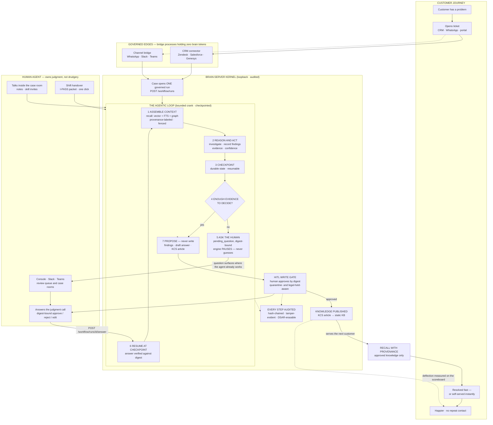

# Architecture

Brain Server is a single Rust binary that couples a **retrieval engine**, an
**embedding model**, a **knowledge graph**, and a **governance layer** behind a
versioned HTTP API. Everything runs in one process; the only external dependency is
an on-disk SQLite database.

```
                    ┌───────────────────────────────────────────────┐
                    │              brain-server (one process)        │
  HTTP clients ───▶ │                                               │
  (agent plugin,   │   ┌──────────┐   ┌───────────┐   ┌──────────┐  │
   brain CLI, MCP, │   │  Handlers│──▶│  Recall   │──▶│ SQLite   │  │
   Dioxus client)  │   │  (Axum)  │   │  Engine   │   │ (WAL)    │  │
                    │   └────┬─────┘   └─────┬─────┘   │  vec0    │  │
                    │        │ auth/AuthZ    │         │  FTS5    │  │
                    │        ▼               ▼         │  KG      │  │
                    │   ┌──────────┐   ┌───────────┐   └──────────┘  │
                    │   │ Audit log│   │ Static    │                 │
                    │   │ (hash    │   │ embeddings │                 │
                    │   │  chain)  │   │ (model2vec)│                 │
                    │   └──────────┘   └───────────┘                 │
                    └───────────────────────────────────────────────┘
```

---

## The governed agentic loop

The customer journey, the AI's role, and the human's role in one view. The
engine **cranks** through a bounded, checkpointed loop; when it runs out of
evidence it stops and asks one precise, digest-bound question — it never
guesses, and it never writes memory without a human approval.



### Inside one crank cycle


### Who does what — and why the human wins

| | The AI agent does | The human agent does | Benefit to the human |
|---|---|---|---|
| Investigation | Reads every past case, article, and graph relation; assembles evidence with confidence scores | Sees an assembled dossier, not twelve tabs | Minutes of digging become seconds of reading |
| Judgment calls | Detects it is stuck and asks one precise, digest-bound question | Answers once — in the console or from their phone via Signal/Slack | No guessing games: the machine knows what it does not know |
| Writing memory | Drafts the KCS article from the case's own recorded evidence | Approves or rejects by digest — nothing enters memory unreviewed | The knowledge base stays clean without being policed |
| Repetition | Cranks around the clock, resumes at checkpoints, never loses context | Handles exceptions and the customer relationship | Shift handovers take one click; context survives the shift change |
| Trust | Every action lands on a tamper-evident hash chain; content screened, fenced, provenance-stamped | Can prove to any auditor exactly what the AI did and who approved it | The AI is accountable by construction — safe to delegate to |

**The flywheel in one sentence:** every human-approved resolution becomes
retrievable knowledge, so the next customer either gets answered faster or
deflects to self-service entirely — and the scoreboard proves which happened.

> Rendering note: diagrams are fenced <code>```mermaid</code> blocks rendered
> client-side by the vendored `theme/js/mermaid.min.js` +
> `theme/js/mermaid-init.js` (no CDN, no CI preprocessor). To export a static
> PNG/SVG instead:
> `npx -y @mermaid-js/mermaid-cli@11 -i diagram.mmd -o diagram.svg -b white`.

---

## Retrieval engine

Recall is **hybrid**: a vector leg and a lexical leg run concurrently on independent
pooled read connections and are fused.

- **Vector leg** — `sqlite-vec` (`vec0`) KNN over embeddings. Embeddings are
  computed in-process by the static `model2vec` model; vectors are int8/binary
  quantized (4–32× smaller) for edge memory bounds.
- **Lexical leg** — SQLite FTS5 (BM25).
- **Fusion** — Reciprocal Rank Fusion (`k = 60`), a deterministic, weight-free
  merge.
- **Expansion** — deterministic PRF (pseudo-relevance feedback) expands the query
  when the top pass-1 result appears in **both** dense and lexical lists within a
  bounded rank. It fires only on cross-retriever agreement, never on a fused score
  threshold alone.
- **Graph leg (optional)** — Personalized PageRank over the knowledge graph, opt-in
  via `?graph=true`, as a third RRF leg.

Every result carries **provenance**: per-retriever ranks, the fused score, any
expansion terms, and (optionally) a rerank score.

### Abstention

When retrieval quality is too low to support a claim, `/recall` returns
`{decision: "low_confidence", hits: []}` instead of top-1 garbage. This is driven
by a calibrated multi-signal recommendation (rank overlap, gap, lexical density) —
never a magic score cutoff.

---

## Ingest pipeline

1. **Markdown / structured / memory** ingest arrives at a handler.
2. Text is **chunked** with a CommonMark-aware splitter (heading-boundary splits,
   code-fence-safe, one chunk per `knowledge` row).
3. Chunks are **embedded** by the static model and written to `vec0`.
4. Text is tokenized into FTS5.
5. `[[relation::entity]]` links (and explicit entities/relations) build the
   **knowledge graph**.
6. **Temporal stamps** (`observed_at` / `valid_from` / `valid_to` / `authority`)
   and **source provenance** (`source` + immutable `revision`) are recorded.

Ingest is governed by a **write-back gate** (v1.14): a candidate can be scored
(novelty via KNN, conflict via consolidation, salience via heuristics) and held in
a proposal queue **without creating a `knowledge` row**. It becomes memory only via
human approval.

---

## Knowledge graph

Entities and relationships live in `entities` / `relationships` tables with a
four-timestamp bi-temporal model (`valid_at` / `invalid_at` + `created_at` /
`superseded_at`, v1.27.22). `/graph/traverse` walks the graph (bounded to depth
4, ≤256 visited) and, with `?explain=true`, returns **faithful hop chains**
(`A --works_at--> B --ceo_of--> C`) rather than a flat id string. Traversal
visits only *current* edges — a rewritten edge whose `superseded_at` is set is
skipped (a backdated correction no longer yields two live edges for one triple).

Graph edges are superseded two ways, both retire-never-delete:

- **Operator-approved `supersedes` links** (via `/consolidate`) atomically
  expire the prior fact (its `invalid_at` closes): historical recall
  (`?at=<past>`) still returns it, current recall does not.
- **Automatic on changed re-ingest** (v1.27.22): re-ingesting a relation with a
  different window sets the old edge's `superseded_at` (transaction-time end)
  and inserts the corrected version as the new current belief. The full version
  lineage is readable via `GET /graph/relationships/{id}/history`.

---

## Governance layer

- **Append-only audit log** — a SHA-256 hash chain. Each row records the hash of
  the previous row; `/audit/verify` proves the chain is intact. Read events
  (recall/search/get) are opt-in.
- **Prompt-injection quarantine** — suspicious input is stored but excluded from
  retrieval until reviewed.
- **DSAR / GDPR** — locate → export → purge → chain-verifiable deletion
  certificate (`POST /dsar`), plus a queryable `/tombstones` registry.
- **Calibrated abstention**, **span verification** (`/verify`), and **reviewable
  proposals** keep the memory honest without an LLM.
- **Read-seam sanitization** — every emitted text field passes redaction →
  markdown-reference strip (EchoLeak) → invisible-Unicode strip before leaving
  the server, so a stored chunk cannot smuggle context out through a rendered
  URL or bidi/zero-width trickery (v1.20.3 / v1.20.27).
- **Fail-closed bind + SSRF-hardened egress** — startup refuses a non-loopback
  bind without auth (v1.20.29); outbound webhook/alert calls follow no redirects
  (v1.20.26).

---

## Data storage

- **SQLite** in WAL mode, with `busy_timeout` so concurrent writers queue rather
  than fail.
- **`vec0`** for quantized embeddings; **FTS5** for lexical search; relational
  tables for the knowledge graph, sources/revisions, and governance.
- **Backup/restore** — AES-256-GCM encrypted, checksummed, excludes secrets.

---

## Multi-domain

Memories can live in scoped **domain databases** (health, business, code, …), each
with its own graph. Retrieval **auto-routes** by per-domain centroids and falls back
across domains on a miss, so one domain's memory never leaks into another's answers.
This is a v1.x foundation (see [Roadmap](./roadmap.md)).

---

## See also

- [Deployment](./deployment.md) — running, configuring, and backing up.
- [Security](./security.md) — the threat model and controls.
- The [API reference](./api.md) and the full [API_CONTRACT.md](./API_CONTRACT.md).
