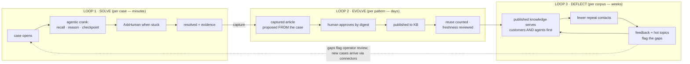
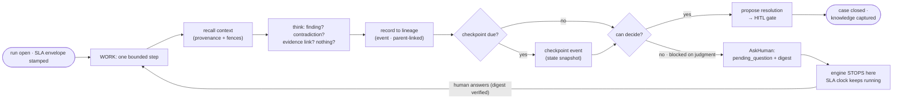
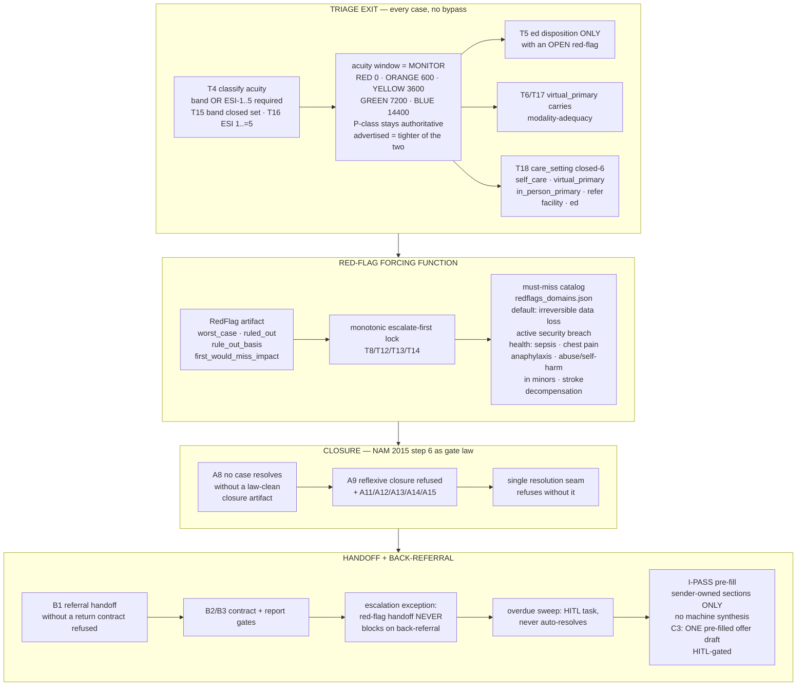
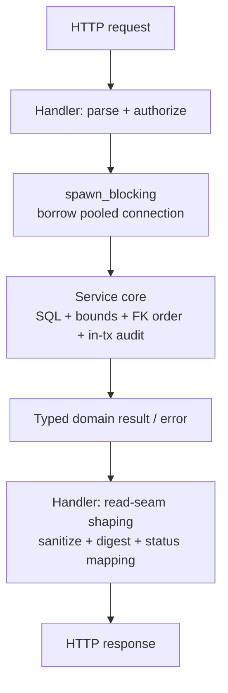

# Architecture

Brain Server's **server runtime is a single process** coupling a **retrieval
engine**, an **embedding model**, a **knowledge graph**, and a **governance
layer** behind a versioned HTTP API. Persistence and compute are local-first:
the only store is an on-disk SQLite database (WAL + `vec0` + FTS5) and
embeddings are computed in-process by the static `model2vec` model. The repo
ships seven binaries from one workspace (`brain`, `mcp`, `bench`,
`brain-migrate-rehearse`, `brain-connector-stub/-gh/-crm` — see `Cargo.toml`
`[[bin]]`); the diagram below is the `brain-server` runtime. Outbound network
egress exists and is pinned at the boundary: validated webhook/alert sends,
the agent-loop provider HTTP client, OIDC/JWKS fetch, and the CRM connectors
(all behind the SSRF-hardened egress policy — see Governance layer).

## How memory moves — three nested loops

Troubleshooting here is not one process but **three loops turning at
different speeds**, converging on what ISO 10002, the KCS Solve loop, ITIL,
and COPC each describe separately:



Loop 1 never skips its human gate; Loop 2 exists only because Loop 1 left
evidence worth keeping; Loop 3 is why the knowledge base pays rent. Hot topics
and feedback flag gaps for operator review — new cases arrive via the CRM /
channel / webhook connectors (plus in-loop `reask` / back-referral returns),
never by automatic hot-topic→case creation. The rest of this page zooms into
Loop 1, whose deterministic core is the GDL case machine (see below).

## The governed agentic loop

The customer journey, the AI’s role, and the human’s role in one view.
The engine **cranks** through a bounded, checkpointed loop; when it runs
out of evidence it stops and asks one precise, digest-bound question —
it never guesses, and it never writes memory without the configured
gate in front of it.

> **Write posture, stated precisely:** with `BRAIN_WRITE_POSTURE=review`
> (recommended for teams; the installer provisions an agent token in this
> mode) every agent write to memory becomes a digest-bound proposal a human
> approves. Screened direct writes remain available under the default
> `open` posture when an operator explicitly chooses them. Either way:
> screened, provenance-stamped, audit-chained.

```mermaid
flowchart TD
    subgraph CUST["CUSTOMER JOURNEY"]
        C1["Customer has a problem"] --> C2["Opens ticket<br/>CRM · WhatsApp · portal"]
        C10["Resolved fast —<br/>or self-served instantly"] --> C11["Happier · no repeat contact"]
    end

    subgraph EDGE["GOVERNED EDGES — bridge processes holding zero brain tokens"]
        E1["CRM connector<br/>Zendesk · Salesforce · Genesys"]
        E2["Channel bridge<br/>WhatsApp · Slack · Teams"]
    end

    C2 --> E1
    C2 -.-> E2

    subgraph KERNEL["BRAIN-SERVER KERNEL (loopback · audited)"]
        direction TB
        I1["Case opens ONE governed run<br/>POST /workflow/runs"]
        subgraph LOOP["THE AGENTIC LOOP (bounded crank · checkpointed)"]
            direction TB
            L1["1 ASSEMBLE CONTEXT<br/>recall: vector + FTS + graph<br/>provenance-labeled · fenced"]
            L2["2 REASON AND ACT<br/>investigate · record findings<br/>evidence · confidence"]
            L3["3 CHECKPOINT<br/>durable state · resumable"]
            L4{"4 ENOUGH EVIDENCE<br/>TO DECIDE?"}
            L5["5 ASK THE HUMAN<br/>pending_question, digest-bound<br/>engine PAUSES — never guesses"]
            L6["6 RESUME AT CHECKPOINT<br/>answer verified against digest"]
            L1 --> L2 --> L3 --> L4
            L4 -- "no" --> L5
            L6 --> L1
            L4 -- "yes" --> L7
        end
        L7["7 PROPOSE — never write<br/>findings · draft answer · KCS article"]
        G1["HITL WRITE GATE<br/>human approves by digest<br/>quarantine- and legal-hold-aware"]
        K1["KNOWLEDGE PUBLISHED<br/>KCS article → static KB"]
        A1["EVERY STEP AUDITED<br/>hash-chained · tamper-evident · DSAR-erasable"]
        I1 --> LOOP
        LOOP --> L7 --> G1
        G1 -- "approved" --> K1
        G1 -.-> A1
        LOOP -.-> A1
    end

    subgraph HUMAN["HUMAN AGENT — owns judgment, not drudgery"]
        H1["Console · Slack · Teams<br/>review queue and case rooms"]
        H2["Answers the judgment call<br/>digest-bound approve / reject / edit"]
        H3["Talks inside the case room<br/>notes · skill invites"]
        H4["Shift handover<br/>I-PASS packet · one click"]
    end

    E1 --> I1
    E2 --> I1
    L5 -- "question surfaces where the agent already works" --> H1
    H1 --> H2
    H2 -- "POST /workflow/runs/id/answer" --> L6
    H3 --> LOOP
    H4 --> LOOP
    G1 --> H2

    K1 -- "serves the next customer" --> R1["RECALL WITH PROVENANCE<br/>approved knowledge only"]
    R1 --> C10
    K1 -.->|deflection measured on the scoreboard| C11
```



#### The record layers on top (1.28.92)

The loop's own rows ARE the request record; two preregistered record layers
ride them additively — no new table, no migration:

- **The disagreement corpus (Reflect/learn).** When a case resolves, the
  closing transaction captures an after-action reflection record — derived
  ONLY from audited gate rows (`gdl_gate` / `control:adversarial_recheck` /
  `handoff_lifecycle`), never agent free text (rows carry `input_digest`,
  never raw case text) — plus hard-negative disagreement tuples.
  Proven retrospective-only: the same case driven twice is byte-identical
  with capture on versus off (sealed state identical; only additive
  `reflection` / `reflection_disagreement` session-log rows differ). The DPO
  exports the labeled corpus (`GET /workflow/reflection/corpus`, Admin scope
  + DPO role dual gate, bounded page `1..=500`, every export audited,
  de-identified at the seam through a synthetic scope-less reader, rows carry
  their frozen train/holdout partition — `REFLECTION_HOLDOUT_PCT=20`,
  sha256-derived).
- **The account record layer (the deliberately-not-a-CRM).** Accounts are
  workflow rows of kind `account` — identifiers only (screened name, owner
  label, `active|archived` status, server clock), never request bodies; audit
  detail carries ids/lengths, never the name. Requests attach via audited
  link rows; a thin pipeline timeline (closed stage vocabulary
  `lead|qualified|proposal|closed_won|closed_lost`, `decision_ref`-required
  transitions — the machine never advances a stage) rides the same session
  log; the per-account history is a pure decision join over
  `handoff_lifecycle`. Six account routes plus the corpus export = seven new
  record-layer routes, the same layering law as everywhere else; the account
  listing carries the DPO dual gate. Schema-driven wizard packs (typed
  choice/score/noul only, 20-option ceiling, ambiguous → abstain) assemble
  ONE typed case for the existing webhook seam — never a chatbot, never free
  text.

### Inside one crank cycle



### Who does what — and why the human wins

| | The AI agent does | The human agent does | Benefit to the human |
|---|---|---|---|
| Investigation | Reads every past case, article, and graph relation; assembles evidence with confidence scores | Sees an assembled dossier, not twelve tabs | Minutes of digging become seconds of reading |
| Judgment calls | Detects it is stuck and asks one precise, digest-bound question | Answers once — in the console or from their phone via Signal/Slack | No guessing games: the machine knows what it does not know |
| Writing memory | Drafts the KCS article from the case's own recorded evidence | Approves or rejects by digest — nothing enters memory unreviewed | The knowledge base stays clean without being policed |
| Repetition | Cranks around the clock, resumes at checkpoints, never loses context | Handles exceptions and the customer relationship | Shift handovers take one click; context survives the shift change |
| Trust | Every action lands on a tamper-evident hash chain; content screened, fenced, provenance-stamped | Can prove to any auditor exactly what the AI did and who approved it | The AI is accountable by construction — safe to delegate to |

**The flywheel in one sentence:** every human-approved resolution becomes
retrievable knowledge, so the next customer either gets answered faster or
deflects to self-service entirely — and the scoreboard proves which happened.

> Rendering note: diagrams are fenced <code>```mermaid</code> blocks rendered
> client-side by the vendored `theme/js/mermaid.min.js` +
> `theme/js/mermaid-init.js` (no CDN, no CI preprocessor). To export a static
> PNG/SVG instead:
> `npx -y @mermaid-js/mermaid-cli@11 -i diagram.mmd -o diagram.svg -b white`.

---

## The GDL case machine — Loop 1's deterministic core

The crank above is driven by the **GDL case machine** (`src/workflow/gdl.rs`,
9,871 lines; `gdl_checkpoint.rs`, 771; `gdl_eval.rs`, 1,191 — 11,833 total):
the 7-phase governed troubleshooting loop
`Intake → Triage → Hypothesize → Plan → Act → Verify → Handoff`
(`GdlPhase::ALL` — forward-only, the machine never skips; a case that cannot
satisfy a phase routes or escalates instead).

The phase machine is deterministic Rust: the model proposes a phase artifact
as JSON, a pure arbiter (`parse_and_gate`) decides, and a rejected artifact is
retried bounded-then-routed — one original ask plus `MAX_PHASE_ATTEMPTS = 3`
gate-error re-asks; exhausting them ROUTES the case (route, not resolve).
Persistence per phase-pass is ONE `WorkflowTx`: the phase's `workflow_steps`
row (Act adds one sub-row per executed test-log row), the CAS run-state
advance (with its own audit row), and one audit row per inserted step —
all-or-nothing, hash-chained. The session narrative (instructions, artifacts,
gate verdicts) rides the append-only `agent_session_events`; the plan strip
(`PLAN_STRIP_MAX_LINES = 24`) renders at the CONTEXT END of every phase
instruction. The verify phase carries a 15-minute stability-window floor
(`VERIFY_STABILITY_WINDOW_MIN = 15`).

The 9 binding laws, enforced where mechanically checkable (every gate failure
CITES ITS LAW via `err(law, detail)`, so a rejection is an auditable process
fact):

- **L1** evidence before action · **L2** one variable at a time · **L3**
  known-good comparison · **L4** what-changed first · **L5** least-invasive
  ladder · **L6** verify under failing conditions · **L7** no premature closure
  · **L8** escalation = evidence handoff · **L9** no fix from memory.

Case-level invariants: the SLA clock arms at triage on a typed row (pinned
P-class table — P1 3,600 / P2 14,400 / P3 86,400 / P4 604,800 seconds,
literals pinned by test and preregistered); the unconditional human escape is
honored at every phase boundary with exact replay; `justified_handoff_rate`
rolls up from recorded soft-handoff rows (`SOFT_HANDOFF_THRESHOLD_PCT = 80`,
unjustified revisits denied-and-audited). Deliberately out of scope: subagent
fan-out, follow-the-sun handoff policy, provider code (the loopback fixture
carries the tests), live routing claims, and auto-publish of anything captured
— capture lands as proposals on the human review queue or not at all.

### Healthcare hardening (1.32.7 "Diagnostic Closure", R18)

The Triage → Handoff span carries a clinically-shaped hardening layer —
triage acuity, a red-flag forcing function, a must-miss catalog, a NAM-gated
closure artifact, a back-referral contract, and I-PASS handoff discipline.
All of it is enforced gate code (`src/workflow/gdl.rs` T/A/B/C families);
the clinical vocabularies are `-style` analogies and keyword data, not coded
terminologies (no SNOMED / ICD / LOINC):



Scope notes, stated exactly as the code holds them: acuity is monitor-only
beside the authoritative P-class SLA (`advertised_sla` takes the tighter of
the two, never the looser); `resource_estimate` never binds; ESI/MTS/ATA are
`-style` labels; medicine is keyword data in one `health` catalog domain with
a `default` fallback. Non-clinical neighbors that must not be cited as
healthcare: TreeHandoff (R17 session-tree infrastructure), the LAYA System-1
decide port (R19 pure modules, ungated, zero behavior change), and the 1.32.8
classifier consume (deliberately absent — opener-gated on the operator
labeling round).

---

## What’s inside the process

Same process, same SQLite — the loops above are the *control story*,
not a separate service:

```
                    ┌───────────────────────────────────────────────┐
                    │              brain-server (one process)        │
  HTTP clients ───▶ │                                               │
  (agent plugin,   │   ┌──────────┐   ┌───────────┐   ┌──────────┐  │
   brain CLI, MCP, │   │  Handlers│──▶│  Recall   │──▶│ SQLite   │  │
   Dioxus client)  │   │  (Axum)  │   │  Engine   │   │ (WAL)    │  │
                    │   └────┬─────┘   └─────┬─────┘   │  vec0    │  │
                    │        │ auth/AuthZ    │         │  FTS5    │  │
                    │        ▼               ▼         │  KG      │  │
                    │   ┌──────────┐   ┌───────────┐   └──────────┘  │
                    │   │ Audit log│   │ Static    │                 │
                    │   │ (hash    │   │ embeddings │                 │
                    │   │  chain)  │   │ (model2vec)│                 │
                    │   └──────────┘   └───────────┘                 │
                    └───────────────────────────────────────────────┘
```

### The layering law

Handlers are protocol adapters ONLY: parse → principal → authorize → one
`spawn_blocking` → domain call → read-seam shaping → response. ALL SQL, caps,
FK ordering, and invariants live in domain modules (`src/workflow/*`, and the
storage cores under `src/service/*`) that take `&Connection` / `WorkflowTx` —
never pool or HTTP types. Every mutation emits its hash-chained audit row
INSIDE the caller's transaction: a transition and its evidence commit or roll
back together. Error paths deny loudly (fail-closed); silence is never
certified. New code is always a service core; see `docs/engine-sdk.md` for the
stable engine ABI the workflow cores compile against.

The law is machine-checked, not aspirational — two CI guards (tests under
`src/service/mod.rs`, run by every `cargo test` job) hold it shut:

1. **`no_sql_in_handlers_enforced`** — ANY SQL statement under `src/handlers/`
   (production source, test fixture, or even a comment naming a statement
   opener) fails the build. There is no allowlist: the handler-side debt was
   frozen at 445 statements (v1.28.46), extracted file-by-file to zero, and
   the guard now keeps it there by construction. A handler that needs new
   storage writes (or extends) a service core first.
2. **`service_layer_free_of_http_types`** — production source under
   `src/service/` never names a transport type (`axum`, `StatusCode`, `Json`,
   `AppState`, `Pool`). Services take connections and return domain types;
   HTTP status mapping happens only at the handler boundary, via each core's
   typed error enum.

### The request flow through the seam

Every write and read crosses the layer boundary the same way:



The seam list — what may cross the boundary, in both directions:

| Crossing | Down (handler → core) | Up (core → handler) |
|---|---|---|
| Connections | `&rusqlite::Connection` (reads) or the caller's `&rusqlite::Transaction` (writes) | — (a core can never outlive or commit the caller's tx) |
| Time | unix-second `i64` arguments (wall-clock is injected, never read) | — |
| Values | validated, bounded scalar/struct parameters | domain types (stored forms, NOT wire shapes) |
| Errors | — | one typed enum per core (`Display` carries the exact pre-move message; the handler maps to the route's frozen status vocabulary) |
| Audit rows | — | written INSIDE the caller's tx by the core that owns the mutation |

What never crosses: pool handles, `AppState`, HTTP status codes, JSON body
wrappers, or `serde` wire shapes. The read seam (`sanitize_read`, digest
binding, PII masking) stays handler-side by contract — cores return stored
bytes; the handler decides what a given reader sees. One disclosed
exception: `GET /export` emits stored content verbatim (portability is the
point; the `untrusted: true` label travels with the rows — see
`docs/THREAT_MODEL.md` §5) — every rendered surface goes through the seam.

---

## Retrieval engine

Recall is **hybrid**: a vector leg and a lexical leg run concurrently on independent
pooled read connections and are fused.

- **Vector leg** — `sqlite-vec` (`vec0`) KNN over embeddings. Embeddings are
  computed in-process by the static `model2vec` model; vectors are int8/binary
  quantized (4–32× smaller) for edge memory bounds.
- **Lexical leg** — SQLite FTS5 (BM25).
- **Fusion** — Reciprocal Rank Fusion (`k = 60`), a deterministic, weight-free
  merge.
- **Expansion** — deterministic PRF (pseudo-relevance feedback) expands the query
  when the top pass-1 result appears in **both** dense and lexical lists within a
  bounded rank. It fires only on cross-retriever agreement, never on a fused score
  threshold alone.
- **Graph leg (on by default)** — Personalized PageRank over the knowledge graph
  as a third RRF leg; `BRAIN_RECALL_GRAPH_ENABLED=false` or per-request
  `graph=false` opts out.

Every result carries **provenance**: per-retriever ranks, the fused score, any
expansion terms, and (optionally) a rerank score.

### Abstention

When retrieval quality is too low to support a claim, `/recall` returns
`{decision: "low_confidence", hits: []}` instead of top-1 garbage. This is driven
by a calibrated multi-signal recommendation (rank overlap, gap, lexical density) —
never a raw fused-score cutoff (the numeric thresholds in `src/search/quality.rs`
gate the multi-signal recommendation, not the fused score itself).

---

## Ingest pipeline

1. **Markdown / structured / memory** ingest arrives at a handler.
2. Text is **chunked** with a CommonMark-aware splitter (heading-boundary splits,
   code-fence-safe, one chunk per `knowledge` row).
3. Chunks are **embedded** by the static model and written to `vec0`.
4. Text is tokenized into FTS5.
5. `[[relation::entity]]` links (and explicit entities/relations) build the
   **knowledge graph**.
6. **Temporal stamps on the structured path** (`observed_at` / `valid_from` /
    `valid_to`, `src/service/ingest.rs`) and **source provenance** (`source` +
    immutable `revision`, `src/sources.rs`) are recorded. Markdown/vault chunk
    writes carry title, heading path, line range, source path, and owner — no
    `observed_at` / `valid_from` / `valid_to` / `authority` columns
    (`src/server/router/memory.rs` `write_markdown_ingest`).

Ingest is governed by a **write-back gate** (v1.14): a candidate can be scored
(novelty via KNN, conflict via consolidation, salience via heuristics) and held in
a proposal queue **without creating a `knowledge` row**. It becomes memory only via
human approval.

---

## Knowledge graph

Entities and relationships live in `entities` / `relationships` tables with a
four-timestamp bi-temporal model (`valid_at` / `invalid_at` + `created_at` /
`superseded_at`; `valid_at`/`invalid_at` from v1.4.0, `superseded_at` +
partial unique index v1.27.22 — `src/migration.rs`). `/graph/traverse` walks
the graph (bounded to depth 4, ≤256 visited — `src/trace.rs` `MAX_HOPS` /
`MAX_VISITED`) and, with `?explain=true`, returns **hop chains**
(`A --works_at--> B --ceo_of--> C`) rather than a flat id string. The
explanation is best-effort by construction (`src/graph_read.rs`
`build_explanation_paths`): the seed name and the leaf name ride the row,
intermediate nodes surface as ids only — a consumer that needs an
intermediate's name calls `/get/{id}`. Traversal visits only *current* edges
— a rewritten edge whose `superseded_at` is set is skipped (a backdated
correction no longer yields two live edges for one triple), and this
current-belief predicate applies even with `?at`: traverse answers
as-of queries over *current beliefs whose valid window contains `at`*, so a
superseded edge is never returned by traverse regardless of `?at`.

Retire-never-delete holds in two different stores — do not conflate them:

- **Knowledge chunks via `/consolidate`** (`src/consolidate.rs`
  `resolve_supersession`): an operator-approved `supersedes` evidence link
  atomically sets the OLD chunk's `knowledge.valid_to` (not
  `relationships.invalid_at`). The existing `/recall` bi-temporal filter
  (`k.valid_to IS NULL OR k.valid_to > ?at`) then excludes the old chunk by
  default while `?at=<before-resolution>` still returns it.
- **Graph edges** (v1.27.22, `src/graph_supersede.rs`): re-ingesting a
  relation with a different window sets the old edge's `superseded_at`
  (transaction-time end) and inserts the corrected version as the new current
  belief. The full version lineage is readable via
  `GET /graph/relationships/{id}/history`.

Ceiling: vault markdown changed-file re-ingest *replaces* old chunks
(`DELETE FROM knowledge WHERE source_path` before re-insert), so
retire-never-delete holds for graph edges and consolidate-expired chunks, not
the vault replace path.

---

## Governance layer

- **Append-only audit log** — a keyed HMAC-SHA256 hash chain. Each link is
  HMAC-SHA256 over the full current row *including* its stored `prev_hash`
  (8-field keyed link, length-prefixed so no separator can shift), with a
  per-DB epoch and a pinned chain head (`schema_meta.audit_chain_head`,
  `/audit/verify`); pre-v1.27.31 legacy epochs verify as legacy (v1.27.31).
  Read events (recall/search/get) are opt-in.
- **Workflow governance** — governed runs on lineage events (branch-never-delete
  rewind), role-gated with audited transitions; the outcome scoreboard,
  monthly calibration signing, and since v1.28.34 the ISO 10002/10003
  complaint lifecycle: lineage-event state machine, HITL remedy matrix citing
  legal basis + published conduct clause, deterministic role-tier approval
  caps (over cap escalates exactly one level), national-body ADR packet per
  Reg. 2024/3228, goodwill ledger aggregating only audited remedies.
- **Prompt-injection quarantine** — suspicious input is stored but excluded from
  retrieval until reviewed.
- **DSAR / GDPR** — locate → export → purge → chain-verifiable deletion
  certificate (`POST /dsar`), plus a queryable `/tombstones` registry.
- **Calibrated abstention**, **span verification** (`/verify`), and **reviewable
  proposals** keep the memory honest without an LLM.
- **Read-seam sanitization** — every emitted text field passes redaction →
  invisible-Unicode strip → markdown-reference strip (EchoLeak) →
  control-char strip (C0/C1, so a control byte splitting `<script>` cannot
  dodge the element-name match) → hostile-element strip (element tier +
  attribute tier: `on*` handlers and `javascript:`/`vbscript:`/`data:`
  schemes on surviving elements die; the tier is scheme-hostile, not
  attribute-hostile) → sentinel strip (fence literals never ride read output;
  sentinels go last so no later transform can re-weld a split marker), the
  strips running to their fixed points, before leaving the server, so a stored
  chunk cannot smuggle context out through a rendered URL or bidi/zero-width
  trickery (v1.20.3 / v1.20.27 / v1.28.72 / v1.28.86).
- **Fail-closed bind + SSRF-hardened egress** — startup refuses a non-loopback
  bind without auth (v1.20.29); outbound webhook/alert calls follow no redirects
  (v1.20.26).

---

## Data storage

- **SQLite** in WAL mode (`journal_mode=WAL`, `busy_timeout=5000` —
  `src/migration.rs`), so concurrent writers queue rather than fail.
- **`vec0`** for quantized embeddings (`embedding_int8` int8 + `embedding_bit`
  binary, cosine); **FTS5** (`knowledge_fts` + sync triggers) for lexical
  search; relational tables for the knowledge graph, sources/revisions, and
  governance.
- **Backup/restore** — AES-256-GCM encrypted, checksummed, excludes secret
  contents (`src/backup.rs` `backup_excludes_secret_contents`).

---

## Multi-domain

Memories can live in scoped **domain databases** (health, business, code, …), each
with its own graph. Retrieval **auto-routes** by per-domain centroids and falls back
across domains on a miss. The fallback can mix the shared global corpus into a
domain answer; every such response carries `included_global: true` so the mixing
is visible (v1.28.80). True storage isolation is a separate deployment mode
(`BRAIN_MULTI_DB`), not the default shim.
Shipped as v1.0 "Domains" (see [Roadmap](./roadmap.md)); `included_global`
mixing labeled since v1.28.80.

---

## See also

- [Deployment](./deployment.md) — running, configuring, and backing up.
- [Security](./security.md) — the threat model and controls.
- The [API reference](./api.md) and the full [API_CONTRACT.md](./API_CONTRACT.md).
