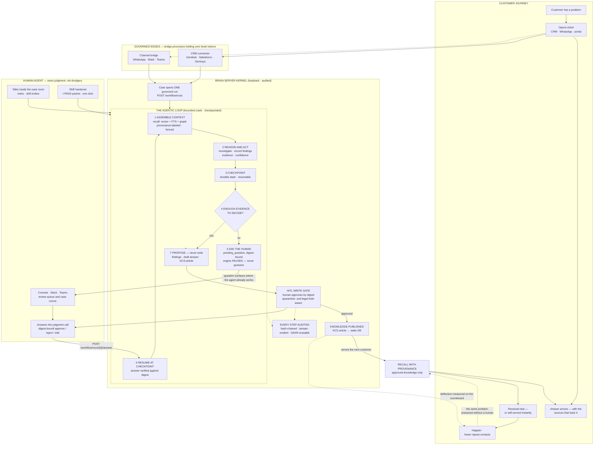
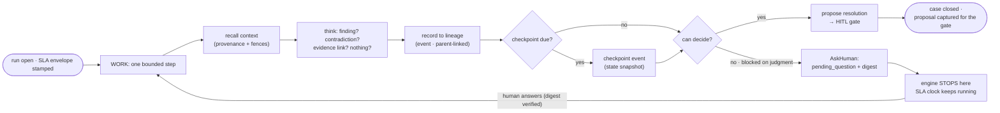
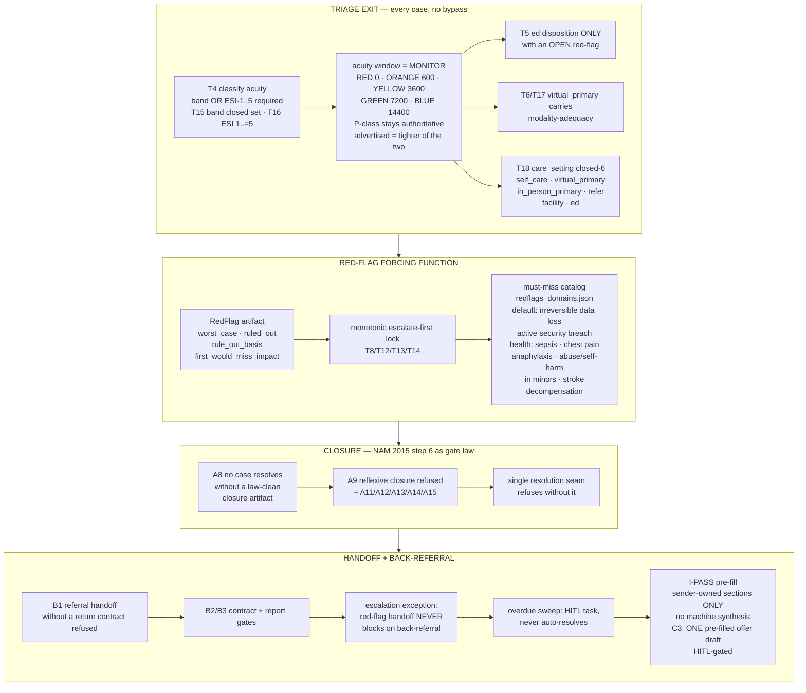
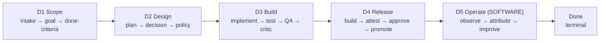
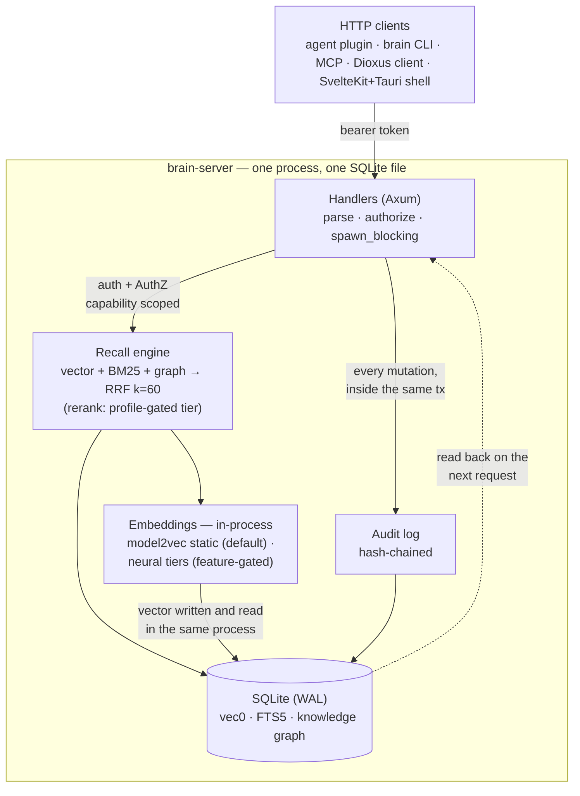
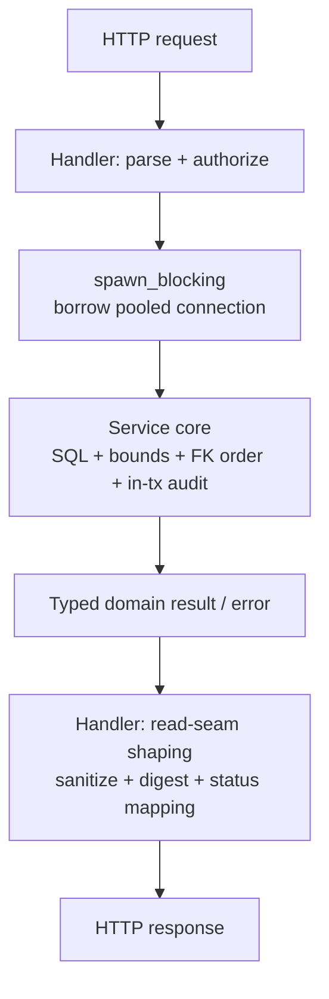

# Architecture

Brain Server's **server runtime is a single process** coupling a **retrieval
engine**, an **embedding model**, a **knowledge graph**, and a **governance
layer** behind a versioned HTTP API. Persistence and compute are local-first:
the only store is an on-disk SQLite database (WAL + `vec0` + FTS5) and
embeddings are computed in-process — the static `model2vec` model by default
(the edge contract), with optional neural tiers behind feature flags (see
[Retrieval engine](#retrieval-engine)).

The server package builds **eight binaries**: `brain-server` (the runtime this
page describes, `src/main.rs`) plus seven tools declared as `[[bin]]` in
`Cargo.toml` — `brain`, `mcp`, `bench`, `brain-migrate-rehearse`,
`brain-connector-stub`, `brain-connector-gh`, `brain-connector-crm`. The pure
engine cores live in a **second workspace** (`crates/` — the delivery, evolve,
engine-SDK, interview/care/consensus/executor/aftersales/evidence/troubleshoot
cores, the gold-sets corpus, the fuzz harness and the legal-rule resolver);
the channel bridge, the Signal gateway and the steward harness are separate
packages under `tools/`. Outbound network egress exists and is pinned at the
boundary: validated webhook/alert sends, the agent-loop provider HTTP client,
OIDC/JWKS fetch, the CRM connectors, and the GitHub delivery read adapters
(all behind the SSRF-hardened egress policy — see Governance layer).

> **This page is measured against the tree.** Every path, count and constant
> below was re-verified against the source on 2026-10-04; the private IP repo
> carries a claim-verification script that re-checks paths, line references
> and line counts mechanically. Correct this page when the tree moves — never
> the other way round.

## How memory moves — four stages and a return path

### The taxonomy

> **Four stages in a ring — Create → Solve → Evolve → Deflect. Operate is the return
> path that closes it. Deliver is a separate software lifecycle on a different axis.**

1. **The four stages are walked through; `Operate` closes the walk.** A stage is either
   something you pass through, or it is the thing that sends you back round. Operate is
   the latter. It is not a fifth stage, and calling the whole thing "4+2" does not help —
   that is still a count, and a count is what makes the shape ambiguous. This is the
   single-loop / double-loop distinction in organizational-learning theory: correcting
   action inside existing governing variables (Solve, Evolve) versus questioning the
   governing variables themselves (Operate). See **Research basis [R1][R2]**.
2. **Deliver is a different axis.** The four stages turn over *memory*; Deliver turns
   over *artifacts*. It is a software lifecycle the knowledge loop runs inside, not a
   rung beside it.
3. **The two `Operate`s are distinct things.** The knowledge `Operate` (this ring's
   return path) and Deliver's `D5 Operate` (phase 5 of the software lifecycle) share a
   name and nothing else. Wherever both can appear, the software one is written
   `D5 Operate (SOFTWARE)`.

### Where each stage is implemented

Measured against the tree; re-run the claim-verification script in the private
IP repo after changing anything here.

| Stage | Where it lives | Status |
|---|---|---|
| **Create** | `src/workflow/create.rs` + `src/workflow/create/` (9 modules) · six routes under `/workflow/claim-schemas` and `/workflow/claims*` | Built and wired. **Promotion is inert** — the promote route returns `promotion_disabled` in every configuration. The disproof condition is now stated at write time and evaluated at read time (`create/disproof.rs`) |
| **Solve** | `src/workflow/gdl.rs`, `gdl_checkpoint.rs`, `gdl_eval.rs`, `src/agentloop/run_loop.rs` · entry `src/handlers/case_run.rs:224` | The most built — the agentic crank, checkpointed and digest-gated |
| **Evolve** | `src/gate.rs`, `src/handlers/gate.rs`, `src/service/gate.rs`, `src/workflow/kcs.rs`, `crates/brain-evolve-core` | Built and wired — the human approval gate, plus a per-domain knowledge-version axis that bumps at publication |
| **Deflect** | `src/workflow/kcs.rs`, `src/workflow/scoreboard.rs`, `src/workflow/drift_census.rs` | Measurement and evidence: reuse, deflection, and scorer-drift over a frozen gold corpus. It does not yet act on what it finds |
| **Operate** | no module named Operate — and the return path is still the least-built part of the ring | The **first return-path code exists**: the ranked gap queue (`create/queue.rs`, built to be the `Operate → Create` edge) and the agreement/labeling machinery — but nothing yet drains a gap into claim creation end-to-end, and outcome attribution to specific knowledge remains design, not code |
| **Deliver** | `crates/brain-delivery-core`, `src/workflow/delivery.rs`, `src/workflow/releases.rs` | Built and wired — core, persistence, reads, **and the release/promotion surface** (see The delivery loop) |

**The consequence worth stating plainly:** the ring below is drawn complete, but in
code `Solve` and `Evolve` carry the weight, `Deflect` observes, `Create` cannot yet
promote, and `Operate` has its first fragment — a queue that ranks gaps — without the
edges that would make it a loop. The two edges that make a line into a cycle
(`Operate → Evolve`, `Operate → Create`) are the two that are still not closed
end-to-end.


```mermaid
flowchart LR
    subgraph L0["CREATE (per gap — minutes)"]
        direction LR
        Z1["gap or capture<br/>from a case"] --> Z2["hypothesise +<br/>validate"] --> Z3["proposal<br/>to the gate"]
    end
    subgraph L1["LOOP 1 · SOLVE (per case — minutes)"]
        direction LR
        A1["case opens"] --> A2["agentic crank:<br/>recall · reason · checkpoint"] --> A3["AskHuman when stuck"] --> A4["resolved + evidence"]
    end
    subgraph L2["LOOP 2 · EVOLVE (per pattern — days)"]
        direction LR
        B1["captured article<br/>proposed FROM the case"] --> B2["human approves by digest"] --> B3["published to KB"] --> B4["reuse counted ·<br/>freshness reviewed"]
    end
    subgraph L3["LOOP 3 · DEFLECT (per corpus — weeks)"]
        direction LR
        C1["published knowledge serves<br/>customers AND agents first"] --> C2["fewer repeat contacts"] --> C3["feedback + hot topics<br/>flag the gaps"] --> C1
    end
    subgraph LRET["OPERATE — the RETURN PATH, not a stage in the sequence"]
        direction LR
        D1["outcomes attributed to<br/>specific knowledge"] --> D2["improvements feed back<br/>into Evolve and Create"]
    end
    A4 -- "resolution proposed" --> B1
    Z3 --> B1
    B4 --> C1
    C3 -.->|"gaps flag operator review; new cases arrive via connectors"| A1
    C3 --> D1
    B4 --> D1
    D2 -.->|"Operate → Evolve"| B2
    D2 -.->|"Operate → Create"| Z1
```

> **Nothing skips the gate.** Solve does not write memory. On close it emits a
> `kcs_new_article` / `kcs_update_article` **proposal**, and that proposal is what enters
> Evolve at `B1` — which is why the arrow runs `A4 → B1` and not `A4 → Z1`. Create's own
> input (`Z1`, "gap or capture from a case") is a *question*, not a captured answer: gaps
> are **generated** candidates, never detected ones, and the generator cannot set a status
> because its output type has no field that could hold one.

> **Two `Operate`s, one name.** The knowledge `Operate` above is the return path that
> closes the ring. `Deliver`'s `D5 Operate` below is phase 5 of the *software*
> lifecycle. They are distinct, and the software one is labelled `(SOFTWARE)` wherever
> both can be seen.

### The four timescales

The stages above are also nested, and they run at **four different cadences**. A reader
must never have to guess which timescale a statement is about — the same word "faster"
means something different at each level, and a cadence quoted without its level is not a
measurement.

| Level | Cadence | What turns at this level | Where it is visible here |
|---|---|---|---|
| **Business** | days – weeks | Why the knowledge base exists at all: outcomes attributed, priorities set, corpus-level deflection | `Operate` (the return path); Deflect's reuse/deflection metrics |
| **Feedback** | continuous | The ring closing: an outcome becomes a signal that re-enters Evolve or Create | the `Operate → Evolve` / `Operate → Create` edges |
| **Operational** | minutes | One case turning: the agentic crank, its human gate, its evidence | Solve — the GDL case machine below |
| **Execution** | seconds | One model turn inside a step: tool calls, compaction, the bounded loop | the governed agentic loop; the run loop itself |

> **Read a cadence with its level.** "Solve runs in minutes" is an operational claim about
> one case; it is not a claim that a case resolves in seconds. The execution level is
> *inside* the operational one, and neither is the business level — an Evolve publication
> (days) is not "slow Solve". The nesting is what makes `reask` meaningful: a case
> re-entering Solve later does so on a *moved* knowledge base, which is why the case record
> carries `knowledge_version` — and since the per-domain knowledge-version axis shipped,
> that version now bumps at every publication, per domain.

Create takes what a case captures and what a gap flags, hypothesises and validates it,
and hands a proposal to the gate. Solve never skips its human gate; Evolve exists only
because Solve left evidence worth keeping; Deflect is why the knowledge base pays rent.
The return path is why a system that only grows knowledge can also *correct* it. Hot topics
and feedback flag gaps for operator review — new cases arrive via the CRM /
channel / webhook connectors (plus in-loop `reask` / back-referral returns),
never by automatic hot-topic→case creation. The rest of this page zooms into
Solve, whose deterministic core is the GDL case machine (see below).

## The governed agentic loop

The customer journey, the AI’s role, and the human’s role in one view.
The engine **cranks** through a bounded, checkpointed loop; when it runs
out of evidence it stops and asks one precise, digest-bound question —
it never guesses, and it never writes memory without the configured
gate in front of it.

> **Write posture, stated precisely:** with `BRAIN_WRITE_POSTURE=review`
> (recommended for teams; the installer provisions an agent token in this
> mode) every agent write to memory becomes a digest-bound proposal a human
> approves. Screened direct writes remain available under the default
> `open` posture when an operator explicitly chooses them. Either way:
> screened, provenance-stamped, audit-chained.


```mermaid
flowchart TD
    subgraph CUST["CUSTOMER JOURNEY"]
        direction TB
        C1["Customer has a problem"] --> C2["Opens ticket<br/>CRM · WhatsApp · portal"]
        C3["Answer arrives — with the<br/>sources that back it"]
        C10["Resolved fast —<br/>or self-served instantly"] --> C11["Happier ·<br/>fewer repeat contacts"]
        C2 --> C3
    end

    subgraph EDGE["GOVERNED EDGES — bridge processes holding zero brain tokens"]
        E1["CRM connector<br/>Zendesk · Salesforce · Genesys"]
        E2["Channel bridge<br/>WhatsApp · Slack · Teams"]
    end

    C2 --> E1
    C2 -.-> E2

    subgraph KERNEL["BRAIN-SERVER KERNEL (loopback · audited)"]
        direction TB
        I1["Case opens ONE governed run<br/>POST /workflow/runs"]
        subgraph LOOP["THE AGENTIC LOOP (bounded crank · checkpointed)"]
            direction TB
            L1["1 ASSEMBLE CONTEXT<br/>recall: vector + FTS + graph<br/>provenance-labeled · fenced"]
            L2["2 REASON AND ACT<br/>investigate · record findings<br/>evidence · confidence"]
            L3["3 CHECKPOINT<br/>durable state · resumable"]
            L4{"4 ENOUGH EVIDENCE<br/>TO DECIDE?"}
            L5["5 ASK THE HUMAN<br/>pending_question, digest-bound<br/>engine PAUSES — never guesses"]
            L6["6 RESUME AT CHECKPOINT<br/>answer verified against digest"]
            L1 --> L2 --> L3 --> L4
            L4 -- "no" --> L5
            L6 --> L1
            L4 -- "yes" --> L7
        end
        L7["7 PROPOSE — never write<br/>findings · draft answer · KCS article"]
        G1["HITL WRITE GATE<br/>human approves by digest<br/>quarantine- and legal-hold-aware"]
        K1["KNOWLEDGE PUBLISHED<br/>KCS article → static KB"]
        A1["EVERY STEP AUDITED<br/>hash-chained · tamper-evident · DSAR-erasable"]
        I1 --> LOOP
        LOOP --> L7 --> G1
        G1 -- "approved" --> K1
        G1 -.-> A1
        LOOP -.-> A1
    end

    subgraph HUMAN["HUMAN AGENT — owns judgment, not drudgery"]
        H1["Console · Slack · Teams<br/>review queue and case rooms"]
        H2["Answers the judgment call<br/>digest-bound approve / reject / edit"]
        H3["Talks inside the case room<br/>notes · skill invites"]
        H4["Shift handover<br/>I-PASS packet · one click"]
    end

    E1 --> I1
    E2 --> I1
    L5 -- "question surfaces where the agent already works" --> H1
    H1 --> H2
    H2 -- "POST /workflow/runs/{id}/answer" --> L6
    H3 --> LOOP
    H4 --> LOOP
    G1 --> H2

    K1 -- "serves the next customer" --> R1["RECALL WITH PROVENANCE<br/>approved knowledge only"]
    R1 --> C3
    R1 --> C10
    K1 -.->|deflection measured on the scoreboard| C11
    C11 -.->|"the same problem,<br/>answered without a human"| R1
```

**The journey closes, and that is the whole design.** The customer at the left
gets an answer at the right, but the path back to the next customer runs through
**`K1` — the published, human-approved knowledge** — not through the loop that
happened to solve this one case. A case that was never approved into memory
resolves that customer and teaches the next one nothing. The dotted edge is the
part that compounds: the same problem, self-served, is `Deflect` working.

#### The record layers on top (v1.28.92)

The loop's own rows ARE the request record; two preregistered record layers
ride them additively — no new table, no migration:

- **The disagreement corpus (Reflect/learn).** When a case resolves, the
  closing transaction captures an after-action reflection record — derived
  ONLY from audited gate rows (`gdl_gate` / `control:adversarial_recheck` /
  `handoff_lifecycle`), never agent free text (rows carry `input_digest`,
  never raw case text) — plus hard-negative disagreement tuples.
  Proven retrospective-only: the same case driven twice is byte-identical
  with capture on versus off (sealed state identical; only additive
  `reflection` / `reflection_disagreement` session-log rows differ). The DPO
  exports the labeled corpus (`GET /workflow/reflection/corpus`, Admin scope
  + DPO role dual gate, bounded page `1..=500`, every export audited,
  de-identified at the seam through a synthetic scope-less reader, rows carry
  their frozen train/holdout partition — `REFLECTION_HOLDOUT_PCT=20`,
  sha256-derived).
- **The account record layer (the deliberately-not-a-CRM).** Accounts are
  workflow rows of kind `account` — identifiers only (screened name, owner
  label, `active|archived` status, server clock), never request bodies; audit
  detail carries ids/lengths, never the name. Requests attach via audited
  link rows; a thin pipeline timeline (closed stage vocabulary
  `lead|qualified|proposal|closed_won|closed_lost`, `decision_ref`-required
  transitions — the machine never advances a stage) rides the same session
  log; the per-account history is a pure decision join over
  `handoff_lifecycle`. Six account routes plus the corpus export = seven new
  record-layer routes, the same layering law as everywhere else; the account
  listing carries the DPO dual gate. Schema-driven wizard packs (typed
  choice/score/noul only, 20-option ceiling, ambiguous → abstain) assemble
  ONE typed case for the existing webhook seam — never a chatbot, never free
  text.

### Inside one crank cycle


```mermaid
flowchart LR
    S(["run open · SLA envelope stamped"]) --> W["WORK: one bounded step"]
    W --> R["recall context<br/>(provenance + fences)"]
    R --> T["think: finding? contradiction?<br/>evidence link? nothing?"]
    T --> REC["record to lineage<br/>(event · parent-linked)"]
    REC --> CK{"checkpoint due?"}
    CK -- "yes" --> CP["checkpoint event<br/>(state snapshot)"]
    CK -- "no" --> Q
    CP --> Q{"can decide?"}
    Q -- "yes" --> DONE["propose resolution<br/>→ HITL gate"]
    Q -- "no · blocked on judgment" --> ASK["AskHuman:<br/>pending_question + digest"]
    ASK --> PAUSE["engine STOPS here<br/>SLA clock keeps running"]
    PAUSE -- "human answers (digest verified)" --> W
    DONE --> CLOSE(["case closed ·<br/>proposal captured for the gate"])
```

### Who does what — and why the human wins

| | The AI agent does | The human agent does | Benefit to the human |
|---|---|---|---|
| Investigation | Reads every past case, article, and graph relation; assembles evidence with confidence scores | Sees an assembled dossier, not twelve tabs | Minutes of digging become seconds of reading |
| Judgment calls | Detects it is stuck and asks one precise, digest-bound question | Answers once — in the console or from their phone via Signal/Slack | No guessing games: the machine knows what it does not know |
| Writing memory | Drafts the KCS article from the case's own recorded evidence | Approves or rejects by digest — nothing enters memory unreviewed | The knowledge base stays clean without being policed |
| Repetition | Cranks around the clock, resumes at checkpoints, never loses context | Handles exceptions and the customer relationship | Shift handovers take one click; context survives the shift change |
| Trust | Every action lands on a tamper-evident hash chain; content screened, fenced, provenance-stamped | Can prove to any auditor exactly what the AI did and who approved it | The AI is accountable by construction — safe to delegate to |

**The flywheel in one sentence:** every human-approved resolution becomes
retrievable knowledge, so the next customer either gets answered faster or
deflects to self-service entirely — and the scoreboard proves which happened.

> Rendering note: diagrams are fenced <code>```mermaid</code> blocks rendered
> client-side by the vendored `theme/js/mermaid.min.js` +
> `theme/js/mermaid-init.js` (no CDN, no CI preprocessor). To export a static
> PNG/SVG instead:
> `npx -y @mermaid-js/mermaid-cli@11 -i diagram.mmd -o diagram.svg -b white`.

---

## The GDL case machine — Solve's deterministic core

The crank above is driven by the **GDL case machine** (`src/workflow/gdl.rs`,
11,127 lines; `gdl_checkpoint.rs`, 825; `gdl_eval.rs`, 1,191 — 13,143 total):
the 7-phase governed troubleshooting loop
`Intake → Triage → Hypothesize → Plan → Act → Verify → Handoff`
(`GdlPhase::ALL` — forward-only, the machine never skips; a case that cannot
satisfy a phase routes or escalates instead).

The phase machine is deterministic Rust: the model proposes a phase artifact
as JSON, a pure arbiter (`parse_and_gate` — no DB, no clock, no provider)
decides, and a rejected artifact is retried bounded-then-routed — **three
asks in total per phase: one original plus two corrective re-asks**
(`MAX_PHASE_ATTEMPTS = 3` pins the *total*, not the re-ask count); exhausting
them ROUTES the case (route, not resolve). The same law governs Deliver — a
model proposes, only the gate disposes — where the arbiter is
`brain-delivery-core`'s `promote` instead (see The delivery loop — the
software axis).
Persistence per phase-pass is ONE `WorkflowTx`: the phase's `workflow_steps`
row (Act adds one sub-row per executed test-log row), the CAS run-state
advance (with its own audit row), and one audit row per inserted step —
all-or-nothing, hash-chained. The session narrative (instructions, artifacts,
gate verdicts) rides the append-only `agent_session_events` (append-only by
the write API: rows are inserted, never mutated or reordered); the plan strip
(`PLAN_STRIP_MAX_LINES = 24`) renders at the CONTEXT END of every phase
instruction. The verify phase carries a 15-minute stability-window floor
(`VERIFY_STABILITY_WINDOW_MIN = 15`).

The 9 binding laws, enforced where mechanically checkable (every gate failure
CITES ITS LAW via `err(law, detail)`, so a rejection is an auditable process
fact):

- **L1** evidence before action · **L2** one variable at a time · **L3**
  known-good comparison · **L4** what-changed first · **L5** least-invasive
  ladder · **L6** verify under failing conditions · **L7** no premature closure
  · **L8** escalation = evidence handoff · **L9** no fix from memory.

Case-level invariants: the SLA clock arms at triage on a typed row (pinned
P-class table — P1 3,600 / P2 14,400 / P3 86,400 / P4 604,800 seconds,
literals pinned by test and preregistered); the unconditional human escape is
honored at every phase boundary with exact replay; `justified_handoff_rate`
rolls up from recorded soft-handoff rows (a per-mille ratio — there is
deliberately no threshold constant governing it — and unjustified revisits
are denied-and-audited). Deliberately out of scope: subagent fan-out,
follow-the-sun handoff policy, provider code (the loopback fixture carries
the tests), live routing claims, and auto-publish of anything captured —
capture lands as proposals on the human review queue or not at all.

### Healthcare hardening (1.32.7 "Diagnostic Closure", R18)

The Triage → Handoff span carries a clinically-shaped hardening layer —
triage acuity, a red-flag forcing function, a must-miss catalog, a NAM-gated
closure artifact, a back-referral contract, and I-PASS handoff discipline.
All of it is enforced gate code (`src/workflow/gdl.rs` T/A/B/C families);
the clinical vocabularies are `-style` analogies and keyword data, not coded
terminologies (no SNOMED / ICD / LOINC):


```mermaid
flowchart TD
    subgraph TRIAGE["TRIAGE EXIT — every case, no bypass"]
        T4["T4 classify acuity<br/>band OR ESI-1..5 required<br/>T15 band closed set · T16 ESI 1..=5"]
        T4 --> ACU["acuity window = MONITOR<br/>RED 0 · ORANGE 600 · YELLOW 3600<br/>GREEN 7200 · BLUE 14400<br/>P-class stays authoritative<br/>advertised = tighter of the two"]
        ACU --> T5["T5 ed disposition ONLY<br/>with an OPEN red-flag"]
        ACU --> T6["T6/T17 virtual_primary carries<br/>modality-adequacy"]
        ACU --> T18["T18 care_setting closed-6<br/>self_care · virtual_primary<br/>in_person_primary · refer<br/>facility · ed"]
    end
    subgraph REDFLAG["RED-FLAG FORCING FUNCTION"]
        RF["RedFlag artifact<br/>worst_case · ruled_out<br/>rule_out_basis<br/>first_would_miss_impact"]
        RF --> LOCK["monotonic escalate-first lock<br/>T8/T12/T13/T14"]
        LOCK --> CAT["must-miss catalog<br/>redflags_domains.json<br/>default: irreversible data loss<br/>active security breach<br/>health: sepsis · chest pain<br/>anaphylaxis · abuse/self-harm<br/>in minors · stroke<br/>decompensation"]
    end
    subgraph CLOSE["CLOSURE — NAM 2015 step 6 as gate law"]
        A8["A8 no case resolves<br/>without a law-clean<br/>closure artifact"]
        A8 --> A9["A9 reflexive closure refused<br/>+ A11/A12/A13/A14/A15"]
        A9 --> SEAM["single resolution seam<br/>refuses without it"]
    end
    subgraph HANDOFF["HANDOFF + BACK-REFERRAL"]
        B1["B1 referral handoff<br/>without a return contract refused"]
        B1 --> B23["B2/B3 contract + report gates"]
        B23 --> EXC["escalation exception:<br/>red-flag handoff NEVER<br/>blocks on back-referral"]
        EXC --> SWEEP["overdue sweep: HITL task,<br/>never auto-resolves"]
        SWEEP --> IPASS["I-PASS pre-fill<br/>sender-owned sections ONLY<br/>no machine synthesis<br/>C3: ONE pre-filled offer draft<br/>HITL-gated"]
    end
    TRIAGE --> REDFLAG --> CLOSE --> HANDOFF
```

Scope notes, stated exactly as the code holds them: acuity is monitor-only
beside the authoritative P-class SLA (`advertised_sla` takes the tighter of
the two, never the looser); `resource_estimate` never binds; ESI/MTS/ATA are
`-style` labels; medicine is keyword data in one `health` catalog domain with
a `default` fallback. Non-clinical neighbors that must not be cited as
healthcare: TreeHandoff (R17 session-tree infrastructure), the LAYA System-1
decide port (R19 pure modules, ungated, zero behavior change), and the 1.32.8
classifier consume (deliberately absent — opener-gated on the operator
labeling round).

---

## The delivery loop — the software axis

Deliver is a **different axis** from the ring above. The four knowledge stages turn over
*memory*; Deliver turns over *artifacts*. It is a lifecycle the knowledge loop runs
inside, not a rung beside it — and nothing about Solve, Evolve, or Deflect changes
because Deliver exists.


```mermaid
flowchart LR
    D1["D1 Scope<br/>intake → goal → done-criteria"] --> D2["D2 Design<br/>plan → decision → policy"]
    D2 --> D3["D3 Build<br/>implement → test → QA → critic"]
    D3 --> D4["D4 Release<br/>build → attest → approve → promote"]
    D4 --> D5["D5 Operate (SOFTWARE)<br/>observe → attribute → improve"]
    D5 --> D6["Done<br/>terminal"]
```

> **The phase machine is `Scope → Design → Build → Release → Operate → Done`**, forward-only,
> from `brain-delivery-core` (`Phase::ALL`). The third phase is **Build** — implementing
> and verifying the artifact — and **Done** is the terminal state. The vocabulary is closed:
> an unrecognised phase string is a typed refusal, never a guess.

> **The six names, enumerated.** The ring above carries four knowledge stages; this
> section is the separate software loop. The split is **5 knowledge loops (four stages +
> the return path) + 1 software loop** — the loop taxonomy is specified in the private
> architecture programme (see Research basis for the published anchors this page uses).

| Loop | Axis | Where it is on this page | What it does |
|---|---|---|---|
| **Create** | Knowledge | `LOOP 0 · CREATE` in the ring above | generated gap, or a question carried in from a case → hypothesise + validate → proposal to the gate |
| **Solve** | Knowledge | `LOOP 1 · SOLVE (per case — minutes)` | case opens → agentic crank → AskHuman when stuck → resolved + evidence |
| **Evolve** | Knowledge | `LOOP 2 · EVOLVE (per pattern — days)` | the case's captured proposal arrives here → human approves by digest → published to KB |
| **Deflect** | Knowledge | `LOOP 3 · DEFLECT (per corpus — weeks)` | published knowledge serves customers AND agents first → fewer repeat contacts → gaps flagged |
| **Operate** | Knowledge (the return path) | `OPERATE — the RETURN PATH` in the ring above | outcomes attributed to specific knowledge → improvements feed back into Evolve and Create |
| **Deliver** | Software | this section, `D1`–`D6` | Scope · Design · Build · Release · Operate · Done — turns over *artifacts*, a different axis |

> **`D5 Operate` is the software lifecycle's phase 5** — observe, attribute, improve the
> **delivered artifact**. It is not the knowledge `Operate` in the ring above, which
> attributes outcomes to *knowledge*.

**The decision law ships as a pure, total core.** `crates/brain-delivery-core`
holds the closed autonomy-tier vocabulary, the phase machine, the promotion
gate, the attestation predicate, the budget ledger, the replay comparator,
and the release-status machine. That crate is **pure and total**: no clock,
no store, no network, no provider (its dependencies are serde, serde_json and
a SHA-2 implementation, nothing else), so it decides without a running host
and **deny always wins**.

**Persistence: five tables, and the release surface on top of them.**

- `delivery_traces` (schema 1.32.15) — content-addressed `trc_<32 hex>` over
  each row's canonical facts *and* its stored ordinal; at 1.32.25 the rows
  also carry model-registry citation columns (`model_registry_id` /
  `model_registry_version`) that sit **deliberately outside** the content
  address — a rewritten citation is invisible to the replay fold, a disclosed
  ceiling.
- `delivery_budgets` (1.32.15) — composite `(run_id, kind)` key.
- `delivery_attestations` (1.32.16) — the twelve-column **signed** chain
  (signed by the host with the operator's Ed25519 key; the core itself never
  signs — an unsigned or foreign-signer case is a refusal the *host* makes,
  never a degraded mark from the core).
- `delivery_bindings` (1.32.17) — authority bindings: which external system
  of record answers for which authority kind, per domain, behind an `active`
  consent lever. No write route exists; bindings are operator configuration.
- `delivery_releases` (1.32.18) — the governed release: nine-value status
  machine, three-way approval binding (subject / authority / state revision),
  commit sha and environment.

**The HTTP surface: seventeen route registrations across fifteen paths, plus
one public webhook.** The four run POSTs (`/workflow/delivery/runs`,
`/workflow/delivery/runs/{id}/advance`, `/workflow/delivery/runs/{id}/answer`,
`/workflow/delivery/runs/{id}/gates`) and the reads
(`/workflow/delivery/runs/{id}/attestations`,
`/workflow/delivery/runs/{id}/replay-verify`,
`/workflow/delivery/runs/{id}/trace`, `/workflow/delivery/runs/{id}/steps`,
`/workflow/delivery/runs/{id}`, `/workflow/delivery/runs`) carry the original contract: authorization is the run's own domain
plus the `workflow` role, and reads ask for Read rather than Write. On top of
those now sit the **release family** — `POST /workflow/delivery/releases`,
`/workflow/delivery/releases/{id}/approve`,
`/workflow/delivery/releases/{id}/promote`, `GET /workflow/delivery/releases` — the
**`/workflow/delivery/due` crank**, `GET /workflow/delivery/bindings` (scoped to the queried domain) and
`GET /workflow/delivery/outcomes` (the derived read model). Two posture details worth naming:
the release family and `/workflow/delivery/due` **explicitly refuse agent principals**, and
approve and promote are deliberately separate requests (anti-replay). The
public inbound arm is `POST /webhooks/delivery/{kind}` — GitHub HMAC verified
— which lands external observations as evidence.

**`promote_release` is one transaction, and the gates run in a fixed refusal
order** (`src/workflow/releases.rs:667`): the approver kill-switch (a revoked
principal cannot approve), the approval-state-revision binding (the approval
attaches to exactly the state it approved), authority-digest re-derivation
(the binding's authority digest is recomputed, not trusted), **signature
verification of the attestation chain before the gate runs**, tier agreement
(every signed predicate's tier agrees with the run's granted tier), then
`chain_defect`, then the **replay-determinism gate** — the trace is replayed
and the re-derived stage digests compared against the recorded ones; a
divergent or evidence-insufficient replay refuses with
`replay_divergent` / `replay_insufficient_evidence`, an audit `Denied`, and
**no state change** (the gate detects, it never repairs; an identical trace
still reaches `allowed`) — and only then `brain_delivery_core::promote`, the
one-hop-at-a-time status walk to `promoted`, the budget draws, and the mint
of a durable delivery intent for the outbox. Every refusal in the chain is a
typed `Denied` with the state untouched.

**The reads are evidence, and one of them is now a read model.**
`/workflow/delivery/runs/{id}/replay-verify` re-derives each trace row's content address from
its own stored columns and reports whether they agree (plus an ordinal/order
fold); the verdict and the listing ride one read, and a mismatch is DATA —
the request succeeds and the reader is handed the diff — because a report
that turned a finding into an error would tell them less than the finding
does. `/workflow/delivery/runs/{id}/trace` serves the rows in ordinal order with the chain head
read from storage rather than recomputed. `GET /workflow/delivery/outcomes` is the derived read
model: change lead time, governed release cadence, change-fail rate
(labelled `role: "control"`), approval→promotion elapsed, each against the
run's own 90-day history — with typed insufficiency rather than a made-up
number when the evidence is not there.

**External authorities and systems of record stay external.** Git, CI, package
registries, deploy targets, project-management trackers, and incident systems
remain the systems of record for whatever they own. The first two connectors
exist and are **read-only by construction**: GitHub `vcs` and `ci` adapters,
pinned to their exact host, following no redirects, with no write verb
anywhere in the adapter layer. They are consumed by the `/workflow/delivery/due` crank (three
phases: select the due batch and verify intents with no network, resolve the
binding and make one read-adapter call, mark the intent delivered) and by the
inbound webhook's `reconcile_authority`, which turns landed observations into
typed `Actual` / `Contradiction` evidence and is the only writer of a
release's `verified_at`. This loop observes and attributes against external
systems; it does not become their writer, and nothing it derives is a
substitute for their own record.

**Persistent is not the same as complete.** Budgets are recorded *and
enforced at promotion* (the ledger is loaded from `delivery_budgets` into the
pure gate, `BudgetExhausted` denies, and an allowed promotion draws its
budgets in the same transaction) — but `blast_radius` is recorded under the
kind `CHECK` and **no production path consults it**. The replay verdict does
not bind a row to the signed chain — an attacker who edits a column *and*
recomputes the address leaves no trace, so it is tamper **evidence** over
stored bytes, and the chain (verified at promotion) is what binds. Adapter
kinds for `registry` / `deploy` / `pm` / `incident` are declared but
consumer-less; there is no rollback or failed release route; outcomes render
incident and rework facts `insufficient` because nothing records them.
**This section describes a ratified decision core, five tables, a
release-and-promotion surface gated by signature and replay, two read
connectors, a crank, and a read model — more than a persistence layer, less
than a complete continuous-delivery runtime.**

**The law sentence, extended to include it: a model proposes; only the gate
disposes.** This is the generative/receptive division the knowledge-creation
literature describes — the model generates candidates, a deterministic component
adapts and disposes **[R5]**. In the knowledge ring that arbiter is the GDL phase
machine's `parse_and_gate`. In D4 it is `promote`, a pure deny-wins function that
reads the run's **autonomy tier** and never the recorded trace mode — a trace that
claims to be deterministic buys no authority it was not granted, and the two
narrowest tiers propose and never promote. Two ceilings are structural, not
incidental: the crate does not sign and does not verify signatures (the host
does both, and a refusal the host must make is never a degraded mark from the
core); and autonomy only ever narrows, so no tier can widen what a principal
may do — a tier is set at run creation and never reassigned.

---

## What the programme shipped — and what deliberately remains

The roadmap that produced the current tree ran as preregistered rounds
(R51–R67). **The last column's banner in earlier versions of this page —
"everything planned, not shipped" — is now history**: most of that
programme landed between 2026-09-29 and 2026-10-04. This section states what
shipped, what remains, and — because it matters most — what none of it did.

| Stage | Shipped in the programme | What deliberately remains | Human's role after |
|---|---|---|---|
| **Create** | nine modules; the disproof condition stated at write time and evaluated at read time; the ranked, budgeted gap queue; the disproof representation on claims. **Promotion stays inert** (compile-time constant, no env var, no flag) | the promote route can never open itself; the out-of-sample false-promotion rate is **not yet measured** — a named non-claim | approves every claim — the gate never opens itself |
| **Solve** | harness truthfulness (real stop conditions, not advisory); a joint eval objective that can refuse; decision classes instrumented; **the per-class confidence→human deferral seam** — a pure, total `decide_deferral` whose per-class table **ships empty** (every class defers to a human, fail-closed) | no class is auto-dispositioned; per-class reliability evidence accrues before any widening, and widening is a human act | answers judgment calls; never decides whether an answer is *stored* |
| **Evolve** | `brain-evolve-core`, the per-domain knowledge-version axis (bumps at publication); the model-reference join on traces | **earned autonomy is not built** — tiers that would widen on measurement exist as design, not code | holds the widen decision; a tier can never widen itself |
| **Deflect** | the drift census (frozen gold corpus, one global tolerance, breaches as hash-chained findings); the ranked gap queue with exploration quota, spend ceiling and kill condition | the reuse edge that would make a template worth writing is **not closed**; the scoreboard observes, it does not act | reviews what the scoreboard says is not working |
| **Operate** | the first return-path code: the gap queue (the `Operate → Create` edge, built), the agreement/labeling machinery with κ, the model-ref join | **end-to-end outcome attribution** — nothing drains a ranked gap into claim creation; the `Operate → Evolve` edge is still design | approves every binding; the corpus-wide path is the last to close |
| **Deliver** | the replay-determinism gate as a pure decision **and wired into the live release promotion**; the release/approve/promote surface with signature and tier gates; authority bindings; GitHub read connectors + inbound webhook; the `/due` crank; the outcomes read model; token binding (the `azp` claim is enforced — a token valid for the wrong application is refused) | `registry`/`deploy`/`pm`/`incident` adapters; a rollback route; `blast_radius` enforcement | the promote gate is a human or a pre-earned tier, never the model |

Three of these are worth naming because they are the ones that could be mistaken
for having handed the machine more authority than it has:

- **The deferral seam shipped EMPTY on purpose.** `decide_deferral` is pure and
  total, its per-class reliability table has zero entries, and every routing
  class resolves to *human required* — the seam exists so that widening is a
  measured, human-authorized act later, not so that anything is auto-dispositioned
  today. It grants no authority; the routing class it reads explicitly "grants
  no authority."
- **The harness-truthfulness rounds are about the harness being *truthful*** —
  a harness that overstates what it decided is a correctness bug, not a style
  issue. Neither granted the loop any new authority.
- **The token-binding round closed a live security finding** (a token valid
  for the wrong application). It removed authority that should never have
  existed; it added none.

**The through-line.** Every round in the programme either (a) made an existing
decision verifiable, or (b) built the next stage's core. **None of them moved a
decision from a human to a model.** If a future round ever proposes that, it is
outside this plan and should be argued on its own merits rather than smuggled in
as an increment. Per-round detail, sequencing and dependencies live in the
private IP repo's execution-order plans.

## Research basis

The shape on this page is not invented here. It matches established literature on
organizational learning and knowledge creation, and where a claim below is
load-bearing the source is named at the point of use. Markers like **[R1]** refer
to the numbered list at the end of this document.

**Why the ring, and not a chain — single- vs double-loop learning.** Argyris &
Schön **[R1][R2]** distinguish *single-loop* learning, which corrects action inside
existing governing variables, from *double-loop* learning, which questions the
variables themselves. That distinction is exactly the difference between
**Solve + Evolve** (fix the case correctly inside the current knowledge base) and
**Operate** (question whether the base itself is right). The thermostat analogy is
theirs: single-loop turns the heat on and off; double-loop asks *why it is set to
69 °F*. **This is the strongest justification for treating `Operate` as a return
path rather than a fifth stage** — it is a different kind of learning, not more of
the same. Triple-loop learning, *learning how to learn*, is a later extension
**[R3]** — and it is absent from Argyris & Schön's own published work, which is
worth knowing before citing it as theirs.

**Why `Create` is separate from `Evolve` — knowledge-creation theory.** Nonaka &
Takeuchi's **SECI** model **[R4]** describes knowledge creation as
Socialization → Externalization → Combination → Internalization, converting tacit
knowledge into explicit and back again. Böhm & Durst's **GRAI** revision **[R5]**
extends SECI for generative AI, separating *generative* (produces candidates) from
*receptive* (adapts its representation). This system follows that split literally:
the model **proposes**, and the deterministic gate **disposes** — the same division
of labour GRAI describes, with the gate made enforceable rather than advisory.

**Why knowledge must be able to die — knowledge lifecycle research.** The
**Knowledge at Risk** literature argues that all knowledge eventually becomes
obsolete and should be deliberately retired, because its half-life depends on how
fast its domain moves. *(Named in the research plan as Durst, *Knowledge at
Risk*; the argument is standard in the KM literature but the exact edition was not
located at verification time — see the unverified list below. It is stated here as
a principle, not as a citation.)* That argument is why this system has `Deflect`
measuring *staleness and non-reuse* rather than only *success* — a base that only
grows is a hoard. It is also why the roadmap's `Operate` work is not optional:
correction is a lifecycle stage, not a repair.

**Why the harness is the safety surface — and the phantom-failure risk.** Recent
work on autonomous agents argues that safety state must not reset between iterations:
a monitor that forgets is not a monitor **[R6]**. That is the direct ancestor of the
gate-law pin — a census of every production loop-construction site, re-derived on
every run, because a convention that is not re-checked decays exactly that way.

The sharper warning is newer. Self-improving agent harnesses can **fabricate a
failure that never happened and then "fix" it**, adding a guardrail that protects
against a phantom problem — measured by a purpose-built *Counterfactual Fabrication
Lab* **[R7]**. This is not a hypothetical failure mode; it is what an optimising
harness does by construction when its self-reports cannot be checked against the
world.

That risk is exactly why the programme preregistered its **doc-state fixtures from
real git history before the predicate existed**. A guard written in response to a
remembered defect, with the defect supplied by the harness's own account of itself,
is the phantom case. Deriving the trigger state from a committed ref means the guard
answers to something that provably happened. The same discipline is why every pin
in this tree is red-first: **a pin that has never failed has not been tested**, and an
untested pin is a guard against nothing. It is also why the replay gate's own
acceptance proof required an anti-vacuity check: a gate that refuses everything
proves nothing, and the first red-proof alone could not distinguish a working gate
from an always-refuse one.

The same argument drives the harness-truthfulness rounds, whose subject is that
a harness that overstates what it decided is a correctness bug, not a style issue.

**Context handling is a first-class architectural concern, not plumbing.** Work
scaling long autonomous research loops identifies four mechanisms that survive
contact with reality — among them *online context compaction* (rewriting the working
context mid-run when compaction would actually pay) and an *evidence-preserving
reducer* (shrinking the log without shrinking the evidence) **[R8]**. This kernel
compacts conservatively and treats a degradation probe as a latch, because the
asymmetry matters: a context that shrinks too little costs tokens, and one that
shrinks the evidence costs correctness. A 2026 survey of harness engineering
organises the same territory into a seven-part architecture — context techniques,
compaction, sub-agent isolation and the rest **[R9]** — which is the closest
published map to how this repository is actually built, and a useful check that
nothing structural has been missed.

**Governance frameworks are recorded as design rationale only.** NIST's AI RMF
(Govern / Map / Measure / Manage) **[R10]**, its 2026 profile on *monitoring of
deployed AI systems* **[R11]**, and the EU AI Act **[R12]** are context for
traceability and record-keeping. This system makes **no compliance claim**.
Obligations in scope must be confirmed against primary sources at ship time, by
someone accountable for that determination — and note that the Act's timeline has
been in flux, so a date asserted here would itself be the kind of claim this page
refuses to make.


## What’s inside the process

Same process, same SQLite — the loops above are the *control story*,
not a separate service:


```mermaid
flowchart TB
    CLI["HTTP clients<br/>agent plugin · brain CLI · MCP · Dioxus client · SvelteKit+Tauri shell"]

    subgraph PROC["brain-server — one process, one SQLite file"]
        direction TB
        H["Handlers (Axum)<br/>parse · authorize · spawn_blocking"]
        R["Recall engine<br/>vector + BM25 + graph → RRF k=60<br/>(rerank: profile-gated tier)"]
        E["Embeddings — in-process<br/>model2vec static (default) ·<br/>neural tiers (feature-gated)"]
        DB[("SQLite (WAL)<br/>vec0 · FTS5 · knowledge graph")]
        A["Audit log<br/>hash-chained"]
    end

    CLI -->|"bearer token"| H
    H -->|"auth + AuthZ<br/>capability scoped"| R
    R --> DB
    R --> E
    E -->|"vector written and read<br/>in the same process"| DB
    H -->|"every mutation,<br/>inside the same tx"| A
    A --> DB
    DB -.->|"read back on the<br/>next request"| H
```

The loops described above are the *control story* over these five boxes, not
separate services. There is no second process, no message bus, and no cache tier:
a request enters the handlers, crosses the seam into a domain core, and lands in
the one database file. The audit row and the mutation it describes commit or roll
back together — there is no window in which one exists without the other.

### The thin binary

`main.rs` is **wiring only** — bootstrap → compose → serve — pinned at ≤ 300
lines with no `#[cfg(test)]` region (the test mass lives in `tests/`). Route
registrations live **only** under `src/server/router/**`, and
`server::bootstrap` stays protocol-free (no axum types). Each clause is
machine-checked by the spire gates in `src/spire_inventory.rs`
(`route_registrations_live_only_under_router`,
`bootstrap_stays_protocol_free`, `spire_inventory_freezes_the_thin_binary`).
The one fenced exception is `src/bin/mcp.rs` — a separate binary's
single-endpoint `/mcp` protocol edge, pinned at exactly one route site.

### Who may decide what

Three tiers, and the boundary between them is a **capability the agent's token
does not hold** — not a prompt, not a model instruction, and not a check the
model can talk its way past.

This division of labour is not a house style. The knowledge-creation literature
that produced GRAI reaches the same conclusion from the other direction: the
machine may be generative *or* receptive, but the authors are explicit that the
two roles are **not equal** — the human "gives the decisive steering impulse"
**[R5]**. What this page adds is that the principle is *enforced* rather than
advisory, and that the enforcement is a capability check the model cannot reach.

| | Agent (the loop) | Operator (the human) | The runtime |
|---|---|---|---|
| **May decide** | how to investigate; which recall to run; when it is stuck | whether a proposal becomes memory; quarantine disposition; whether knowledge is wrong | whether a write is admitted at all; which capabilities exist |
| **May not decide** | whether its own output is stored; whether a claim is true; whether a proposal is promoted | — | what the model *meant*; whether an artifact is good |
| **Enforced by** | `can:["read","write","reject"]` on the `agent` preset role | approve/promote requires the `workflow` role (delivery surfaces) or the `approve` capability (knowledge proposals), held only by an operator token | `BRAIN_WRITE_POSTURE`, the authz matrix, and the two-principal split |

**The three hard human-approval points.** These are not configurable and no posture
disables them:

1. **Under the `review` posture, nothing enters memory without a human.** The agent-facing
   write surfaces emit a digest-bound *proposal*; an operator disposes of it. The agent role
   has `reject` but never `approve` or `promote`, so it cannot dispose of its own work.
   ⚠️ **This holds only under `review`.** The default is `open`, which inserts durable memory
   directly — see "The write posture" below.
2. **Quarantined content never auto-admits.** A screened write that trips the blocklist is
   stored **flagged** and excluded from retrieval (a quarantined ingest writes no vector);
   it waits for a person, and the disposition route is Admin-gated. Quarantine is a
   `flagged` column on the row, not a separate store.
3. **Delivery promotion is gated by an autonomy tier, not by confidence.** The arbiter reads
   the run's granted tier and never the trace's *claimed* determinism; the two narrowest
   tiers propose and never promote; the release approve and promote routes refuse agent
   principals outright.

**The capability vocabulary is closed, and it is ten entries** (`CAN_ACTIONS`, `src/role.rs`):

```
read · write · approve · reject · calibrate · release_quarantine · dsar_export · purge · admin · workflow
```

The agent preset holds `["read", "write", "reject"]`. The omitted six are operator- or
service-side and each gates a real route — `calibrate` (agreement), `release_quarantine`
(disposition), `dsar_export`, `purge`, `admin`, `workflow`. A role carrying any item outside
this list is **rejected at write time** (`Role::validate`), and the only production writer of
the roles table is the handler that calls it.

**⚠️ A KNOWN DEFECT, disclosed rather than absorbed: `publish` is unsatisfiable.**
KCS article publication is gated on the `publish` capability, but `publish` is **not** in
`CAN_ACTIONS`. No production path can therefore store a role holding it, so
`authorize_role(.., "publish")` denies **every principal that has roles — including the
`admin` preset** — and passes principals that have none. **KCS article publication is
impossible for every role-bearing principal today.** The fix is minting `publish` into
`CAN_ACTIONS`; it is not fixed here because the vocabulary is frozen for this round. The
finding is carried in `src/authz/gates.rs` with its own pins.

**⚠️ An undisclosed default worth knowing: `BRAIN_RBAC_ROLELESS_POSTURE` defaults to
`pass`.** A principal holding no role bypasses every `authorize_role` gate. Role gates bind by
default only if the operator sets this to `deny`.

**What the model may be asked to decide**, and what it may not:

| Decision | Model may propose | Runtime decides | Human must approve |
|---|---|---|---|
| Which articles to recall | ✅ | — | — |
| How to investigate a case | ✅ | — | — |
| Whether it is stuck | ✅ (asks) | — | answers the question |
| A draft article's content | ✅ | screen + fence | ✅ before it is memory |
| Whether knowledge is *true* | — | — | ✅ — never the model's call |
| Whether a published claim is now *wrong* | — | — | ✅ — and today this is a person noticing, not a system |
| Whether a run may promote | — | autonomy tier + signature + replay gate | ✅ above the narrowest tiers |

The last two rows are the honest limit: **the system can be proposed to, screened,
and gated, but it cannot decide that it was wrong.** That gap is the whole reason
`Operate` exists as a design with a first fragment of code rather than a closed
loop. It is also the gap the harness literature warns about from the other side: a
self-improving harness that cannot check its own account against the world will
confidently guard against failures that never happened **[R7]**.

**The write posture, stated precisely.** `BRAIN_WRITE_POSTURE` is `open` by
default (back-compatibility: write surfaces insert directly) or `review`, which
routes the agent-facing writes through the proposal pipeline. An unrecognised
value **refuses to boot** rather than silently degrading to `open` — a posture
that fails open is not a posture.

### The layering law

Handlers are protocol adapters ONLY: parse → principal → authorize → one
`spawn_blocking` → domain call → read-seam shaping → response. ALL SQL, caps,
FK ordering, and invariants live in domain modules (`src/workflow/*`, and the
storage cores under `src/service/*`) that take `&Connection` / `WorkflowTx` —
never pool or HTTP types. Every mutation emits its hash-chained audit row
INSIDE the caller's transaction: a transition and its evidence commit or roll
back together. Error paths deny loudly (fail-closed); silence is never
certified. New code is always a service core; see `docs/engine-sdk.md` for the
stable engine ABI the workflow cores compile against.

The law is machine-checked, not aspirational — two CI guards (tests under
`src/service/mod.rs`, run by every `cargo test` job) hold it shut:

1. **`no_sql_in_handlers_enforced`** — ANY SQL statement under `src/handlers/`
   (production source, test fixture, or even a comment naming a statement
   opener) fails the build. There is no allowlist: the handler-side debt was
   frozen at 445 statements (v1.28.46), extracted file-by-file to zero, and
   the guard now keeps it there by construction. A handler that needs new
   storage writes (or extends) a service core first.
2. **`service_layer_free_of_http_types`** — production source under
   `src/service/` never names a transport type (`axum`, `StatusCode`, `Json`,
   `AppState`, `Pool`). Services take connections and return domain types;
   HTTP status mapping happens only at the handler boundary, via each core's
   typed error enum.

### The request flow through the seam

Every write and read crosses the layer boundary the same way:


```mermaid
flowchart TD
    A[HTTP request] --> B[Handler: parse + authorize]
    B --> C[spawn_blocking
borrow pooled connection]
    C --> D[Service core
SQL + bounds + FK order + in-tx audit]
    D --> E[Typed domain result / error]
    E --> F[Handler: read-seam shaping
sanitize + digest + status mapping]
    F --> G[HTTP response]
```

The seam list — what may cross the boundary, in both directions:

| Crossing | Down (handler → core) | Up (core → handler) |
|---|---|---|
| Connections | `&rusqlite::Connection` (reads) or the caller's `&rusqlite::Transaction` (writes) | — (a core can never outlive or commit the caller's tx) |
| Time | unix-second `i64` arguments (wall-clock is injected, never read) | — |
| Values | validated, bounded scalar/struct parameters | domain types (stored forms, NOT wire shapes) |
| Errors | — | one typed enum per core (`Display` carries the exact pre-move message; the handler maps to the route's frozen status vocabulary) |
| Audit rows | — | written INSIDE the caller's tx by the core that owns the mutation |

What never crosses: pool handles, `AppState`, HTTP status codes, JSON body
wrappers, or `serde` wire shapes. The read seam (`sanitize_read`, digest
binding, PII masking) stays handler-side by contract — cores return stored
bytes; the handler decides what a given reader sees. One disclosed
exception: `GET /export` emits stored content verbatim (portability is the
point; the `untrusted: true` label travels with the rows — see
`docs/THREAT_MODEL.md` §5b; another operator's personal rows still redact at
this seam) — every rendered surface goes through the seam.

---

## The agentic flow — delegation, autonomy, and who may be asked

This section states the agentic shape **as built**, because the interesting properties
here are the limits: what the loop may delegate, how far, and to whom the answer goes.

### Delegation is bounded structurally, not by policy

A loop may delegate to a **child loop**, and the child's authority is strictly narrower
than its parent's:

| Constraint | Where | What it guarantees |
|---|---|---|
| Filtered tools | `spec.allowed_tools` filtered against the parent's set | a child sees a **subset**, never more |
| Narrowed environment | `narrowed_env(parent_env, &spec.caps)` | write, process and commands can only ever be **narrowed**; a write-denying parent denies the child, and disjoint command sets deny execution |
| Explicit budget | `Some(spec.token_budget)` — never the `None` uncapped default | spend is bounded **before** dispatch |
| Turn cap | `spec.max_turns` | a runaway child stops at the cap, loudly |
| Namespacing | `child:<name>:` prefix | child output is never mistaken for the parent's |

**The depth bound is a type invariant.** `ExchangeBudget` carries a `depth`; a root
authority is 0, an exchange view or child reservation is 1, and `reserve_child` returns
`AccountingRefusal::Invalid` when `depth != 0`. **A child structurally cannot delegate
again** — the bound is in the type, not in a check that could be forgotten.

> **Why depth 2, stated rather than assumed.** A hard nesting bound is a *safety*
> decision, and the recent literature on skill abstraction is what makes it defensible
> rather than accidental: abstractions are **leaky**, and a ladder you cannot descend is
> a dead end — the evidence favours **abstraction plus primitives**, retaining a path back
> down **[R13]**. A structural depth bound is this system's version of that: a child that
> exceeds its envelope is refused at the type, and the honest fallback is the parent's own
> primitives. **Widening the bound would need a demonstrated case, not a use case.**

### There is exactly one collaboration shape, and it is not general

**The kernel has one collaboration primitive**, and naming it precisely matters more than
inflating it:

- At the **Verify** phase, the GDL delegates **one tool-less child** whose entire mandate
  is to **falsify** the confirmed hypothesis from captured evidence. Its allowed-tool set
  is empty *by construction* — it reasons over the task text and cannot execute. Its
  verdict is a **named gate failure**; an unavailable child **degrades honestly** and is
  recorded rather than silently passing.

**What does not exist, and is not coming by omission:** parallel children, peer-to-peer
messaging, a blackboard, or any child-to-parent negotiation. A child returns exactly one
typed outcome and has no way to ask the parent anything. `FuturesUnordered` and `join_all`
appear nowhere in `src/` — there is no fan-out in the decision kernel at all. (The one
disclosed exception is CPU-only and off the decision path: the opt-in `loom` tier runs
rayon fan-out inside `spawn_blocking` for batch-ingest embedding and consolidate
pre-processing, with the KNN loop deliberately serial and a pin holding that fused ranks
are byte-identical with loom on or off.) **If you are reading this expecting a general
multi-agent system, this is the section that tells you it is not one** — it is a
single-parent loop with one bounded, adversarial second opinion.

### Autonomy is graduated on one axis, and the other axis has none

The software lifecycle carries a **closed four-tier vocabulary** — `observe`, `propose`,
`bounded-auto`, `delegated` — and the gate reads the run's **granted** tier, never the
trace's *claimed* determinism. A trace that says "deterministic" buys no authority it
was not granted.

**The knowledge ring has no tiers at all.** The GDL runs at a fixed proficiency and its
only narrowing is the write posture plus the phase machine above it. The per-class
confidence→deferral seam that shipped with the programme does not change this: its table
is empty, every class defers, and the routing class it reads grants no authority. This
asymmetry is real and worth stating rather than smoothing:

| Axis | Graduated authority? | Why |
|---|---|---|
| **Deliver** (software) | Yes — four tiers, granted at run open | its phases are *self-contained artifact transformations* with an objective, checkable outcome (did the build pass?) |
| **The knowledge ring** | No — fixed proficiency, gate on every write | its outcomes are **judgement calls about what is true**, where "the model was confident" is not evidence of correctness |

That asymmetry is the design, and it should not be read as an omission waiting to be
patched. The earned-autonomy work in the roadmap extends tiering **within** an axis; it
does not propose to graduate the ring's authority on a model's confidence, because the
per-class evidence in the research says confidence is the wrong instrument for that
**[R14]**.

### Skills-based routing — where it lives

Routing a case to people by capability is **shipped**, deterministic, and HITL-owned.
It is worth naming every seam, because "the system knows who is good at what" is a claim
that deserves an address:

| Piece | Where | Role |
|---|---|---|
| The store | `principal_skills` (`domain`, `principal`, `skill`, created at migration) | which principal holds which skill, per domain |
| The class→skills map | `frontdoor::worktype_skills(kind)` | each case class's **required** skill tags (troubleshoot, care, returns, field-service, complaints, …) |
| The class policy | `frontdoor::WORKTYPE_TABLE` | required evidence + ordered gates per worktype |
| The board builder | `crew::board_for_worktype(skills, required)` | the principals who should see this class, given their skills |
| The write path | `crew::file_skills_proposal` → `apply_skills_change` | skills change **only by proposal, then approval** |
| The read surface | `GET /ops/crew`, `GET /ops/skills`, `GET /ops/workload` | the roster and per-principal load |
| The write surface | `POST /ops/skills` (**Write**) — file a proposal; the machine cannot apply its own | |

**The invariant that makes this safe:** the routing table is **proposal-gated**. The
system cannot write the table it is itself routed by — a skills change is a proposal like
any other, and an operator disposes of it. Routing decides *who is asked*; it never
decides anything.

**Beside the skills table there is now a routing core** (`src/workflow/routing.rs` +
`src/service/routing.rs`), and its honesty is the point: it maps a case's routing class
to a declared queue — **reading the class and discarding the confidence outright** —
under an escalation law: an undeclared queue or a missing candidate escalates to the
operations queue (`Q-OPS-ESCALATION`) rather than guessing; assignee selection returns
**offers that structurally cannot assign** (there is no assignee field and no commit
method — accepting an offer is a human act); and **no writer exists anywhere in the
tree** for queue declarations, so today every case escalates. The seam's caller is an
operator CLI verb, not an HTTP route. Escalation is the honest default until queue
declarations have a governed writer.

> **What exists now, and what still does not.** The confidence→human seam **exists**:
> `POST /classify` returns a deferral receipt (`routing_class`, `outcome`,
> `requires_human`) computed by a pure, total decision over class + confidence +
> evidence count, and that decision is **carried on the run** (written to the session
> log at intake, read back under strict parsing — a bare confidence with no evidence
> count beside it is unrepresentable) and carried by delivery runs at creation. What
> still does not exist: **any automatic disposition**. The per-class reliability table
> is empty, every class resolves to *human required* (fail-closed), nothing joins a
> confidence to a queue, and there is no front-line best-practice template. The
> deferral evidence is accruing per class; widening is a measured, human-authorized
> act that has not happened.
>
> The reason a confidence→human policy is *not* a single threshold is worth one line, since
> it is the most likely wrong implementation: a global cutoff is the wrong instrument,
> because metacognitive competence is **domain-specific in a way no aggregate metric
> shows**, and lowering the model's temperature moves its confidence without moving its
> competence **[R14]**. A naive policy also fails in a way that looks like success — it
> collapses into "send the ambiguous cases to a human" while scoring well, which is the
> documented failure mode of routing systems **[R15]**, and the reason a deployment whose
> task mix differs from the evaluation's loses more than the table predicts **[R16]**.

---

## Retrieval engine

Recall is **hybrid**: a vector leg and a lexical leg run concurrently on independent
pooled read connections and are fused.

- **Vector leg** — `sqlite-vec` (`vec0`) KNN over embeddings. Embeddings are
  computed in-process; vectors are int8/binary quantized (4–32× smaller) for
  edge memory bounds. The default backend is the static `model2vec` model
  (the edge/Jetson contract); the `neural-embed` feature adds ONNX tiers for
  the `enterprise` (BGE-M3) and `desktop` (gte-base-en-v1.5) profiles, and
  the `compact` profile uses a smaller static potion model. An unknown
  profile value resolves to the edge default (the static model — the safe
  tier), and the model ids are pinned literals shared by config and
  embedder as a contract.
- **Lexical leg** — SQLite FTS5 (BM25).
- **Fusion** — Reciprocal Rank Fusion (`k = 60`), a deterministic, weight-free
  merge (equal fused scores tie-break deterministically on freshness, then
  authority).
- **Expansion** — deterministic PRF (pseudo-relevance feedback) expands the
  query when the **quality estimator recommends it**: a multi-signal
  recommendation over rank overlap, score gap, reciprocal rank and lexical
  density (defaults in config: `agreement_min 2`, `gap_threshold 0.023`,
  `confidence_threshold 0.6`, `rerank_threshold 0.85`). Expansion still
  requires cross-retriever agreement (minimum top-list overlap) and never
  fires on a fused-score threshold alone.
- **Graph leg (on by default)** — Personalized PageRank over the knowledge graph
  as a third RRF leg (HippoRAG-2-style, bounded iterations and visit caps);
  `BRAIN_RECALL_GRAPH_ENABLED=false` or per-request `graph=false` opts out.
- **Rescue pass** — when the estimator says *clarify the query* and the graph
  leg had not run, a complexity-gated second graph pass runs before the
  engine gives up.
- **Rerank tier** — a cross-encoder rerank stage exists behind the
  `rerank-tier` feature (enterprise/desktop profiles; BYO ONNX model,
  opt-in env); the default edge build ships RRF-only, and the rerank is a
  no-op there by construction.

The hit record carries per-retriever ranks and the fused score; the rendered
per-hit provenance block (retriever ranks, expansion flag and term count,
optional rerank score) appears when the request asks for `provenance=true`. When a
`max_context_tokens` budget is set, the engine packs evidence by budgeted
monotone submodular maximization (deterministic, with an
`answer_in_context` diagnostic) rather than truncating a ranked list.

### Abstention

When retrieval quality is too low to support a claim, `/recall` returns
`{decision: "low_confidence", hits: []}` instead of top-1 garbage. This is driven
by a calibrated multi-signal recommendation (rank overlap, gap, lexical density) —
never a raw fused-score cutoff (the numeric thresholds gate the multi-signal
recommendation, not the fused score itself; the defaults live beside the
quality config and are consumed by `src/search/quality.rs`).

---

## Ingest pipeline

1. **Markdown / structured / memory** ingest arrives at a handler.
2. Text is **chunked** with a CommonMark-aware splitter (heading-boundary splits,
   code-fence-safe, one chunk per `knowledge` row).
3. Chunks are **embedded** and written to `vec0`.
4. Text is tokenized into FTS5.
5. `[[relation::entity]]` links (and explicit entities/relations) build the
   **knowledge graph**.
6. **Temporal stamps on the structured path** (`observed_at` / `valid_from` /
    `valid_to`, `src/service/ingest.rs`) and **source provenance** (`source` +
    immutable `revision`, `src/sources.rs`) are recorded. Markdown/vault chunk
    writes carry title, heading path, line range, source path, and owner — no
    `observed_at` / `valid_from` / `valid_to` / `authority` columns
    (`src/server/router/memory.rs` `write_markdown_ingest`).

Ingest is governed by a **write-back gate** (v1.14): a candidate can be scored
(novelty via KNN, conflict via consolidation, salience via heuristics) and held in
a proposal queue **without creating a `knowledge` row**. It becomes memory only via
human approval. Screened writes that trip the always-on blocklist land in
quarantine (stored, flagged, excluded from retrieval until a person disposes); an
optional feature-gated ONNX classifier (layer 2) scores writes behind the
blocklist, fail-open by declared posture.

---

## Knowledge graph

Entities and relationships live in `entities` / `relationships` tables with a
four-timestamp bi-temporal model (`valid_at` / `invalid_at` + `created_at` /
`superseded_at`; `valid_at`/`invalid_at` from v1.4.0, `superseded_at` at
v1.27.22 with the partial unique index at v1.27.25 — `src/migration.rs`).
`/graph/traverse` walks the graph (bounded to depth 4, ≤256 visited —
`src/trace.rs` `MAX_HOPS` / `MAX_VISITED`) and, with `?explain=true`, returns
**hop chains** (`A --works_at--> B --ceo_of--> C`) rather than a flat id
string. The explanation is best-effort by construction (`src/graph_read.rs`
`build_explanation_paths`): the seed name and the leaf name ride the row,
intermediate nodes surface as ids only — a consumer that needs an
intermediate's name calls `/get/{id}`. Traversal visits only *current* edges
— a rewritten edge whose `superseded_at` is set is skipped (a backdated
correction no longer yields two live edges for one triple), and this
current-belief predicate applies even with `?at`: traverse answers as-of
queries over *current beliefs whose valid window contains `at`*, so a
superseded edge is never returned by traverse regardless of `?at`.

Retire-never-delete holds in two different stores — do not conflate them:

- **Knowledge chunks via `/consolidate`** (`src/consolidate.rs`
  `resolve_supersession`): an operator-approved `supersedes` evidence link
  atomically sets the OLD chunk's `knowledge.valid_to` (not
  `relationships.invalid_at`). The existing `/recall` bi-temporal filter
  (`k.valid_to IS NULL OR k.valid_to > ?at`) then excludes the old chunk by
  default while `?at=<before-resolution>` still returns it.
- **Graph edges** (v1.27.22, `src/graph_supersede.rs`): re-ingesting a
  relation with a different window sets the old edge's `superseded_at`
  (transaction-time end) and inserts the corrected version as the new current
  belief. The full version lineage is readable via
  `GET /graph/relationships/{id}/history`.

Ceiling: vault markdown changed-file re-ingest *replaces* old chunks
(`DELETE FROM knowledge WHERE source_path` before re-insert — a chunk under
legal hold refuses the re-ingest with 409 instead), so retire-never-delete
holds for graph edges and consolidate-expired chunks, not the vault replace
path.

---

## Governance layer

- **Append-only audit log** — a keyed HMAC-SHA256 hash chain. Each link is
  HMAC-SHA256 over the full current row *including* its stored `prev_hash`
  (8-field keyed link, length-prefixed so no separator can shift), with a
  per-DB epoch, a pinned chain head (`schema_meta.audit_chain_head`,
  `/audit/verify`) and a chain key held beside the DB (a DB that needs a key
  and has none fails closed rather than degrading); pre-v1.27.31 legacy
  epochs verify as legacy (v1.27.31). Read events (recall/search/get) are
  sampled-and-switchable: off by default in loopback mode, **on by default
  under JWT auth**, with `BRAIN_AUDIT_READ_EVENTS` overriding either way and
  a sampling rate beside it.
- **Workflow governance** — governed runs on lineage events (branch-never-delete
  rewind), role-gated with audited transitions; the outcome scoreboard,
  monthly calibration signing, and since v1.28.34 the ISO 10002/10003
  complaint lifecycle: lineage-event state machine, HITL remedy matrix citing
  legal basis + published conduct clause, deterministic role-tier approval
  caps (over cap escalates exactly one level), national-body ADR packet per
  Reg. 2024/3228, goodwill ledger aggregating only audited remedies.
- **Prompt-injection quarantine** — suspicious input is stored but excluded from
  retrieval until reviewed (the always-on blocklist; an optional feature-gated
  ONNX classifier scores behind it).
- **DSAR / GDPR** — locate → export → purge → chain-verifiable deletion
  certificate (`POST /dsar`), plus a queryable `/tombstones` registry.
- **Calibrated abstention**, **span verification** (`/verify`), and **reviewable
  proposals** keep the memory honest without an LLM.
- **Read-seam sanitization** — every emitted text field passes redaction →
  invisible-Unicode strip → markdown-reference strip (EchoLeak) →
  control-char strip (C0/C1, so a control byte splitting `<script>` cannot
  dodge the element-name match) → hostile-element strip (element tier +
  attribute tier: `on*` handlers and `javascript:`/`vbscript:`/`data:`
  schemes on surviving elements die; the tier is scheme-hostile, not
  attribute-hostile) → sentinel strip (fence literals never ride read output;
  sentinels go last so no later transform can re-weld a split marker), the
  strips running to their fixed points, before leaving the server, so a stored
  chunk cannot smuggle context out through a rendered URL or bidi/zero-width
  trickery (v1.20.3 / v1.20.27 / v1.28.72 / v1.28.86).
- **Fail-closed bind + SSRF-hardened egress** — startup refuses a non-loopback
  bind without auth (v1.20.29); outbound webhook/alert calls follow no redirects
  and every outbound client resolves → validates against the IANA
  special-purpose tables → pins its addresses (v1.20.26 / v1.28.69), with the
  delivery read adapters pinned to their exact upstream hosts.

---

## Data storage

- **SQLite** in WAL mode (`journal_mode=WAL`, `busy_timeout=5000` —
  `src/migration.rs`), so concurrent writers queue rather than fail.
- **`vec0`** for quantized embeddings (`embedding_int8` int8 + `embedding_bit`
  binary, cosine); **FTS5** (`knowledge_fts` + sync triggers) for lexical
  search; relational tables for the knowledge graph, sources/revisions, and
  governance.
- **Backup/restore** — AES-256-GCM encrypted, checksummed, excludes secret
  contents (`src/backup.rs` `backup_excludes_secret_contents`); a restore
  that cannot read its legal holds refuses instead of proceeding.

---

## Multi-domain

Memories can live in scoped **domain databases** (health, business, code, …), each
with its own graph. Retrieval **auto-routes** by per-domain centroids and falls back
across domains on a miss. The fallback can mix the shared global corpus into a
domain answer; every such response carries `included_global: true` so the mixing
is visible (v1.28.80). True storage isolation is a separate deployment mode
(`BRAIN_MULTI_DB`), not the default shim.
Shipped as v1.0 "Domains" (see [Roadmap](./roadmap.md)); `included_global`
mixing labeled since v1.28.80.

---

## Research sources

Verified 2026-09-29 against primary or publisher sources. Items marked
**unverified** are named in the private research plan but could not be confirmed;
they are listed so the gap stays visible rather than being inherited silently, and
**nothing on this page depends on them**. Where a citation in the research plan was
wrong, the correction is recorded rather than silently applied.

**Organizational learning — the ring's shape**

- **[R1]** Argyris, C. & Schön, D. A. (1974). "Organizational Learning and
  Action." *Harvard Business Review*, May–June 1974. — single-loop learning.
  <https://hbr.org/1974/05/organizational-learning-and-action>
- **[R2]** Argyris, C. (1977). "Double Loop Learning in Organizations."
  *Harvard Business Review*, September 1977. — the governing-variable
  distinction. Expanded with Schön in *Organizational Learning: Action as Adaptive
  Change* (1978).
  <https://hbr.org/1977/09/double-loop-learning-in-organizations>
  *(Corrected during verification: the plan cited "Argyris & Schön 1978" for
  double-loop. The magazine article is 1977 and single-authored; 1978 is the book.)*
- **[R3]** Tosey, P. (2012). "The origins and conceptualizations of 'triple-loop'
  learning." *Human Resource Development Review* 1(2), 223–236.
  <https://journals.sagepub.com/doi/abs/10.1177/1350507611426239>
  *(Corrected: the plan's journal, title and author list were wrong. Two
  independent sources confirm Argyris & Schön **never used the term**, so citing
  triple-loop learning as theirs is a common error.)*

**Knowledge creation — why Create is separate, and who decides**

- **[R4]** Nonaka, I. (1994). "A dynamic theory of organizational knowledge
  creation." *Organization Science* 5(1), 14–37. — the SECI model in its original
  peer-reviewed form. <https://journals.sagepub.com/doi/10.1287/orsc.5.1.14>
  Book form: Nonaka, I. & Takeuchi, H. (1995), *The Knowledge-Creating Company*.
- **[R5]** Böhm, K. & Durst, S. (2025). "Knowledge management in the age of
  generative artificial intelligence — from SECI to GRAI." *VINE Journal of
  Information and Knowledge Management Systems* 56(1), 106–126.
  <https://www.sciencedirect.com/org/science/article/pii/S2059589125000463>
  — the GRAI revision. **Read in full for this page.** Two passages carry the
  architecture directly: GRAI splits each SECI phase into a human and a machine
  field (*"the active role would generate an output … the passive role could be
  compared to listening and adapting/rebuilding the internal representation"*), and
  it is explicit that the roles are **not equal** — *"the authors see dominance or
  importance of the human user in this process … the human actor gives the decisive
  steering impulse."* That is the published basis for "Who may decide what" below.

**Agent harness safety — the gate-law and harness-truthfulness line of work**

- **[R6]** "Safety Does Not Compose: Non-Decaying Loop State for Autonomous LLM
  Agents" (2026), arXiv:2608.27141. — persistent, non-decaying loop-level safety
  state; an arbiter detection floor under mediated commits.
  <https://arxiv.org/pdf/2608.27141>
- **[R7]** Wang, S. et al. (2026). "Phantom Guardrails: When Self-Improving Agent
  Harnesses Fix Failures That Never Happened." arXiv:2607.13083. — the
  counterfactual-fabrication failure mode, and the lab that measures it.
  <https://arxiv.org/abs/2607.13083>
- **[R8]** "SoL-Pi: Recursively Scaling Auto-Research Loops…" (2026),
  arXiv:2609.20519. — four surviving mechanisms in long autonomous loops, including
  online context compaction and an evidence-preserving reducer.
  <https://arxiv.org/abs/2609.20519>
- **[R9]** "Agent Harness Engineering: A Survey" (2026) — a seven-part account of
  harness architecture: context techniques, compaction, sub-agent isolation.
  *(Located via OpenReview and ResearchGate listings; the canonical record was not
  retrieved directly. Cite the OpenReview entry, not a reconstructed one.)*

- **[R13]** Cupiał, B., Tuyls, J., Wołczyk, M., Paglieri, D., Klissarov, M., Eysenbach, B.,
  Miłoś, P. & Narasimhan, K. R. (2026). *Up and Down the Abstraction Ladder: Code-Based
  Skills for Language Agents.* arXiv:2609.31076. — skills nearly triple progression and
  cut inference cost 86%, but *"abstractions are leaky"*: combining skills **with
  primitives** is what preserves a path back down. The argument for a structural depth
  bound rather than an unbounded ladder. <https://arxiv.org/abs/2609.31076>
- **[R14]** Cacioli, J. (2026). *Do LLMs Know What They Know? Measuring Metacognitive
  Efficiency with Signal Detection Theory.* arXiv:2603.25112. Pre-registered. — Type-1
  and Type-2 sensitivity are different capacities, and metacognitive efficiency is
  **domain-specific in a way aggregate metrics cannot see**; temperature moves the
  confidence criterion without changing the capacity. The reason the deferral policy is
  per-class, and the reason the knowledge ring is not graduated on model confidence.
  <https://arxiv.org/abs/2603.25112>
- **[R15]** Garg, S. & Sagtani, A. (2026). *Unsolvability Ceiling in Multi-LLM Routing: An
  Empirical Study of Evaluation Artifacts.* arXiv:2605.07395. — standard routers collapse
  to **majority-class prediction**; reported routing headroom is substantially inflated.
  The disproof condition any deferral or routing policy must be measured against.
  <https://arxiv.org/abs/2605.07395>
- **[R16]** Gans, J. S. (2026). *Artificial Jagged Intelligence: When AI Benchmarks
  Misstate Deployment Value.* NBER Working Paper 34712. — deployment loss exceeds
  benchmark loss exactly when the tasks an organisation uses most are the ones the
  system handles worst. <https://www.nber.org/papers/w34712>

**Governance — design rationale, not a compliance claim**

- **[R10]** NIST (2023). *Artificial Intelligence Risk Management Framework
  (AI RMF 1.0)*, NIST AI 100-1. <https://www.nist.gov/itl/ai-risk-management-framework>
- **[R11]** NIST (2026). *Monitoring of Deployed AI Systems*, NIST AI 800-4,
  March 2026. — six monitoring categories for deployed systems; notes that AI
  outputs are typically non-deterministic, which is the premise behind this
  system's "the model proposes, the runtime decides" split.
- **[R12]** European Union (2024). Regulation (EU) 2024/1689 (Artificial
  Intelligence Act), OJ L, 12.7.2024. <https://eur-lex.europa.eu/eli/reg/2024/1689/oj>
  *Timeline as verified 2026-09-29:* general application date **2 August 2026**,
  with Article 50 transparency obligations applying from that date; GPAI provider
  obligations (Arts. 53–55) in force since 2 August 2025. **Some high-risk
  deadlines have been the subject of postponement proposals**, so any date asserted
  here would go stale — confirm at ship time against the Official Journal.

**Standards — normative, not research**

- KCS v6 — *Knowledge-Centered Service Standard Practice*, Consortium for Service
  Innovation. v6 is current. <https://library.serviceinnovation.org/KCS/KCS_v6/KCS_v6_Practices_Guide/020>
  — the Solve and Evolve lineage.
- COPC — Customer Operations Performance Center, CX Standard. *(The "COPC 8.0
  (2026)" edition cited in the plan was **not confirmed**; verify before external
  citation.)*
- ISO 30401:2018 — *Knowledge management systems — Requirements*. — §2, "the
  standards this converges on".
- ISO 10002 — *Complaints handling guidelines*. — the complaint lifecycle.
- ISO/IEC 42001:2023 — *AI management systems*. — record-keeping framing.
- SLSA v1.2 (2025) and in-toto — software supply-chain provenance, for `Deliver`.
- ISO 29110, DORA, ITIL 4 — the software-lifecycle row in the loop table.

**Named in the research plan but NOT verified — do not cite without checking**

- **Aegis** — "runtime action-boundary control; model proposes, trusted runtime
  decides." The *principle* is real and is enforced in this codebase, but no
  citable source was located. The claim now rests on **[R5]** and on the code.
- **SARC** — "four enforcement sites: pre-action gate, action-time monitor,
  post-action auditor, escalation router." Same status.
- **CKLT (Zhang, 2026)** — computational knowledge lifecycle,
  birth/growth/revision/death. No source located.
- **ResearchLoop (Xia & Wang, 2026)** — evidence-gated claim admission. Not
  located. Two located works cover the same ground: **AutoKD** (multi-agent
  autonomous knowledge discovery) and **XScientist** (arXiv, 2026 — an agent-native
  research protocol using claim-to-evidence anchors).
- **Durst, *Knowledge at Risk*** — knowledge half-life and deliberate retirement.
  The argument is standard in the KM literature; the exact edition was not located.

> **The rule this section follows.** A citation is a claim, and an unverifiable one
> is worse than none. Where verification failed, that is written down here instead
> of being smoothed into a link — and where it succeeded and *corrected* the plan,
> the correction is recorded too, because a silently-fixed citation teaches the
> reader nothing and cannot be audited later.

---

## See also

- [Deployment](./deployment.md) — running, configuring, and backing up.
- [Security](./security.md) — the threat model and controls.
- The [API reference](./api.md) and the full [API_CONTRACT.md](./API_CONTRACT.md).
